- [Tarea 0101 — Análisis de la traducción de un programa en C](#tarea-0101--análisis-de-la-traducción-de-un-programa-en-c)
- [1. Descripción de la tarea](#1-descripción-de-la-tarea)
- [2. Entorno de trabajo](#2-entorno-de-trabajo)
- [3. Acceder a la carpeta de trabajo](#3-acceder-a-la-carpeta-de-trabajo)
- [4. Código fuente: `main.c`](#4-código-fuente-mainc)
- [5. Fase 1 — Preprocesado](#5-fase-1--preprocesado)
- [6. Fase 2 — Compilación](#6-fase-2--compilación)
- [7. Fase 3 — Ensamblado](#7-fase-3--ensamblado)
- [8. Fase 4 — Enlazado](#8-fase-4--enlazado)
- [9. Ejecutar el programa](#9-ejecutar-el-programa)
- [10. Observa todo el proceso](#10-observa-todo-el-proceso)
- [11. ¿Hay que hacer siempre todo esto?](#11-hay-que-hacer-siempre-todo-esto)
- [Objetivos](#objetivos)
- [Instrucciones de entrega](#instrucciones-de-entrega)
- [Rúbrica](#rúbrica)


# Tarea 0101 — Análisis de la traducción de un programa en C

**Módulo:** Entornos de Desarrollo (ED)

**Unidad de Trabajo:** UT1 — SI - Proceso de desarrollo de software

> **IMPORTANTE:** No debes entregar una memoria explicando paso a paso lo que has hecho.
>
> La entrega debe centrarse en **analizar y comparar los archivos obtenidos en cada fase**.
> 
> También debes modificar el programa, mira instrucciones de entrega al final.
>
> [Instrucciones de entrega](#instrucciones-de-entrega)
> 
> ·
---

# 1. Descripción de la tarea

Cuando escribimos un programa en C, el archivo que nosotros podemos leer y modificar no es todavía el programa que ejecutará el procesador.

Antes de poder ejecutarlo, el código pasa por varias fases:

**Código fuente → Preprocesado → Compilación → Ensamblado → Enlazado → Ejecutable**

En esta tarea vamos a realizar cada fase por separado para poder observar qué ocurre y qué archivos se generan.

Trabajaremos principalmente los conceptos de:

* **código fuente**;
* **código objeto**;
* **archivo ejecutable**;
* herramientas utilizadas para transformar un programa;
* funcionamiento general de un lenguaje compilado como C.

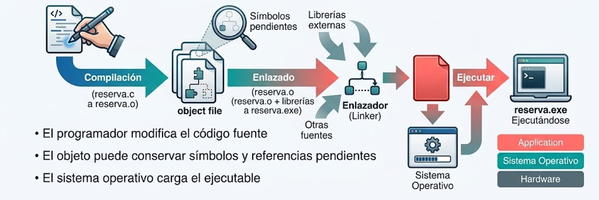

---

# 2. Entorno de trabajo

Para realizar la práctica utilizaremos:

* **Windows** como sistema operativo **anfitrión**;
* **VirtualBox** para ejecutar una máquina virtual;
* **Linux Mint** como sistema operativo **invitado**;
* la **terminal de Linux**;
* el compilador **GCC**;
* el editor de texto **nano**.

No necesitas conocer todavía cómo se crea o configura una máquina virtual. En esta tarea solamente utilizaremos una máquina virtual que ya está preparada.

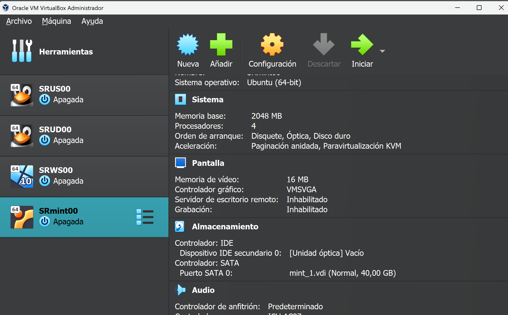

> Ventana principal de VirtualBox con la máquina virtual Linux Mint seleccionada.

### Iniciar la máquina virtual

1. Abre **VirtualBox**.
2. Selecciona la máquina virtual de **Linux Mint** indicada por el profesor.
3. Pulsa **Iniciar**.
4. Espera a que Linux Mint termine de arrancar.
5. Abre una **Terminal**.

### Comprobar GCC

En la terminal escribe:

```bash
gcc --version
```

Si aparece información sobre la versión de GCC, puedes continuar.

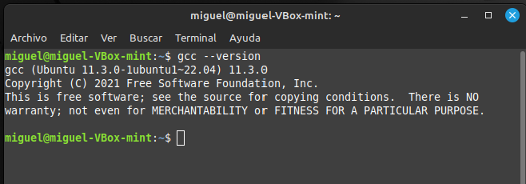

Si el comando no funciona, consulta con el profesor.

---

# 3. Acceder a la carpeta de trabajo

En la máquina virtual ya encontrarás preparada una carpeta llamada:

```text
ED0101
```

Dentro de ella también encontrarás el archivo `main.c` que utilizaremos durante toda la práctica.

**No debes crear la carpeta ni escribir el programa. Ya están preparados.**

Desde la terminal, entra en la carpeta:

```bash
cd ~/ED0101
```

Comprueba su contenido:

```bash
ls -lh
```

Entre los archivos mostrados debe aparecer:

```text
main.c
```

A partir de este momento, todos los comandos de la práctica deben ejecutarse dentro de esta carpeta.

> Si `main.c` no aparece, comprueba que estás en la carpeta correcta antes de continuar.

---

# 4. Código fuente: `main.c`

El archivo `main.c` ya contiene el programa que vamos a utilizar.

Antes de comenzar el proceso de traducción, vamos a observarlo.

Ábrelo utilizando `nano`, un editor de texto sencillo similar al Bloc de notas:

```bash
nano main.c
```

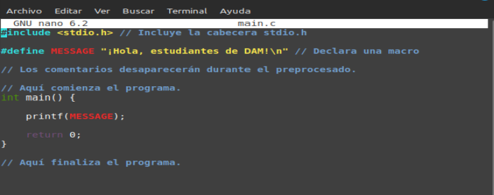

El contenido del archivo es:

```c
#include <stdio.h> // Incluye la cabecera stdio.h

#define MESSAGE "¡Hola, estudiantes de DAM!\n" // Declara una macro

// Los comentarios desaparecerán durante el preprocesado.

// Aquí comienza el programa.
int main() {

    printf(MESSAGE);

    return 0;
}

// Aquí finaliza el programa.
```

Observa el programa, pero **no debes modificarlo**.

Para salir de `nano`:

**Ctrl + X**

Si accidentalmente has realizado alguna modificación y `nano` te pregunta si deseas guardarla, responde que **no**.

> Ahora habrás salido de `nano`, pero continúas en la terminal.

Comprueba de nuevo que el archivo existe:

```bash
ls -lh
```

`main.c` es nuestro **código fuente**: el código escrito por el programador y pensado para ser leído y modificado por personas.

---

# 5. Fase 1 — Preprocesado

El primer paso es el **preprocesado**.

El preprocesador actúa, entre otras cosas, sobre directivas que comienzan por `#`, como:

```c
#include
#define
```

Ejecuta:

```bash
gcc -E main.c -o main.i
```

Se habrá creado un nuevo archivo:

```text
main.i
```

Compruébalo:

```bash
ls -lh
```

Abre ahora el archivo:

```bash
nano main.i
```

No intentes comprender todo su contenido. Observarás que el archivo es mucho más largo que `main.c`.

Busca especialmente la zona en la que aparece tu función:

```c
int main()
```

## Analiza

Compara `main.c` con `main.i` y responde:

1. ¿Cuál de los dos archivos ocupa más espacio?
2. ¿Qué ha ocurrido con los comentarios?
3. ¿Sigue apareciendo la palabra `MESSAGE`?
4. ¿Qué aparece ahora donde antes utilizábamos `MESSAGE`?
5. ¿Por qué crees que `main.i` contiene muchas más líneas que `main.c`?

El preprocesador ha incorporado el contenido necesario indicado mediante `#include` y ha sustituido las macros definidas mediante `#define`.

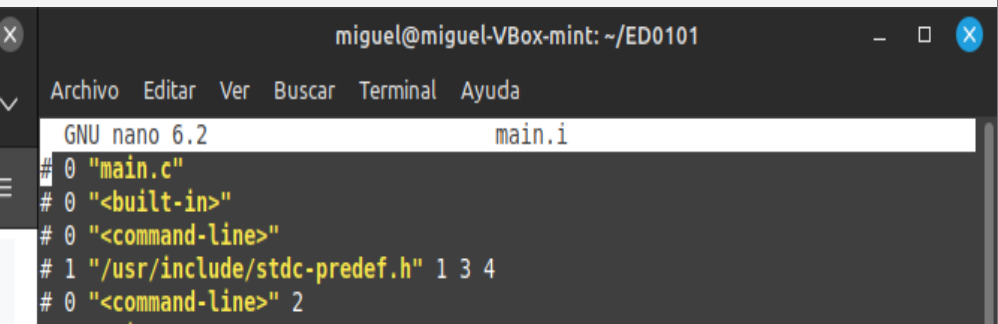
>
> Fragmento de `main.i` donde aparezca `main()` y pueda observarse que:
>
> * los comentarios han desaparecido;
> * ya no aparece `MESSAGE`;
> * aparece directamente `"¡Hola, estudiantes de DAM!\n"`.
>
> Es probablemente la captura más didáctica de toda la actividad.

---

# 6. Fase 2 — Compilación

Ahora vamos a transformar el código preprocesado en **lenguaje ensamblador**.

Ejecuta:

```bash
gcc -S main.i -o main.s
```

Se habrá creado:

```text
main.s
```

Ábrelo:

```bash
nano main.s
```

El archivo continúa siendo un archivo de texto, pero su contenido ha cambiado completamente.

No necesitas comprender las instrucciones en lenguaje ensamblador.

## Analiza

Responde:

1. ¿Puedes abrir `main.s` con un editor de texto?
2. ¿Se parece todavía al programa en C de partida?
3. ¿Encuentras instrucciones cortas propias del lenguaje ensamblador?
4. ¿Consideras que este código resulta fácil de escribir o leer para una persona?

> El contenido concreto de `main.s` puede variar dependiendo de la versión de GCC y de la arquitectura del equipo.

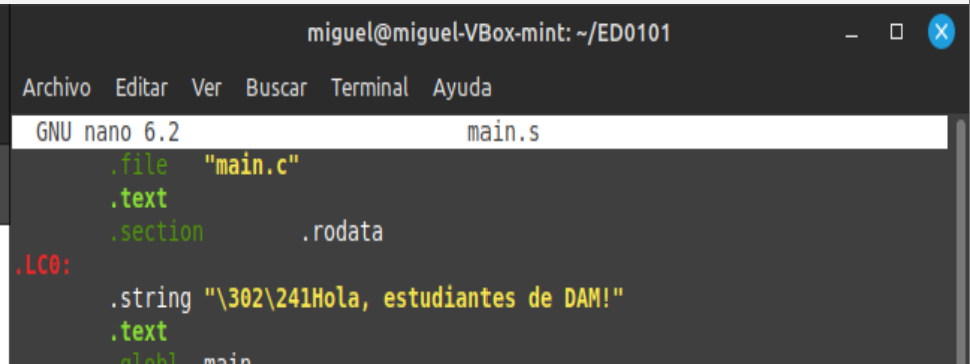
>
> Un pequeño fragmento de `main.s` abierto en `nano`, donde puedan verse claramente instrucciones en ensamblador.
>
> No es necesario que el alumnado interprete esas instrucciones.

---

# 7. Fase 3 — Ensamblado

El código ensamblador se transforma ahora en un **archivo objeto**.

Ejecuta:

```bash
gcc -c main.s -o main.o
```

Se habrá creado:

```text
main.o
```

Comprueba qué tipo de archivo es:

```bash
file main.o
```

También puedes observar una pequeña parte de su contenido mediante:

```bash
hexdump -C main.o | head
```

## Analiza

Responde:

1. ¿Es `main.o` un archivo de texto como `main.c` o `main.s`?
2. ¿Qué información proporciona el comando `file`?
3. ¿Por qué no tiene sentido intentar leer normalmente este archivo con `nano`?
4. ¿Es `main.o` ya el programa ejecutable final?

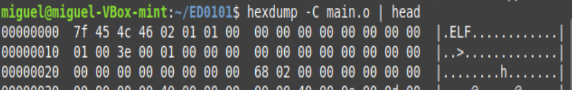
>
> Terminal mostrando conjuntamente:
>
> ```bash
> file main.o
> hexdump -C main.o | head
> ```
>
> Esta captura permite visualizar muy bien el paso de un archivo de texto a un archivo binario.

---

# 8. Fase 4 — Enlazado

Todavía debemos obtener el programa ejecutable.

Durante el **enlazado**, el archivo objeto se combina con el código necesario procedente de bibliotecas y otros componentes utilizados por el programa.

Ejecuta:

```bash
gcc main.o -o main
```

Se habrá creado:

```text
main
```

Comprueba su tipo:

```bash
file main
```

También puedes observar una pequeña parte de su contenido:

```bash
hexdump -C main | head
```

## Analiza

Compara `main.o` y `main`.

1. ¿Son los dos archivos binarios?
2. ¿Los identifica el comando `file` de la misma manera?
3. ¿Cuál de los dos es el ejecutable?
4. ¿Qué ha ocurrido durante el enlazado?

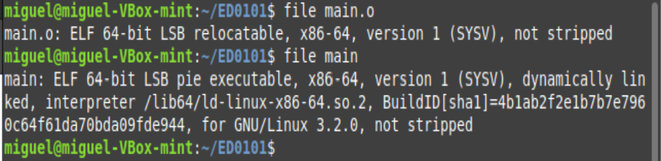
> Una única terminal mostrando:
>
> ```bash
> file main.o
> file main
> ```
>
> El objetivo es que pueda observarse claramente que **archivo objeto** y **ejecutable** no son lo mismo.

---

# 9. Ejecutar el programa

Ya tenemos el programa ejecutable.

Ejecuta:

```bash
./main
```

Si todo ha funcionado correctamente aparecerá:

```text
¡Hola, estudiantes de DAM!
```

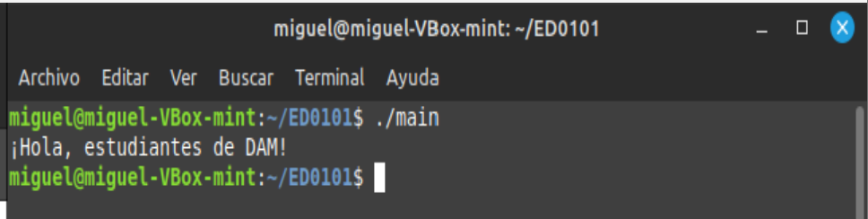
>
> Terminal mostrando la ejecución:
>
> ```bash
> ./main
> ¡Hola, estudiantes de DAM!
> ```

---

# 10. Observa todo el proceso

En este momento debes tener cinco archivos principales:

```text
main.c
main.i
main.s
main.o
main
```

Compruébalo:

```bash
ls -lh
```

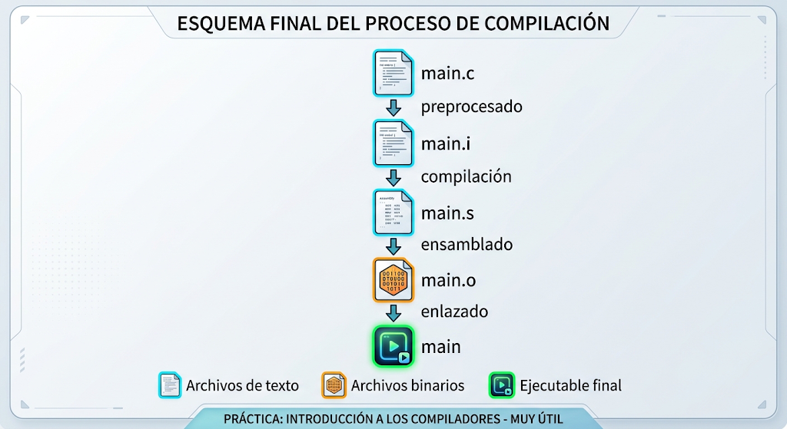
>
> Esquema final:
>
> ```text
> main.c
>    ↓ preprocesado
> main.i
>    ↓ compilación
> main.s
>    ↓ ensamblado
> main.o
>    ↓ enlazado
> main
> ```
>
> Podría diferenciar visualmente:
>
> * archivos de texto;
> * archivos binarios;
> * ejecutable final.

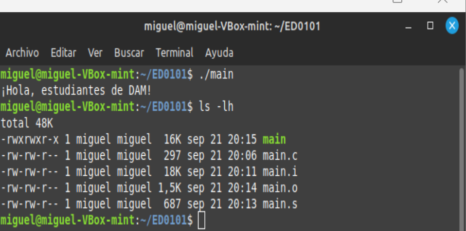
>
> Resultado de:
>
> ```bash
> ls -lh
> ```
>
> mostrando juntos `main.c`, `main.i`, `main.s`, `main.o` y `main`.
>
> Permite además comparar sus tamaños.

---

## Tabla resumen

Completa una tabla similar a la siguiente:

| Archivo  | ¿Cuándo aparece? | ¿Texto o binario? | ¿Legible fácilmente por una persona? | ¿Ejecutable? | ¿Qué contiene? |
| -------- | ---------------- | ----------------- | ------------------------------------ | ------------ | -------------- |
| `main.c` | Inicio           |                   |                                      |              |                |
| `main.i` | Preprocesado     |                   |                                      |              |                |
| `main.s` | Compilación      |                   |                                      |              |                |
| `main.o` | Ensamblado       |                   |                                      |              |                |
| `main`   | Enlazado         |                   |                                      |              |                |

---

# 11. ¿Hay que hacer siempre todo esto?

Para poder estudiar el proceso hemos ejecutado cada fase por separado.

Sin embargo, normalmente un programador no necesita escribir todos estos comandos.

GCC puede realizar automáticamente todo el proceso con:

```bash
gcc main.c -o programa
```

Ejecuta después:

```bash
./programa
```

El resultado debe ser el mismo.

## Reflexión final

Responde razonadamente:

1. ¿Qué fases ha realizado GCC internamente al ejecutar solamente `gcc main.c -o programa`?
2. ¿Qué diferencias fundamentales existen entre `main.c`, `main.o` y `main`?
3. ¿Por qué decimos que C es un lenguaje compilado?
4. ¿Qué función han realizado durante esta práctica las siguientes herramientas?

   * `nano`
   * GCC
   * la terminal
   * VirtualBox

---

# Objetivos

Al finalizar la tarea debes ser capaz de:

* reconocer las principales fases de traducción de un programa en C;
* diferenciar **código fuente**, **código objeto** y **ejecutable**;
* identificar los archivos generados durante el proceso;
* comprender la función general del **preprocesador**, **compilador**, **ensamblador** y **enlazador**;
* utilizar herramientas básicas de Linux para examinar, transformar y ejecutar un programa;
* explicar los cambios que se producen entre unas fases y otras;
* reconocer la funcionalidad de algunas de las herramientas utilizadas durante el desarrollo de software.

---

# Instrucciones de entrega

Debes entregar:

## 1. Documento PDF

> REALIZA LA PRÁCTICA MODIFICANDO EL MENSAJE, PONIENDO EN ÉL TU NOMBRE:
>
> 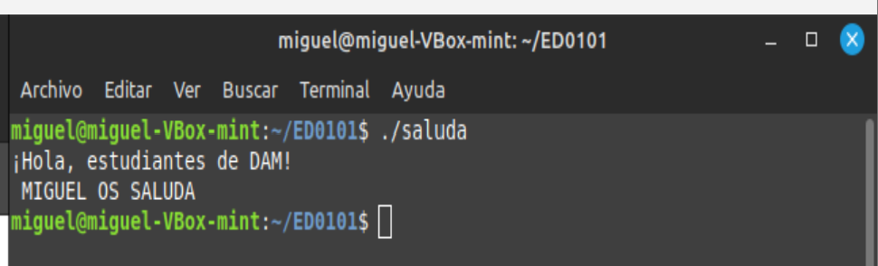


El documento **no debe ser una memoria paso a paso**.

Debe contener:

* las respuestas razonadas a las preguntas **Reflexión final**;
* las capturas necesarias para justificar tus observaciones;
* la reflexión final.

Las capturas deben utilizarse como **evidencias** de aquello que estás explicando.

**No es CORRECTO realizar una captura de cada comando ejecutado.**

## 2. Archivos generados

Debes incluir también los siguientes archivos:

```text
main.c
main.i
main.s
main.o
main
```

---

# Rúbrica

| Calificación | Descripción                                                                                                                                                                                                                                          |
| -----------: | ---------------------------------------------------------------------------------------------------------------------------------------------------------------------------------------------------------------------------------------------------- |
|        **0** | No realiza las etapas solicitadas o la entrega no permite comprobar el trabajo realizado.                                                                                                                                                            |
|        **3** | Realiza solamente parte de las fases o presenta los archivos sin explicar adecuadamente qué ocurre en ellas.                                                                                                                                         |
|        **6** | Completa todas las fases y obtiene correctamente los archivos, pero el análisis y las comparaciones son superficiales o presentan errores.                                                                                                           |
|        **9** | Completa correctamente todas las fases y analiza con claridad las diferencias entre los archivos, utilizando evidencias y vocabulario técnico adecuado.                                                                                              |
|       **10** | Realiza un aporte extra y solicita su 10|
