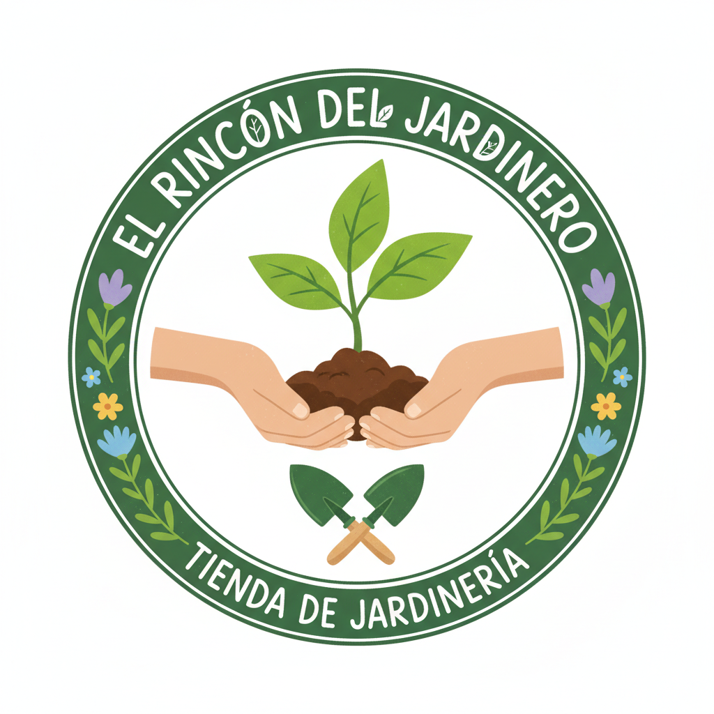

**Entornos de Desarrollo (ED)**  
**Unidad de Trabajo 1 (UT1)**  
**Tarea 04**

# TA04 Proceso de desarrollo de una aplicación

## El problema

El objetivo de esta actividad es aplicar tus conocimientos sobre el proceso de desarrollo de software a un ejemplo concreto, en el contexto de una reunión entre un cliente y el jefe de proyecto de un equipo de desarrollo.

## ¿Qué tiene que hacer tu equipo de trabajo?

Imagina que eres parte del equipo de desarrollo de software para una tienda especializada en vender productos de jardinería. Tu tarea será describir detalladamente las fases del ciclo de vida de desarrollo de una aplicación destinada a satisfacer las necesidades de esta tienda. A continuación, se presenta una escena ficticia en la que el cliente y el jefe de proyecto mantienen una reunión para discutir los requerimientos y características del sistema que desean implementar. 

### Escena de la reunión:

**Cliente**: “Nos gustaría desarrollar una aplicación para nuestra tienda de jardinería. Queremos algo sencillo, pero eficaz. Por supuesto, la aplicación debe ser de software libre, ya que preferimos no depender de licencias caras."

**Jefe de proyecto**: “Claro, podemos trabajar en esa línea. ¿Qué funcionalidades le gustaría que la aplicación cubriera?”

**Cliente**: “Bueno, en primer lugar, necesitamos generar facturas para nuestras ventas de manera fácil y rápida. También sería útil llevar un registro de las ventas realizadas por cada empleado. Eso nos ayudará a controlar las comisiones y el rendimiento individual."

**Jefe de proyecto**: "Entendido, una gestión por empleado es importante para monitorizar el trabajo. ¿Qué más necesita la tienda?"

**Cliente**: "El stock, es vital saber lo que tenemos en el almacén. El sistema debería poder actualizarse inmediatamente cada vez que se venda un algo. Además, sería ideal que la aplicación funcione con lectores de código de barras y tarjetas de crédito."

**Jefe de proyecto**: "Podemos integrar esas funcionalidades. ¿Qué hay sobre la gestión de los precios de los productos?"

**Cliente**: "Sí, necesitamos poder ajustar los precios en cualquier momento. A veces realizamos promociones y rebajas y es importante que los cambios se reflejen inmediatamente en la aplicación."

**Jefe de proyecto**: "Perfecto, lo tendremos en cuenta. Ahora bien, ¿cómo manejan la velocidad de respuesta del sistema?"

**Cliente**: "Preferiríamos que el tiempo de respuesta fuera lo más rápido posible, no queremos perder clientes por tener que esperar. Ah, y algo crucial: no podemos permitir que se procesen dos ventas simultáneamente de un mismo artículo, ya que eso podría generar errores en el stock."

**Jefe de proyecto**: "Entendido. En cuanto al personal, ¿qué tipo de datos le gustaría almacenar?"

**Cliente**: "Nos gustaría registrar información importante, como el DNI, nombre, apellidos, número de Seguridad Social, etc"

**Jefe de proyecto**: "Eso se puede hacer fácilmente. Y para los productos, ¿qué tipo de información deben incluir en la base de datos?"

**Cliente**: "Lo habitual, el código de producto, la marca, nombre comercial, esas cosas."

**Jefe de proyecto**: "Tomo nota de todo. tenemos que hablar de otros aspectos generales..."

**Cliente**: "Sí claro, veamos si este proyecto va a..."

### Desarrollo del proyecto

A partir de esta conversación, deberás diseñar una planificación del proyecto, detallando **cada una de las fases**de desarrollo necesarias para la creación de esta aplicación. Debes seguir las premisas estudiadas en la presente unidad de trabajo.

### Requisitos del trabajo:

1. **Análisis de requisitos**. Aquí se deben identificar las necesidades generales del cliente y planificar los primeros pasos del proceso. Sintetiza los requisitos **funcionales y no funcionales** del sistema, distinguiendo claramente entre los dos tipos. Escribe al menos 15 requisitos. Cumple con las características que deben tener los requisitos. Usa el **formato** adecuado según lo estudiado en la unidad. ***(DEBES CENTRARTE EN ESTA FASE)***

2. **Diseño**. Proporciona una propuesta de diseño del sistema, mencionando los módulos que interactuarán entre sí y seleccionando el **ciclo de vida de desarrollo o la metodología** que consideres más adecuada para este tipo de aplicación. Incluye al menos dos documentos de los que se generan en esta fase según los apuntes.
   
3. **Codificación**. Planifica el proceso de codificación, eligiendo el **lenguaje** de programación y las **herramientas** que utilizarás para obtener el código fuente, el código objeto y el ejecutable. Justifica la elección de estas herramientas.

4. **Desarrollo de las fases restantes del ciclo de vida del software**. Describe el objetivo de cada fase (pruebas, mantenimiento, ...) y explica cómo abordarías tú cada una de ellas en este proyecto.

### Instrucciones de entrega:

- Redacta una **memoria en formato PDF** en la que respondas a las cuestiones planteadas, siguiendo una estructura clara. Distingue un apartado para cada fase del proceso de desarrollo.

### Rúbrica:

| Calificación | Descripción                                                                                                                                       |
|--------------|---------------------------------------------------------------------------------------------------------------------------------------------------|
| 0            | No se entrega la tarea o se entrega confundida                                                   |
| 3            | Se describe el proceso de desarrollo, pero con errores, **falta** alguna fase del proceso. No se ajusta a las premisas del enunciado. Los requisitos se formulan sin seguir las **indicaciones**. |
| 6            | Se presenta una planificación razonable del desarrollo, pero faltan *detalles* en algunas fases o la *justificación* de decisiones importantes.        |
| 9            | Se describe el proceso de desarrollo correctamente, cubriendo **todas** las fases del ciclo de vida con buena **justificación** y siguiendo las premisas. |
| 10           | Se añade un detalle o funcionalidad extra que mejora el proyecto, como una propuesta de optimización o mejora no solicitada inicialmente. Se cumplen el resto de requisitos anteriores.         |

