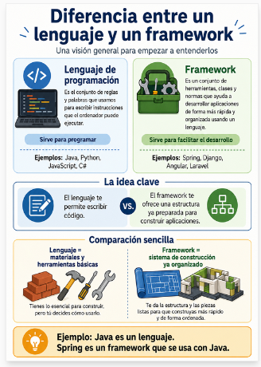

  

[react - ](./01PRO/web/ED0103_react.md) [Django - ](./01PRO/web/ED0103_django.md) [flask - ](./01PRO/web/ED0103_flask.md) [lisp](./01PRO/web/ED01_lisp.md)

Un **lenguaje de programación** es el conjunto de reglas, palabras y estructuras que usamos para escribir instrucciones que el ordenador puede ejecutar.

Ejemplos:

* **Java**
* **Python**
* **JavaScript**
* **C#**

Por ejemplo, en Java podemos escribir:

```java
System.out.println("Hola");
```

Un **framework** es un conjunto de herramientas, clases, normas y estructura ya preparadas que nos ayudan a desarrollar aplicaciones más fácilmente usando un lenguaje.

Ejemplos:

* **Spring** usa Java.
* **Django** usa Python.
* **Angular** usa TypeScript/JavaScript.
* **Laravel** usa PHP.

La diferencia clave es esta:

> El **lenguaje** te permite escribir código.
> El **framework** te da una forma organizada y ya preparada de construir una aplicación con ese código.

Una comparación sencilla:

* El **lenguaje** serían los ladrillos, cemento y herramientas básicas.
* El **framework** sería un sistema de construcción ya organizado, con planos, normas y piezas preparadas para levantar una casa más rápido.

Por eso, **Java es un lenguaje**, mientras que **Spring es un framework que permite crear aplicaciones Java de forma más estructurada**.
