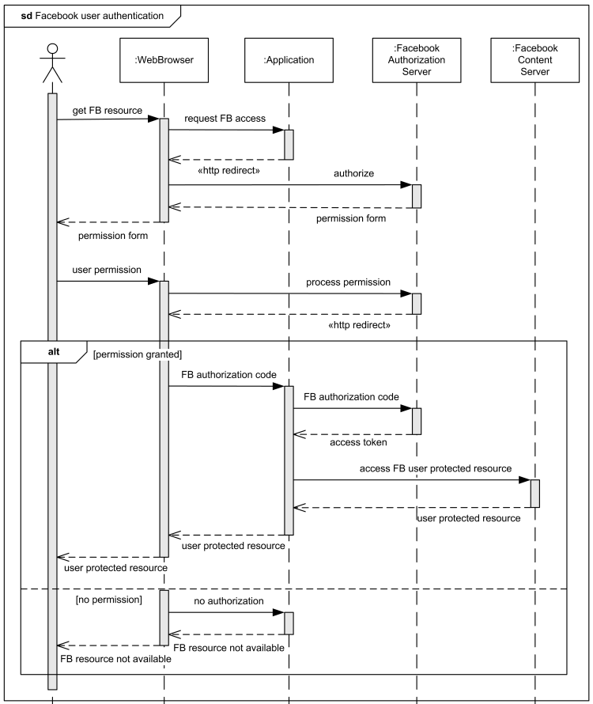
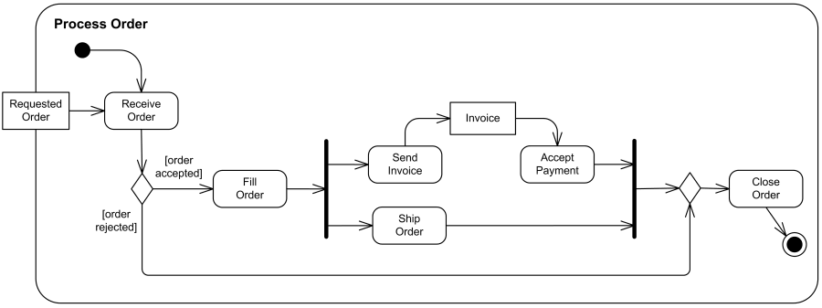

# Elaboración de diagramas

## Introducción

### UML: Diagramas

Los más utilizados son:

- Diagramas de casos de uso
- Diagramas de secuencia
- Diagramas de estados
- Diagramas de actividades

## Diagramas de casos de uso

### Elementos

- **Sistema** (recuadro con el nombre)
- **Actores** (monigotes)
- **Casos** de **uso** (óvalos)
- **Asociaciones** entre Caso de uso y actores (segmentos)
- **Relaciones**:
  - **inclusión**: ejecución obligatoria de casos de uso
    
    

  - **extensión**: variaciones opcionales de casos de uso
    
    

  - **generalización**: permite identificar CASOS DE USO comunes entre los actores
    
    
  

### Ejemplo 1

### Ejemplo 2

## Diagramas de secuencia
* Permiten añadir la variable TIEMPO (dimensión y)
* Secuencian y temporizan las interacciones en el sistema
* Detallan los casos de uso (1 CU → 1 SECUENCIA)
* ELEMENTOS: (dimensión x)
* OBJETOS y ACTORES: originan la secuencia de mensajes
* MENSAJES: representan la interacción entre dos objetos
* Un objeto puede interaccionar consigo mismo

### Elementos

- **Actores** 
- **Objetos**
 
 
- **Línea** de vida
- **Mensajes**

- **alt**: se ejecuta un bloque u otro dependiendo de una condición

- **loop**: se repite una acción varias veces 

### Ejemplo 1

### Ejemplo 2

## Diagrama de estados [+](./ED0203estado.md)

### Ejemplo 1

## Diagrama de actividad [+](./ED0204actividad.md)

### Elementos

### Ejemplo 1

### Ejemplo 2

### Ejemplo 3

## Referencias

- [Diagramas UML de ejemplo](https://uml-diagrams.org)
- [Ejemplos](https://www.uml-diagrams.org/index-examples.html)
- [OMG.org, donde bajar las especificaciones de UML](https://www.omg.org/spec/UML/)
- [UML.org](http://uml.org)
