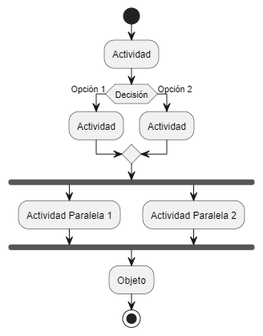
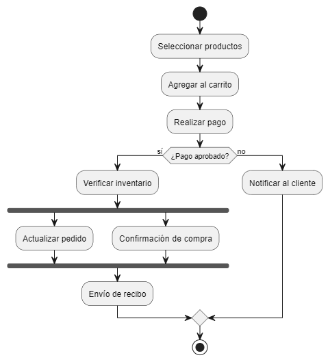

[Volver al índice principal](./ED0200.md)

# ED0204 - UML: Diagramas de Actividades

Los diagramas de actividades en UML (Lenguaje Unificado de Modelado) son diagramas que muestran el flujo de actividades o tareas dentro de un proceso o sistema. Ayudan a entender cómo se conectan las actividades, cómo se toman decisiones y cómo se manejan las acciones paralelas. Estos diagramas son útiles en el desarrollo de software y en el modelado de procesos de negocio, ya que facilitan la comunicación y el entendimiento entre los miembros de un equipo.

## Utilidad de los Diagramas de Actividades

Los diagramas de actividades son útiles en varias etapas del desarrollo y análisis de sistemas. Permiten:

- **Documentar y comunicar procesos**: Representan procesos de forma clara, ayudando a que todos los involucrados entiendan cómo funcionan.
- **Optimizar procesos**: Permiten identificar partes redundantes, cuellos de botella y oportunidades de mejora al visualizar el proceso completo.
- **Analizar comportamientos complejos**: Son útiles para modelar sistemas con actividades que ocurren en paralelo o de forma concurrente, facilitando el análisis de cómo se coordinan.
- **Facilitar la toma de decisiones**: Muestran claramente los puntos de decisión y las opciones disponibles, ayudando a entender las consecuencias de cada alternativa.
- **Apoyar la automatización**: Facilitan la implementación de sistemas automatizados y la documentación de reglas de negocio al modelar las actividades y flujos.

## Elementos de los Diagramas de Actividades

Para crear un diagrama de actividades en UML, se usan los siguientes elementos principales:

1. **Actividades**: Son las acciones o tareas dentro del proceso, representadas como rectángulos con bordes redondeados. Ejemplos de actividades incluyen "Revisar solicitud", "Enviar notificación" o "Generar reporte".

2. **Flujo de Control**: Representado por flechas, indica el orden en que se ejecutan las actividades, mostrando la secuencia del proceso desde el inicio hasta el fin.

3. **Nodos de Decisión**: Estos nodos se representan con rombos y muestran los puntos donde el flujo toma un camino dependiendo de una condición. Por ejemplo, una decisión puede dividir el flujo en "Aprobado" o "Rechazado".

4. **Nodo de Inicio**: Representado por un círculo negro, marca el inicio del proceso. Es único y muestra el punto de partida del flujo de actividades.

5. **Nodo de Fin**: Representado por un círculo negro con un borde, señala el final del proceso. Puede haber varios nodos de fin si hay diferentes resultados posibles.

6. **Bifurcación y Unión (Fork/Join)**: La bifurcación se muestra con líneas horizontales o verticales que dividen el flujo en varios caminos, permitiendo la ejecución de actividades en paralelo. La unión sincroniza estos caminos en un solo flujo.

## Ejemplos de Diagramas de Actividades

### Ejemplo 1: Proceso de Compra en Línea

En un diagrama de actividades para un proceso de compra en línea, el flujo comienza con el **Nodo de Inicio** (círculo negro) que marca el comienzo del proceso. Luego se pasa a la actividad **"Seleccionar productos"**, que se representa con un rectángulo redondeado. Esta actividad muestra la acción del usuario de elegir los productos que quiere comprar.

A continuación, el flujo va hacia la actividad **"Agregar al carrito"**, también representada por un rectángulo redondeado, que indica que el usuario añade los productos seleccionados al carrito de compras.

Después, se llega a la actividad **"Realizar pago"**, donde el cliente hace el pago de los productos. Aquí hay un **Nodo de Decisión** (rombo) para validar el método de pago. Este nodo tiene dos posibles salidas: **"Pago aprobado"** y **"Pago rechazado"**. Dependiendo del resultado, el flujo se divide en dos caminos:

- Si el pago es aprobado, el flujo continúa hacia la actividad **"Verificar inventario"** (rectángulo redondeado), donde se verifica si los productos están disponibles.
- Si el pago es rechazado, el flujo va hacia la actividad **"Notificar al cliente"**, informándole sobre el rechazo del pago.

En paralelo, se puede ejecutar la actividad **"Actualizar pedido"** para asegurarse de que el inventario se ajuste a la compra. Esta acción paralela se representa con una **Bifurcación (Fork)**, que se muestra con una línea horizontal o vertical que divide el flujo en dos caminos que se ejecutan al mismo tiempo.

Una vez que se completan las actividades paralelas, se sincronizan en una **Unión (Join)**, donde ambos flujos se juntan antes de continuar hacia la **"Confirmación de compra"**. Esta actividad confirma al cliente que la compra se completó exitosamente.

Finalmente, el flujo llega a la actividad **"Envío de recibo"**, donde se envía un recibo al cliente para documentar la transacción. El proceso termina con el **Nodo de Fin** (círculo negro con borde), que indica que el proceso ha terminado.

### Ejemplo 2: Solicitud de Vacaciones

Un proceso de solicitud de vacaciones comienza con el **Nodo de Inicio**, que lleva a la actividad **"Presentar solicitud"**. Luego, un **Nodo de Decisión** determina si la solicitud es **"Aprobada"** o **"Rechazada"**. Si es aprobada, el flujo continúa hacia **"Notificar al empleado"** y **"Registrar vacaciones"**, mientras que un rechazo lleva a la actividad **"Informar rechazo"** al empleado. Si la solicitud es aprobada, también podría haber un flujo paralelo para registrar las vacaciones en el sistema de recursos humanos.

### Ejemplo 3: Proceso de Registro de Usuarios

Este proceso comienza con la actividad **"Recibir solicitud de registro"**, seguida por **"Verificación de datos"**. Si los datos son correctos, el flujo continúa hacia **"Crear cuenta"**, mientras que un flujo alternativo para datos incorrectos lleva a **"Solicitar corrección"**. Una **Bifurcación** permite que **"Enviar confirmación"** y **"Actualizar base de datos"** se realicen al mismo tiempo, sincronizándose luego en la actividad **"Notificar al usuario"**.

## Conclusión

Los diagramas de actividades son una herramienta versátil y poderosa en UML, ya que permiten modelar procesos detallados y entender mejor el comportamiento dinámico de sistemas complejos. Estos diagramas ayudan a los equipos a visualizar y analizar las tareas, decisiones y flujos paralelos, facilitando la comunicación y la optimización de procesos.

[Volver al índice principal](./ED0200.md)