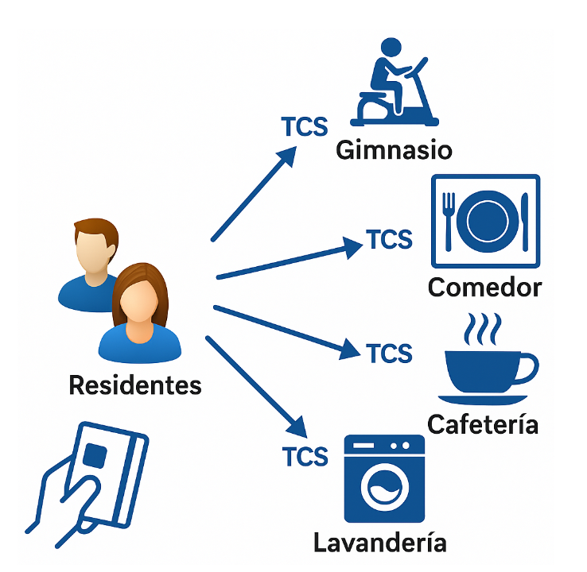
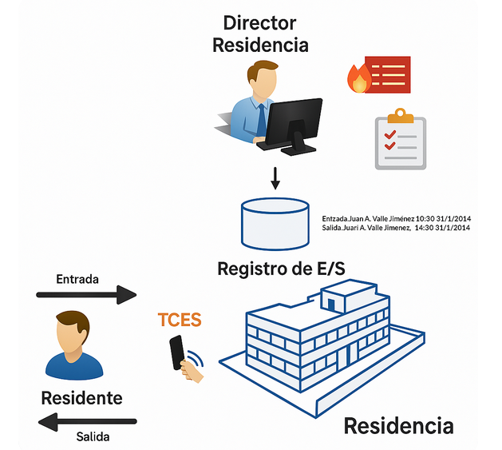

# UT 02
## Tarea 2: Analiza el funcionamiento del sistema de control de acceso

## Enunciado

Lee atentamente el siguiente caso práctico.

De esta información deberás **extraer los casos de uso** y los **actores que los desarrollan**, así como los **posibles sistemas externos** que van a interoperar con el nuevo sistema.

1. **Enumera y codifica los actores** en un listado.  
2. **Enumera y codifica los casos de uso** en otro listado.  
3. **Realiza el diagrama de casos de uso** siguiendo los pasos que hemos visto en clase.  
4. **Documenta uno de los casos de uso** que hayas extraído.

---

## Caso de estudio

Se desea implantar un **sistema de control** que permita a los residentes de un Colegio Mayor el acceso mediante una tarjeta **RFID (Radio Frequency Identification)** a una serie de servicios que se ofrecen en la residencia.

El primer objetivo del sistema es **controlar el acceso al recinto de la residencia**.  
El segundo objetivo es **controlar el uso de determinados servicios** en distintas estancias, como el comedor, la cafetería o el gimnasio.

Cada residente contrata a su llegada, o posteriormente, distintos tipos de servicios. Su tarjeta RFID asociada (que se le proporciona en el momento de formalizar su ingreso) reflejará la activación de estos servicios en función de su elección (ver Figura 1).  
Así, cada residente podrá elegir si contratar o no el servicio de gimnasio, el de pensión completa o solo el régimen de desayuno.  

Esta contratación la hará efectiva el **departamento económico** a través del sistema, **no el residente directamente**. Por defecto, la contratación será para todo el curso, aunque el estudiante puede solicitar la contratación por trimestres.  
Sería deseable que el residente pudiera **consultar sus servicios contratados** a través del sistema.

Cuando el residente acceda a una estancia que ofrece algún servicio, deberá pasar antes por lo que se denomina **Terminal de Control de Servicio (TCS)**. En cada TCS, el residente pasará su tarjeta sobre un lector RFID del sistema, y los **conserjes de la residencia** podrán ver en un monitor asociado si el residente tiene o no acceso al servicio.  
Para hacer esto, el sistema mantendrá activos los lectores de proximidad durante el horario en el que el servicio se puede utilizar.

> **Figura 1**. Acceso de residentes a diferentes servicios mediante TCS.

---

Otra funcionalidad que el sistema debe ofrecer es la de **registrar las entradas y salidas** de los residentes a la residencia (ver Figura 2). Esto se realizará mediante los **Terminales de Control de Entrada y Salida (TCES)**.  

El TCES y la información que proporciona permitirán que el **director** pueda tomar decisiones posteriormente, por ejemplo, sobre evacuaciones en caso de incendio o para determinar el grado de permanencia de los residentes.  

Para ello, el sistema permitirá al director:
- Ver el **estado de ocupación** de la residencia en tiempo real.  
- Generar **informes de permanencia** por meses, con datos que identifiquen a los residentes presentes en la residencia.

> **Figura 2**. Registro de entrada/salida al recinto de la residencia mediante TCES.

---

La **administración y gestión de las tarjetas** se realizan en el **departamento económico**, que debe poder:
- Asignar una tarjeta a un residente al contratar.  
- Activar en la tarjeta los servicios seleccionados.  
- Desactivar una tarjeta si fuera necesario.  
- Generar **informes sobre la contratación** de los distintos servicios.

---

El sistema, al manejar información contable sobre los servicios contratados, deberá **emitir mensualmente y de forma automática** (aunque se podrá cancelar esta emisión por el departamento económico) una **remesa de cobros** con cargo a la cuenta de cada residente.  

Para esta emisión, el sistema se comunicará **vía protocolo HTTPS** con un **sistema de emisión de cobros de una entidad bancaria** mediante un **API REST**.  
Este **sistema bancario externo** será considerado un **sistema externo** en el diagrama de casos de uso.

---

En cuanto a la seguridad, el sistema deberá ofrecer garantías en el tratamiento de la información.  
De forma **semanal**, y **sin intervención de ningún operador**, deberá **copiar la base de datos de producción** a otra máquina de respaldo denominada **base de datos SCR**.  
Esta máquina ya existe y centraliza todas las copias de seguridad de la residencia.  
La **base de datos SCR** se considerará también un **sistema externo**.

---

Los **administrativos de secretaría** deberán poder:
- Consultar los datos de cada residente.  
- Generar **informes de ocupación** de la residencia.  

Esta información es fundamental para gestionar la ocupación y las futuras admisiones.

El **director** será el único que podrá:
- Ver el estado de ocupación de la residencia en tiempo real.  
- Colaborar con los conserjes y secretarios realizando sus funciones si fuera necesario.

---

El sistema deberá incorporar una **funcionalidad de notificación**, que permita a los **conserjes** enviar mensajes al móvil de cualquier residente.  
Esta funcionalidad se apoyará en la tecnología **Google Cloud Messaging**, que actuará como **sistema externo**.  

Los conserjes también podrán solicitar **informes de ocupación anónimos**, es decir, sin incluir datos personales de los residentes.

---

## Entrega

El trabajo debe entregarse en un único documento que contenga:
  
   - Listado y codificación de actores  
   - Listado y codificación de casos de uso  
   - Diagrama de casos de uso  
   - Documentación completa de un caso de uso  
