- [Elaboración de diagramas](#elaboración-de-diagramas)
  - [Introducción UML: Diagramas](#introducción-uml-diagramas)
  - [Diagramas de casos de uso](#diagramas-de-casos-de-uso)
  - [Diagramas de secuencia](#diagramas-de-secuencia)
  - [Diagrama de estados +](#diagrama-de-estados-)
  - [Diagrama de actividad +](#diagrama-de-actividad-)
      - [Referencias](#referencias)

# Elaboración de diagramas

## Introducción UML: Diagramas

Los diagramas que vamos a estudiar son:

- Diagramas de casos de uso
- Diagramas de secuencia
- Diagramas de estados
- Diagramas de actividades

## Diagramas de casos de uso

**Diagrama de casos de uso**
Un diagrama de casos de uso representa, de forma general, qué puede hacer un usuario u otro sistema con la aplicación. Ayuda a identificar los servicios principales que ofrece el sistema y quién interactúa con ellos, sin entrar todavía en cómo se programan internamente.

* ***ELEMENTOS***

- **Sistema** (recuadro con el nombre)
- **Actores** (monigotes)
- **Casos** de **uso** (óvalos)
- **Asociaciones** entre Caso de uso y actores (segmentos)
- **Relaciones**:
  - **inclusión**: ejecución obligatoria de casos de uso
    
    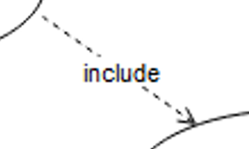

  - **extensión**: variaciones opcionales de casos de uso
    
    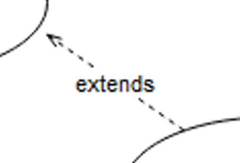

  - **generalización**: permite identificar CASOS DE USO comunes entre los actores
    
    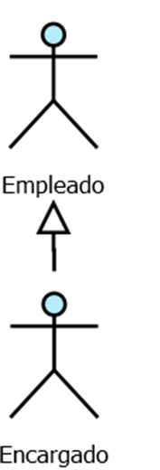
  

* Ejemplo 1

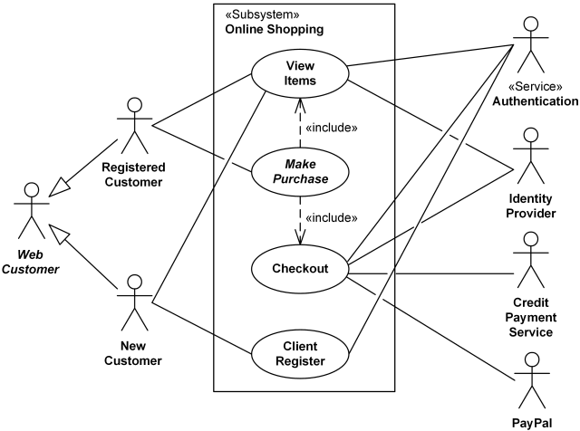

* Ejemplo 2

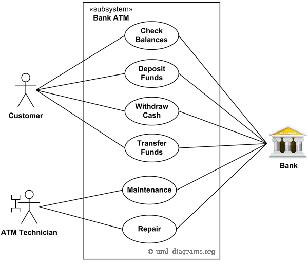

## Diagramas de secuencia

**Diagrama de secuencia**
Un diagrama de secuencia representa cómo interactúan distintos objetos o elementos del sistema a lo largo del tiempo. Permite ver el orden en que se envían los mensajes entre ellos para realizar una operación concreta, ayudando a comprender la colaboración entre partes del sistema sin centrarse todavía en el código interno.

* Permiten añadir la variable TIEMPO (dimensión y)
* Secuencian y temporizan las interacciones en el sistema
* Detallan los casos de uso (1 CU → 1 SECUENCIA)
* ELEMENTOS: (dimensión x)
* OBJETOS y ACTORES: originan la secuencia de mensajes
* MENSAJES: representan la interacción entre dos objetos
* Un objeto puede interaccionar consigo mismo

* ***ELEMENTOS***

- **Actores** 
- **Objetos**
 
 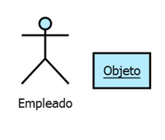
- **Línea** de vida
- **Mensajes**

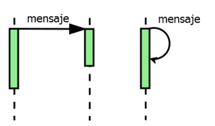

- **alt**: se ejecuta un bloque u otro dependiendo de una condición

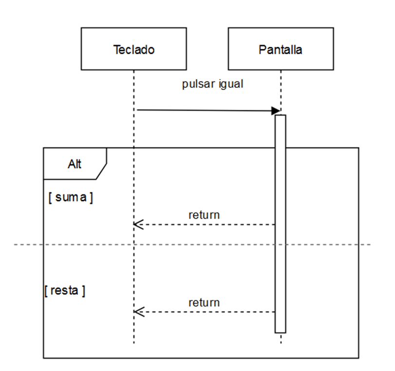

- **loop**: se repite una acción varias veces 

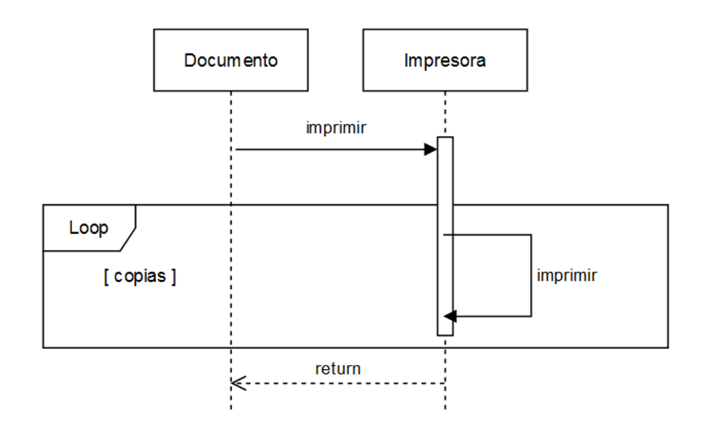

* Ejemplo 1

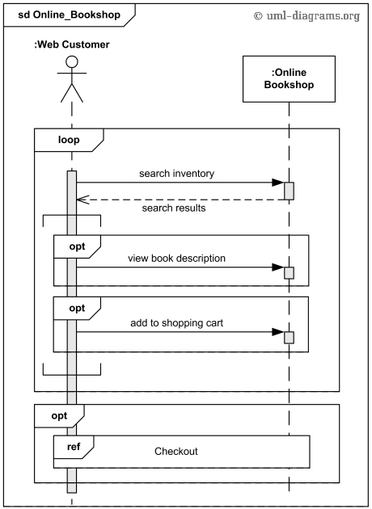

* Ejemplo 2

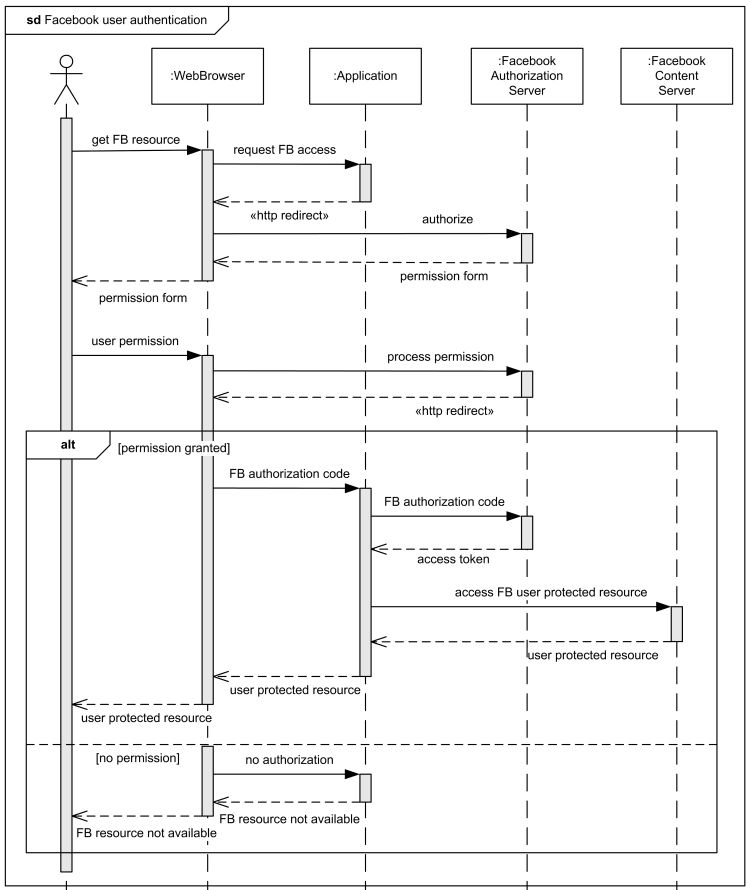

## Diagrama de estados [+](./ED0203estado.md)

**Diagrama de estados**
Un diagrama de estados muestra los distintos estados por los que puede pasar un objeto o elemento del sistema a lo largo del tiempo. Resulta útil cuando queremos entender cómo cambia su situación según los eventos que ocurren, por ejemplo, un pedido que pasa de “pendiente” a “enviado” o “cancelado”.

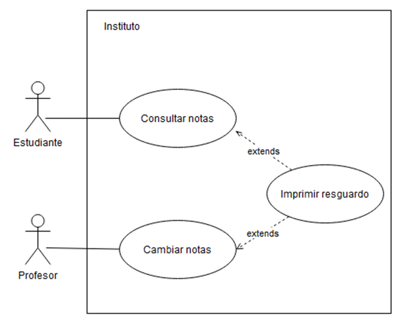

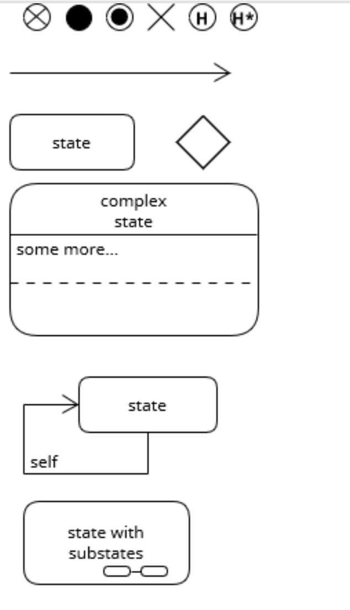

* Ejemplo 1

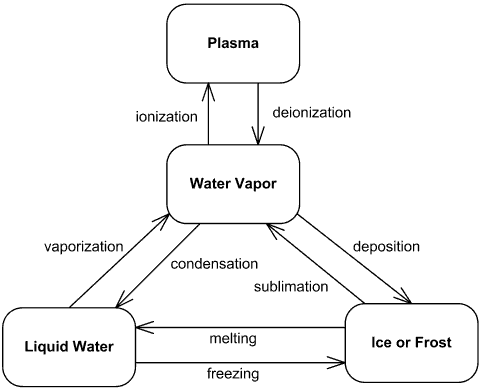

## Diagrama de actividad [+](./ED0204actividad.md)

**Diagrama de actividades**
Un diagrama de actividades representa el flujo de pasos que se siguen para realizar una tarea o proceso. Permite ver el orden de las acciones, las decisiones que pueden aparecer y los distintos caminos posibles, de forma parecida a un diagrama de flujo, pero dentro del contexto del modelado UML.

* ***ELEMENTOS***

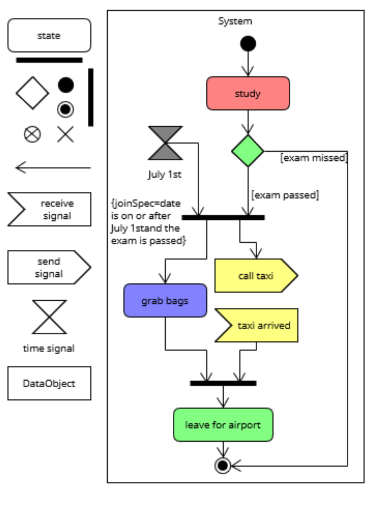

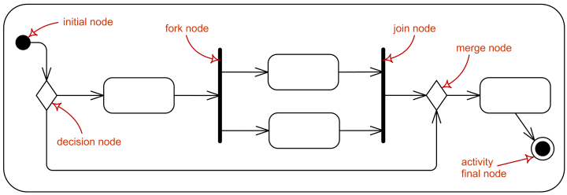

* Ejemplo 1

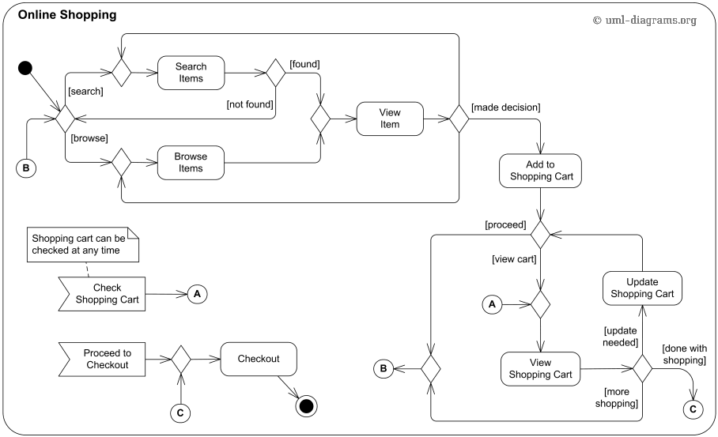

* Ejemplo 2

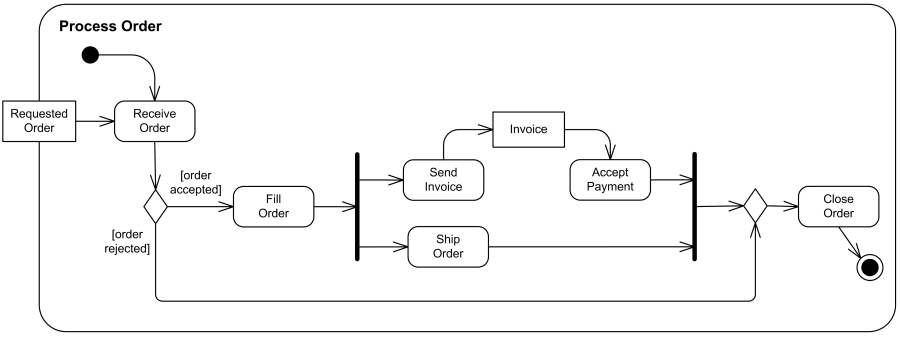

* Ejemplo 3

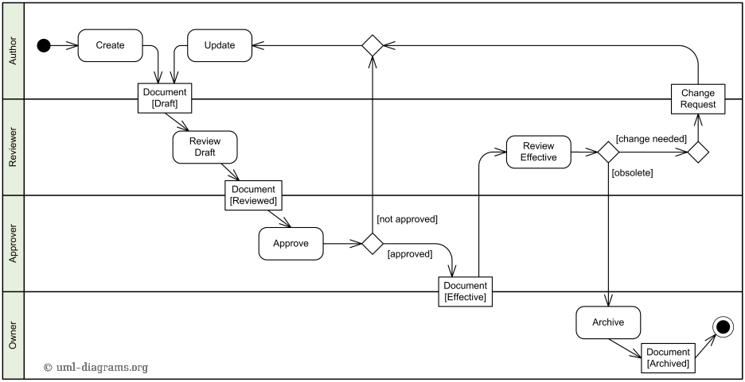

#### Referencias

- [Diagramas UML de ejemplo](https://uml-diagrams.org)
- [Ejemplos](https://www.uml-diagrams.org/index-examples.html)
- [OMG.org, donde bajar las especificaciones de UML](https://www.omg.org/spec/UML/)
- [UML.org](http://uml.org)

