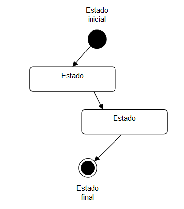
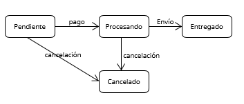

[Volver al índice principal](./ED0200.md)

# Diagramas de Estado en UML

## Introducción
Los diagramas de estado en UML (Lenguaje de Modelado Unificado) son herramientas visuales que permiten modelar el comportamiento dinámico de un sistema, particularmente cómo un objeto cambia de estado en respuesta a diferentes eventos. Estos diagramas son especialmente útiles en sistemas donde los objetos tienen ciclos de vida complejos y dependen de estados específicos para funcionar correctamente.

A través de los diagramas de estado, se puede comprender mejor el flujo y las transformaciones que ocurren en los objetos del sistema. Esto hace que el modelado de sistemas sea más claro y detallado, permitiendo anticipar y manejar mejor los posibles escenarios en el diseño y desarrollo de software.

## Utilidad de los Diagramas de Estado
Los diagramas de estado son valiosos en el diseño de sistemas orientados a objetos, ya que ayudan a modelar el comportamiento de un objeto a lo largo de su ciclo de vida. Son útiles en diversas fases del desarrollo de software:

- **Análisis de Requisitos**: Permiten visualizar cómo el sistema debe responder ante distintos eventos, proporcionando claridad sobre el comportamiento esperado de los objetos.
- **Diseño de Sistemas**: Ayudan a identificar y diseñar correctamente las transiciones y comportamientos de los objetos. Esto garantiza que el sistema funcione adecuadamente bajo diferentes condiciones.
- **Pruebas y Depuración**: Al mostrar todos los posibles estados y transiciones de un objeto, es más fácil planificar pruebas exhaustivas y localizar errores en el comportamiento del sistema.

Los diagramas de estado también facilitan la comunicación entre los miembros del equipo, al ofrecer un lenguaje visual común que representa el comportamiento del sistema de forma intuitiva.

## Elementos de los Diagramas de Estado
1. **Estados**: Representan las distintas etapas o condiciones de un objeto en un momento determinado. Cada estado puede tener subestados y acciones asociadas, que describen las actividades que el objeto realiza mientras se encuentra en dicho estado. *Se representa con el rectángulo*
2. **Transiciones**: Son las conexiones entre estados, indicando cómo un objeto pasa de un estado a otro en respuesta a eventos. Las transiciones pueden estar condicionadas, es decir, ocurren solo si se cumplen ciertos requisitos específicos. *Se representa con la flecha*
   - **Eventos**: Son los desencadenantes que provocan una transición de un estado a otro. Los eventos pueden incluir interacciones del usuario, respuestas a otros objetos o eventos temporales, como el paso de un tiempo determinado. *En la etiqueta que acompaña a la flecha, en primer lugar*
   - **Acciones**: Son operaciones que se ejecutan durante la transición de un estado a otro o al entrar o salir de un estado. Estas acciones definen el comportamiento del objeto en cada estado y su respuesta ante eventos específicos. *En la etiqueta que acompaña a la flecha, en segundo lugar*
3. **Estados Inicial y Final**: Representan el inicio y el final del ciclo de vida del objeto dentro del sistema. El estado inicial indica el punto de partida del objeto, mientras que el estado final simboliza la conclusión de su actividad en el sistema. *Se representa con los discos negros inicial y final*

## Ejemplo de uso de etiquetas para Evento y Acción

          ┌───────────────────────┐
          │ EsperandoCredenciales │
          └──────────┬────────────┘
                     │
      **ingresarCredenciales** / *verificarCredenciales*
                     │
                     │
           ┌─────────▼────────┐
           │    Verificando   │
           └─────────┬────────┘
                     │
        **credencialesCorrectas** / *mostrarBienvenida*
                     │
                     │
       ┌─────────────▼─────────────┐
       │      AccesoPermitido      │
       └───────────────────────────┘

## Ejemplos de Diagramas de Estado

### Ejemplo Sencillo
Consideremos un ciclo de vida simplificado de un pedido en un sistema de compras en línea. Este objeto "Pedido" podría tener los siguientes estados y transiciones:

- **Estados**:
  - *Pendiente*: El pedido ha sido creado pero no confirmado.
  - *Procesando*: El pedido ha sido confirmado y se está preparando para su envío.
  - *Entregado*: El pedido ha sido recibido por el cliente.

- **Transiciones y Eventos**:
  - De *Pendiente* a *Procesando*: Cuando el pago es confirmado, el pedido pasa a "Procesando".
  - De *Procesando* a *Entregado*: Cuando el cliente recibe el pedido, se registra como "Entregado".
  - Desde *Pendiente* o *Procesando*, una orden puede pasar a *Cancelado* si el cliente decide cancelar antes de que el pedido sea "Entregado".

[Volver al índice principal](./ED0200.md)

