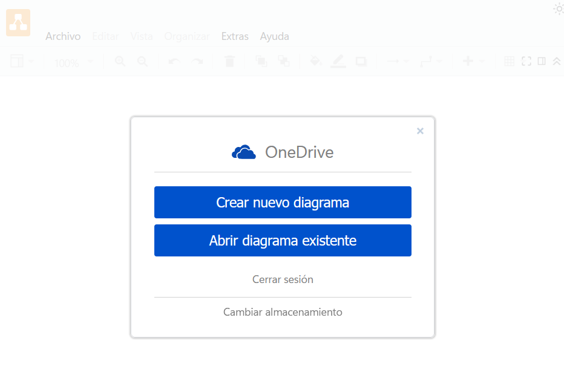
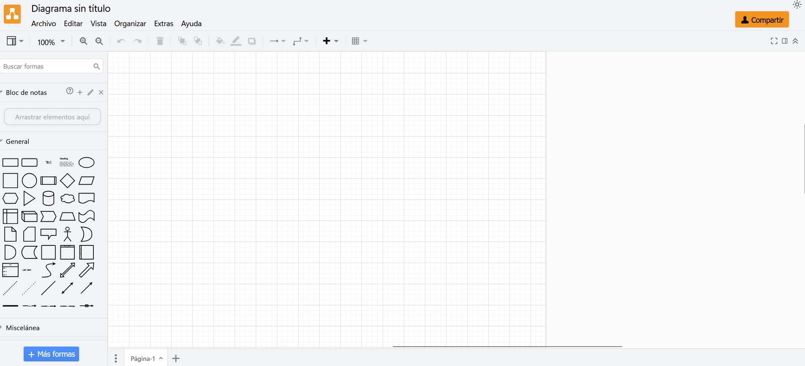
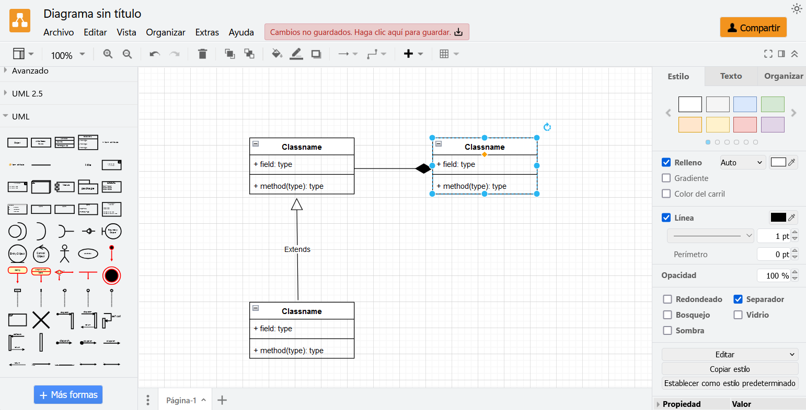
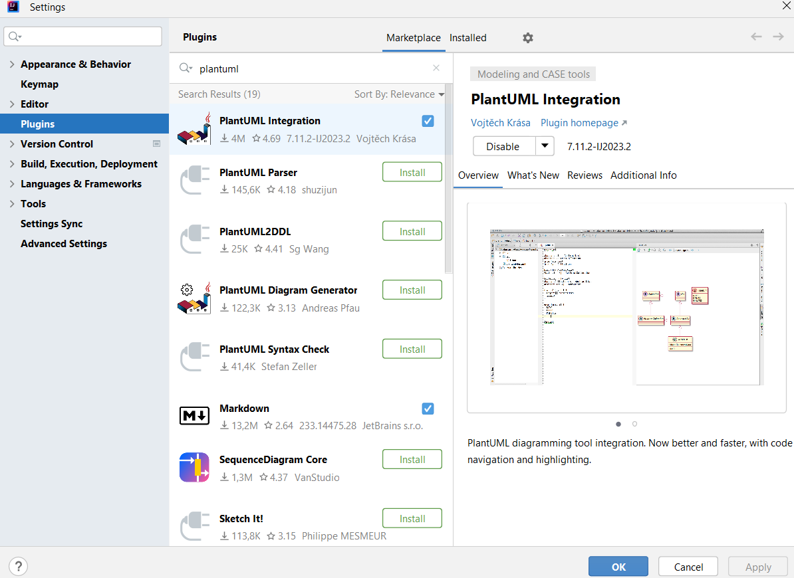
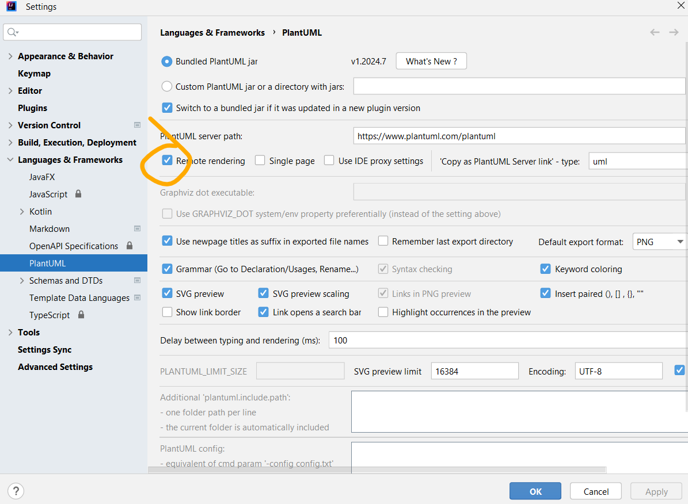
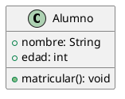
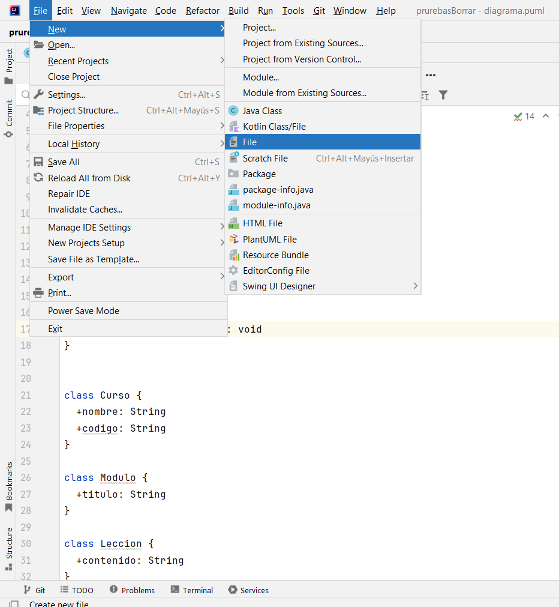
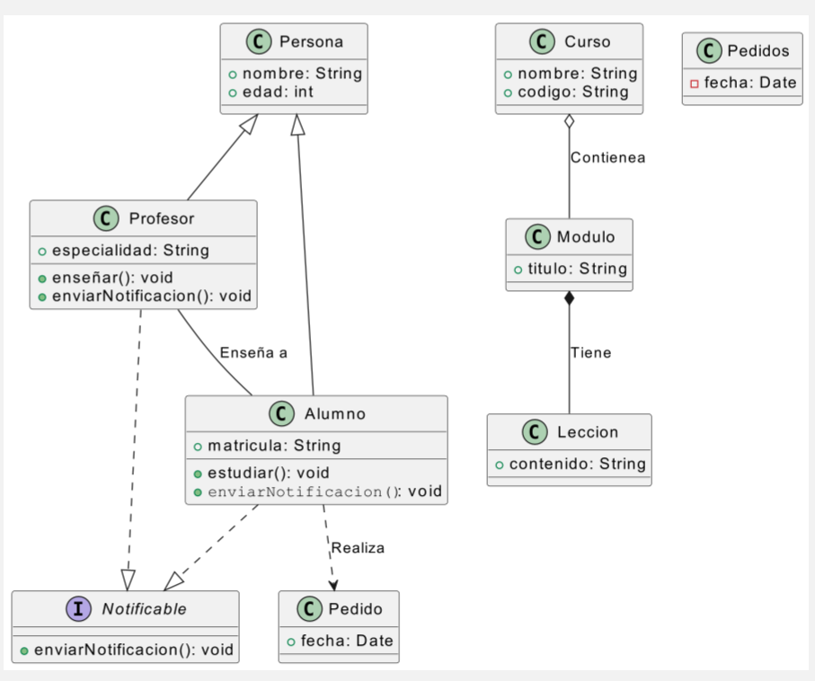

5.b Se han utilizado herramientas para la elaboración de diagramas de clases.

A lo largo de la UT utilizaremos estas herramientas:

## **Herramientas para generar diagramas de clases**  

Los diagramas de clases son fundamentales en el desarrollo de software, ya que permiten visualizar la estructura de un sistema orientado a objetos. Existen diversas herramientas para crearlos, que pueden clasificarse en:  

1. **Herramientas de modelado gráfico**  
   - StarUML: Software especializado en UML con una interfaz gráfica intuitiva.  
   - Visual Paradigm: Herramienta profesional con soporte para múltiples diagramas UML.  
   - **Draw.io**: Alternativa en línea gratuita con soporte para UML.  

2. **Herramientas basadas en texto (code-first)**  
   - **PlantUML**: Usa una sintaxis basada en texto para definir diagramas, lo que facilita su integración con código fuente.  

---

### **Herramientas para diagramas UML en IDEs**  

Muchos **IDEs** incluyen soporte para generar diagramas de clases automáticamente o mediante extensiones:  

🔹 **IntelliJ IDEA**  
   - **PlantUML Integration**: Permite escribir diagramas UML en texto y visualizarlos en tiempo real.   

🔹 **Visual Studio Code**  
   - PlantUML Extension: Permite escribir y renderizar diagramas UML directamente en el editor.  
  
🔹 **Eclipse**  
   - Papyrus: Plugin de modelado UML avanzado.  
   - ObjectAid UML Explorer: Genera diagramas UML automáticamente a partir del código fuente.  

🔹 **NetBeans**  
   - EasyUML: Plugin para generar diagramas UML desde clases Java.

## Nosotros vamos a usar Draw.io y PlantUML en IntelliJ IDEA

### **Cómo funciona Draw.io**

**Draw.io** (actualmente conocido como **diagrams.net**) es una herramienta de diagramación gratuita y de código abierto que permite crear diagramas de flujo, mapas conceptuales, diagramas de red, diagramas UML, wireframes y más. Se puede usar en línea a través de su web (**[https://app.diagrams.net](https://app.diagrams.net)**) o de forma local mediante su aplicación de escritorio.

### **Funcionamiento básico**
1. **Elegir un destino para guardar los archivos**  
   Al abrir Draw.io, te pedirá seleccionar dónde guardar el archivo de tu diagrama. Puedes elegir entre opciones como Google Drive, OneDrive, Dropbox o trabajar localmente en tu equipo.
   

2. **Interfaz de usuario**  
   - **Lienzo**: Área de trabajo donde se colocan los elementos del diagrama.  
   - **Barra lateral izquierda**: Contiene las formas y símbolos para crear diagramas.  
   - **Barra superior**: Contiene herramientas para editar, alinear y exportar diagramas.
    

3. **Crear un diagrama**  
   - Arrastra y suelta elementos desde la barra lateral al lienzo.  
   - Conéctalos usando las líneas y flechas inteligentes.  
   - Personaliza colores, tamaños, fuentes y estilos desde el panel de propiedades.  
  

4. **Guardar y exportar**  
   - Puedes guardar tu diagrama en formato `.drawio`, `.xml` o exportarlo a **PDF, PNG, SVG o JPG**.  
   - También permite copiarlo como código XML para incrustarlo en otras aplicaciones.  

### Cómo funciona PlantUML en InteliJ

### **Guía sencilla para instalar la extensión PlantUML en IntelliJ y crear un archivo `.puml`**  

A continuación, te explico paso a paso cómo instalar **PlantUML** en IntelliJ IDEA y generar un primer archivo `.puml` con una clase simple.  

---

### **1️ Instalar la Extensión PlantUML en IntelliJ IDEA**
1. **Abrir IntelliJ IDEA**.
2. Ir a **File** → **Settings** (o `Ctrl + Alt + S`).
3. En la barra lateral, ir a **Plugins**.
4. En la pestaña **Marketplace**, buscar **PlantUML Integration**.
5. Hacer clic en **Install** y luego en **Restart IDE**.

---

### **2️ Configurar PlantUML en IntelliJ**
1. Después de reiniciar IntelliJ, ir a **File** → **Settings**.
2. Buscar **Languages & Frameworks** → **PlantUML**.
3. En **PlantUML render**, seleccionar **PlantUMLServer: remote rendering**.
4. Hacer clic en **Apply** y luego en **OK**.

---

### **3️ Crear un Archivo `.puml` y Dibujar una Clase**
1. En el **Project Explorer**, hacer clic derecho en la carpeta de tu proyecto.
2. Seleccionar **New** → **File**.
3. Nombrarlo **Alumno.puml**.
4. Escribir el siguiente código:

---

### **4️ Ver el Diagrama UML**
1. Abrir el archivo **Alumno.puml**.
2. Hacer clic en la pestaña **Preview** en la parte superior.
3. Si no aparece, presionar `Alt + Shift + P` o hacer clic derecho y seleccionar **Show UML Diagram**.

---

### **5️ Exportar el Diagrama**
1. Hacer clic derecho en el diagrama.
2. Seleccionar **Save as** y elegir formato (PNG, SVG, etc.).

---

💡 **¡Listo!** Ya tienes IntelliJ IDEA configurado con PlantUML y tu primer diagrama de clases. 🚀
