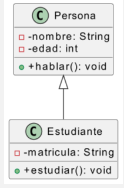
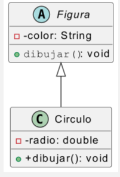
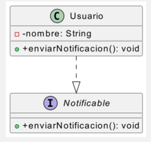

#### *5.c	Se ha interpretado el significado de diagramas de clases.*

#### *5.d	Se han trazado diagramas de clases a partir de las especificaciones de las mismas.*

A lo largo de la UT interpretaremos diagramas de clase y los traduciremos en código java.


## **Ejemplo 1: Persona y Estudiante (Herencia)**
### 📌 **Diagrama UML**



### 📖 **Interpretación**
- `Persona` es una **clase base** con atributos `nombre`, `edad` y el método `hablar()`.
- `Estudiante` **hereda** de `Persona` y agrega su propio atributo `matricula` y el método `estudiar()`.
- La relación `Persona <|-- Estudiante` indica que `Estudiante` **extiende** a `Persona`.
- Los atributos son privados y los métodos públicos.

### 💻 **Código Java**
```java
class Persona {
    private String nombre;
    private int edad;

    public void hablar() {
        System.out.println("Hola, soy una persona.");
    }
}

class Estudiante extends Persona {
    private String matricula;

    public void estudiar() {
        System.out.println("Estoy estudiando.");
    }
}

public class Main {
    public static void main(String[] args) {
        Estudiante e = new Estudiante();
        e.nombre = "Juan";
        e.edad = 20;
        e.matricula = "12345";
        
        e.hablar();
        e.estudiar();
    }
}
```

---

## **Ejemplo 2: Figura y Círculo (Polimorfismo)**
### 📌 **Diagrama UML**



### 📖 **Interpretación**
- `Figura` es una **clase abstracta** con el método abstracto `dibujar()`, lo que obliga a sus subclases a implementarlo.
- `Circulo` **hereda** de `Figura` e implementa `dibujar()`.
- La relación `Figura <|-- Circulo` indica herencia.
- Los atributos son privados y los métodos públicos.

### 💻 **Código Java**
```java
abstract class Figura {
    private String color;

    public abstract void dibujar(); // Método abstracto
}

class Circulo extends Figura {
    private double radio;

    @Override
    public void dibujar() {
        System.out.println("Dibujando un círculo de radio " + radio);
    }
}

public class Main {
    public static void main(String[] args) {
        Circulo c = new Circulo();
        c.radio = 5.0;
        c.color = "Rojo";

        c.dibujar();
    }
}
```

---

## **Ejemplo 3: Usuario y Notificación (Interfaz)**
### 📌 **Diagrama UML**



### 📖 **Interpretación**
- `Notificable` es una **interfaz** con el método `enviarNotificacion()`, que las clases que la implementen deben definir.
- `Usuario` **implementa** `Notificable` y define su propio comportamiento para `enviarNotificacion()`.
- La relación `Usuario ..|> Notificable` indica que `Usuario` **implementa la interfaz**.

### 💻 **Código Java**
```java
interface Notificable {
    public void enviarNotificacion();
}

class Usuario implements Notificable {
    private String nombre;

    public void enviarNotificacion() {
        System.out.println("Enviando notificación a " + nombre);
    }
}

public class Main {
    public static void main(String[] args) {
        Usuario user = new Usuario();
        user.nombre = "Carlos";

        user.enviarNotificacion();
    }
}
```
