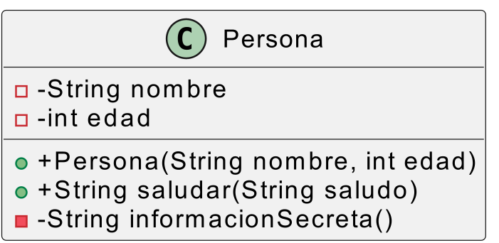
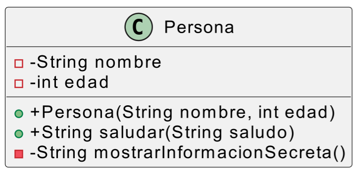

#### *5.d	Se han trazado diagramas de clases a partir de las especificaciones de las mismas.*

### Las especificaciones de las clases pueden ser de mayor o menor nivel

#### Especificaciones de bajo nivel

---

La clase se llama `Persona` y tiene los siguientes miembros:

### **Atributos**  
- `nombre`: Es un atributo privado de tipo `String`. Almacena el nombre de la persona.  
- `edad`: Es un atributo privado de tipo `int`. Almacena la edad de la persona.  

### **Métodos**  
- `Persona(String nombre, int edad)`: Es un constructor público que recibe dos parámetros, un `String` para el nombre y un `int` para la edad. Inicializa los atributos de la clase con estos valores.  
- `saludar(String saludo)`: Es un método público que recibe un `String` como parámetro y devuelve otro `String`. Construye un mensaje que combina el saludo recibido con el nombre de la persona.  
- `informacionSecreta()`: Es un método privado que no recibe parámetros y devuelve un `String`. Devuelve información interna de la persona que no es accesible desde fuera de la clase.  

#### Especificaciones de alto nivel

### **Descripción de alto nivel del proyecto**  

Se plantea el desarrollo de una aplicación orientada a la gestión de personas en un determinado contexto, como puede ser un sistema de registro de usuarios. 

En este sistema, cada persona tiene características básicas que deben ser almacenadas y gestionadas, como su nombre y edad. Además, es necesario proporcionar funcionalidades que permitan interactuar con estas personas de manera estructurada, permietiendo que las personas saluden a cualquier otro elemento del sistema.  

Parte de la información que almacenemos de la persona será secreta, por lo que será necesario que la propia persona pueda mostrar esa información solo a quien ella quiera.

