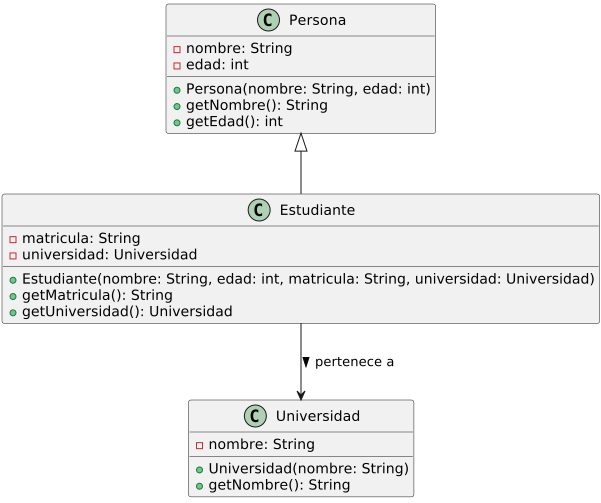

#### 5.e Se ha escrito código a partir de un diagrama de clases.

### Ejemplo de código que responde a un diagrama de clases:


```
// Clase base Persona
class Persona {
private String nombre;
private int edad;

    public Persona(String nombre, int edad) {
        this.nombre = nombre;
        this.edad = edad;
    }

    public String getNombre() {
        return nombre;
    }

    public int getEdad() {
        return edad;
    }
}

// Clase Estudiante que hereda de Persona
class Estudiante extends Persona {
private String matricula;
private Universidad universidad; // Asociación unidireccional

    public Estudiante(String nombre, int edad, String matricula, Universidad universidad) {
        super(nombre, edad);
        this.matricula = matricula;
        this.universidad = universidad;
    }

    public String getMatricula() {
        return matricula;
    }

    public Universidad getUniversidad() {
        return universidad;
    }
}

// Clase Universidad sin referencia a los estudiantes
class Universidad {
private String nombre;

    public Universidad(String nombre) {
        this.nombre = nombre;
    }

    public String getNombre() {
        return nombre;
    }
}

// Programa principal
public class Main {
public static void main(String[] args) {
Universidad uni = new Universidad("Universidad Central");

        Estudiante est1 = new Estudiante("Juan Pérez", 20, "12345", uni);
        Estudiante est2 = new Estudiante("Ana Gómez", 22, "67890", uni);

        System.out.println("Información de los estudiantes:");
        System.out.println(est1.getNombre() + " - Matrícula: " + est1.getMatricula() + " - Universidad: " + est1.getUniversidad().getNombre());
        System.out.println(est2.getNombre() + " - Matrícula: " + est2.getMatricula() + " - Universidad: " + est2.getUniversidad().getNombre());
    }
}
```