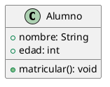

### **Guía detallada para configurar PlantUML en IntelliJ con renderizado local (Graphviz)**  

Si no quieres depender de internet para generar diagramas UML con PlantUML en **IntelliJ IDEA**, necesitas configurar el renderizado local usando **Graphviz**. A continuación, te dejo una guía paso a paso para instalarlo y configurarlo correctamente.  

---

## **1️⃣ Instalar Graphviz**
Graphviz es la herramienta que PlantUML usa para renderizar diagramas localmente.  

### **🔹 En Windows**
1. **Descargar Graphviz** desde su página oficial:  
   👉 [https://graphviz.gitlab.io/download/](https://graphviz.gitlab.io/download/)
2. Instalarlo seleccionando la opción predeterminada.
3. **Añadir Graphviz al PATH** (si no lo hace automáticamente):  
   - Abre el **Símbolo del sistema (cmd)** y ejecuta:
     ```cmd
     dot -version
     ```
   - Si no reconoce el comando, agrega Graphviz al PATH manualmente:
     1. Ve a **Panel de control** → **Sistema** → **Configuración avanzada del sistema**.
     2. En la pestaña **Opciones avanzadas**, haz clic en **Variables de entorno**.
     3. En **Variables del sistema**, busca `Path` y haz clic en **Editar**.
     4. Agrega la ruta donde instalaste Graphviz, normalmente:
        ```
        C:\Program Files\Graphviz\bin
        ```
     5. Guarda los cambios y reinicia IntelliJ.

### **🔹 En Linux (Ubuntu/Debian)**
Ejecuta en la terminal:
```bash
sudo apt update
sudo apt install graphviz
```
Verifica la instalación con:
```bash
dot -version
```

### **🔹 En macOS**
Ejecuta en la terminal:
```bash
brew install graphviz
```

---

## **2️⃣ Instalar el Plugin PlantUML en IntelliJ**
Si aún no lo tienes instalado:
1. Abre **IntelliJ IDEA**.
2. Ve a **File** → **Settings** → **Plugins**.
3. Busca **PlantUML Integration** en el **Marketplace**.
4. Haz clic en **Install** y luego en **Restart IDE**.

---

## **3️⃣ Configurar PlantUML para renderizar localmente**
1. En IntelliJ, ve a **File** → **Settings** (`Ctrl + Alt + S`).
2. Busca **Languages & Frameworks** → **PlantUML**.
3. En la opción **PlantUML Render**, selecciona **Local Graphviz**.
4. En **Graphviz Dot Executable**, verifica que apunte a la ubicación de `dot`:
   - En Windows:  
     ```
     C:\Program Files\Graphviz\bin\dot.exe
     ```
   - En Linux/macOS:
     ```
     /usr/bin/dot
     ```
5. Haz clic en **Apply** y luego en **OK**.

---

## **4️⃣ Crear y visualizar un diagrama UML**
1. En el **Explorador de Proyectos**, haz clic derecho en la carpeta de tu proyecto.
2. Selecciona **New** → **File**.
3. Nómbralo `Alumno.puml`.
4. Escribe el siguiente código UML:



5. Guarda el archivo (`Ctrl + S`).
6. Para ver el diagrama, abre `Alumno.puml` y presiona `Alt + Shift + P` o selecciona **Show UML Diagram** en la pestaña de vista previa.

---

## **5️⃣ Solución de problemas comunes**
### **❌ No se genera el diagrama**
✔ Verifica que `dot` está instalado ejecutando:
```cmd
dot -version
```
✔ Revisa la configuración en IntelliJ:  
   **File** → **Settings** → **Languages & Frameworks** → **PlantUML** → **Local Graphviz**.  
✔ Reinicia IntelliJ después de hacer cambios.

### **❌ IntelliJ no encuentra `dot.exe` (Windows)**
✔ Asegúrate de que `C:\Program Files\Graphviz\bin` está en el `Path`.  
✔ Si el problema persiste, reinicia tu PC y prueba nuevamente.

---

## **Conclusión**
Ahora tienes **PlantUML funcionando en IntelliJ sin necesidad de internet**, gracias a Graphviz. Esto te permite generar diagramas UML de forma rápida y completamente local. 🎯🚀