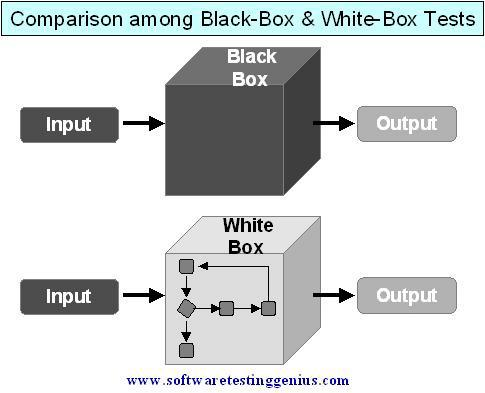
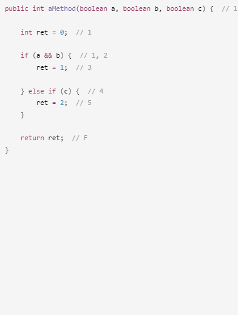
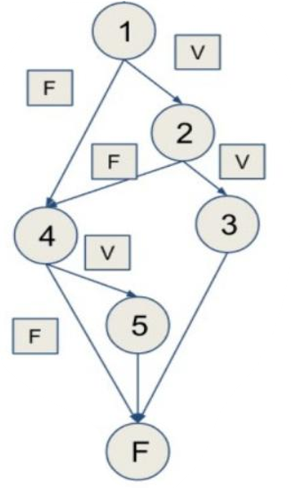
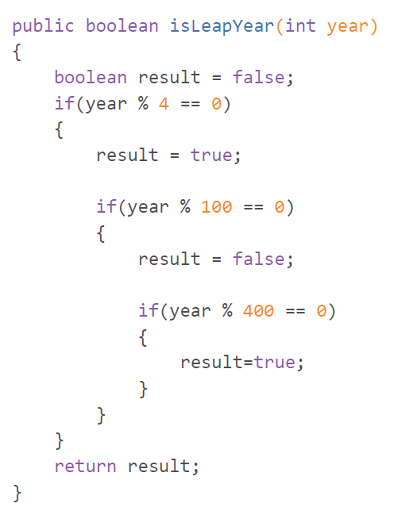
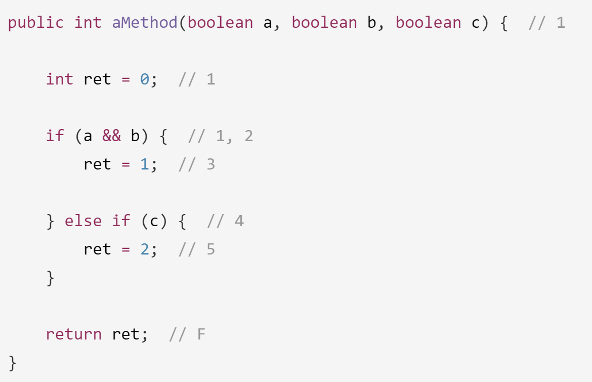

# ENTORNOS DE DESARROLLO **DAM 1**

**Basado en el trabajo de** [Nacho Iborra](https://nachoiborraies.github.io/) [Entornos](https://nachoiborraies.github.io/entornos/)

**Bajo licencia** [CCBY-NC-SA](https://creativecommons.org/licenses/by-nc/4.0/)


# **UT 6: diseño de pruebas**

### Contenido

- [ENTORNOS DE DESARROLLO **DAM 1**](#entornos-de-desarrollo-dam-1)
- [**UT 6: diseño de pruebas**](#ut-6-diseño-de-pruebas)
    - [Contenido](#contenido)
- [A - Introducción a las pruebas de software](#a---introducción-a-las-pruebas-de-software)
  - [1. Objetivos y principios de las pruebas de software](#1-objetivos-y-principios-de-las-pruebas-de-software)
  - [2. Etapas de las pruebas de software](#2-etapas-de-las-pruebas-de-software)
    - [2.1. Evaluación de los resultados](#21-evaluación-de-los-resultados)
    - [2.2. Definición de caso de prueba](#22-definición-de-caso-de-prueba)
  - [3. Tipos de pruebas](#3-tipos-de-pruebas)
    - [3.1. Pruebas unitarias](#31-pruebas-unitarias)
    - [3.2. Pruebas de integración](#32-pruebas-de-integración)
    - [3.3. Pruebas de regresión](#33-pruebas-de-regresión)
    - [3.4. Pruebas de nivel superior](#34-pruebas-de-nivel-superior)
    - [CI/CD: *Integración Continua / Despliegue Continuo*](#cicd-integración-continua--despliegue-continuo)
  - [4. Casos de prueba](#4-casos-de-prueba)
- [B - Diseño de pruebas unitarias](#b---diseño-de-pruebas-unitarias)
  - [1. Pruebas de caja blanca](#1-pruebas-de-caja-blanca)
    - [1.1. Pruebas de ruta o camino básico](#11-pruebas-de-ruta-o-camino-básico)
    - [1.2 Grado de cobertura](#12-grado-de-cobertura)
    - [1.3. Pruebas de condición](#13-pruebas-de-condición)
    - [1.4. Ensayos de bucle](#14-ensayos-de-bucle)
  - [2. Pruebas de caja negra](#2-pruebas-de-caja-negra)
    - [2.1. Partición equivalente](#21-partición-equivalente)
    - [2.2. Análisis de los valores límite](#22-análisis-de-los-valores-límite)
  - [Anexos](#anexos)
    - [I Dibujar grafos de flujo](#i-dibujar-grafos-de-flujo)
    - [II Calcular complejidad ciclomática](#ii-calcular-complejidad-ciclomática)
  - [Control de cambios](#control-de-cambios)


# A - Introducción a las pruebas de software

Como vimos en secciones anteriores de este curso, una de las etapas en
el proceso de desarrollo de software es la prueba. Y es una etapa
realmente importante. En este
[video](https://www.youtube.com/watch?v=TDynSmrzpXw&list=PLDC2A0C8D2EC934C7)
(que muestra diferentes desastres causados por fallos de software)
puedes ver lo importante que es configurar una etapa de prueba adecuada
y eficiente.

Las pruebas de software consisten en la **verificación** dinámica del
comportamiento de un programa, con un conjunto de **casos de prueba**
correctamente seleccionados. Se realizan pruebas para encontrar posibles
errores en la implementación, calidad o usabilidad de un software
determinado.

## 1. Objetivos y principios de las pruebas de software

Los principales objetivos de las pruebas de software son:

-   Detectar errores de software

-   Corregir estos errores

-   Comprobar la integración adecuada de los componentes

-   Asegurar que se hayan implementado todos los requisitos

Para alcanzar estos objetivos, las pruebas de software deben seguir un conjunto de principios:

-   La prueba puede ayudarnos a encontrar errores, pero no su ausencia.

-   Se debe planificar la realización de las pruebas.

-   El número de errores que se encuentran es directamente proporcional al número de errores ya encontrados. Si una prueba suele detectar errores, es una buena prueba.

-   La elección adecuada de los casos de prueba (datos que usaremos para
    probar) es fundamental.

-   Los casos de prueba deben escribirse tanto para entradas válidas
    como no válidas o inesperadas. Evitar casos triviales o repetitivos.

-   La cantidad de pruebas puede crecer indefinidamente, debemos saber
    cuándo parar.

## 2. Etapas de las pruebas de software

Las etapas de cada proceso de prueba son:

1.  Seleccionar el objetivo principal.

2.  Decidir qué tipo de prueba se va a realizar y qué tipo de elementos
    necesitamos para hacerla.

3.  Implementar los casos de prueba. Un *caso de prueba* es un conjunto
    de datos o condiciones de entrada que se utilizarán para revelar
    algo sobre el programa o los atributos que estamos verificando.

4.  Determine los resultados esperados de los casos de prueba y cree un
    documento con todos ellos.

5.  Ejecutar las pruebas.

6.  Evaluación de los resultados.

7.  Plan de acciones correctoras.

    1.  *ejemplos: resistencia de una silla vs comodidad de una silla*

### 2.1. Evaluación de los resultados

La evaluación de los resultados consiste en comparar los resultados
reales de las pruebas con los resultados esperados. Cada diferencia
entre ellos significa que hay un error y este error generalmente se debe
a la unidad o atributo que estamos probando.

De la evaluación de resultados debe salir un plan de acciones
correctoras. En él se debe incluir un listado de los errores detectados
y las propuestas de solución asociadas.

### 2.2. Definición de caso de prueba

Un caso de prueba es el conjunto formado por unas entradas (de prueba),
unas condiciones de ejecución y unos resultados esperados. Tiene como
objetivo concreto realizar una prueba concreta del código.

Supongamos que queremos diseñar un caso de prueba para un procedimiento
que nos valida el 'login' al sistema. Un posible caso de prueba podría
ser el siguiente:

-   **ENTRADA**: usuario "hacker" password "kaixo"

-   **CONDICIONES** DE EJECUCIÓN: en la base de datos, no existe en la
    tabla CUENTA(usuario, pass, intentos) la tupla \<"hacker", "kaixo",
    x\> pero sí una tupla \<"hacker", "hola", x\>

-   **RESULTADO** ESPERADO: no deja entrar y cambia la tupla a
    \<"hacker", "hola", x+1\>

El **objetivo** del caso de prueba es comprobar que no se deja entrar a
un usuario existente con una contraseña equivocada.

El Procedimiento de prueba serían los pasos que hay que llevar a cabo
para probar uno (o varios) casos de prueba. Para el caso anterior, un
posible procedimiento de prueba podría ser el siguiente:

1)  Ejecutar la clase Presentación

2)  Comprobar que en la BD "passwords.mdb" existe la tupla \<"hacker",
    "hola", x\>

3)  Escribir "hacker" en la interfaz gráfica (en el campo de texto
    etiquetado "Escribe nombre usuario")

4)  Escribir "kaixo" en la interfaz gráfica (en el campo de texto
    "Escribe password")

5)  Pulsar botón "Acceder al sistema"

6)  Comprobar que no deja entrar al sistema y que en la BD la tupla ha
    cambiado a \<"hacker", "hola", x+1\>

Un buen caso de prueba es aquel que tiene una probabilidad muy alta de
descubrir un nuevo error. Un caso de prueba no debe ser redundante y
debe ser el mejor de un conjunto de pruebas de propósito similar.

No debe ser ni muy sencillo ni excesivamente complejo: es mejor realizar
cada prueba de forma separada si se quiere probar diferentes casos.

Una prueba tiene éxito si descubre un error.

*(recordemos que las pruebas no sirven para asegurar la ausencia de
errores)*

## 3. Tipos de pruebas

Hay diferentes tipos de pruebas. Vamos a verlos de nivel inferior a
superior.

### 3.1. Pruebas unitarias

Las pruebas unitarias comprueban el comportamiento apropiado de una
**unidad de código**. Una unidad de código es típicamente una **clase**
en lenguajes orientados a objetos (Java, C#\...), o un **conjunto de
funciones** estrechamente relacionadas en lenguajes no orientados a
objetos (C, JavaScript\...). Por lo general, son administrados por el
equipo de desarrollo y deben ser:

-   Automatizables

-   Completas

-   Repetibles

-   Independientes (una prueba unitaria no debe afectar el resultado de
    otra)

*(con este tipo de pruebas vamos a trabajar en la parte práctica)*

### 3.2. Pruebas de integración

Intentan encontrar errores en las conexiones de interfaz y/o en la
**interacción** entre diferentes componentes o **unidades** de una
aplicación. En otras palabras, una vez que las pruebas unitarias son
exitosas, tratamos de unir todas (o algunas de) estas unidades y ver
cómo funciona el programa. Son realizadas por el equipo de desarrollo
aplicando algunas de estas técnicas:

-   **Big bang**: consiste en integrar y probar todo a la vez (no se
    recomienda, a menos que el proyecto sea muy simple)

-   **De arriba hacia abajo**: los componentes se prueban de acuerdo con
    su jerarquía, de arriba hacia abajo. De esta manera, los componentes
    inferiores que aún no están implementados o probados son
    reemplazados por componentes auxiliares que **simulan** su
    comportamiento. Por lo tanto, las interfaces entre los componentes
    se verifican en las primeras etapas del proyecto.

-   **De abajo hacia arriba**: los componentes inferiores se implementan
    y prueban en primer lugar, por lo que no necesitamos ningún
    componente auxiliar para reemplazarlos. A medida que se prueban, los
    componentes superiores también se pueden integrar y probar.

### 3.3. Pruebas de regresión

Son una variación de las pruebas de integración.

Cuando se realiza un cambio en la implementación se repiten pruebas ya
realizadas con el fin de verificar que el cambio no tiene consecuencias
en el funcionamiento del resto del programa.

Estos fallos se pueden encontrar tanto en el código modificado como en
cualquier otro componente integrado o relacionado con el que se ha
modificado.

### 3.4. Pruebas de nivel superior

Después de las etapas de pruebas de unidad e integración, todavía
podemos diferenciar dos tipos adicionales de pruebas:

-   Pruebas de ***validación***: estas pruebas son realizadas por clientes y
    jefes de proyecto con el fin de comprobar que se cumplen **todos los
    requisitos** registrados en la fase de análisis.

-   Pruebas de ***aceptación***: las realizan los usuarios.

    -   Pruebas **alfa**: las realiza el usuario en presencia de
        personal de desarrollo del proyecto haciendo uso de una máquina
        y en un entorno provisionales.

    -   Pruebas **beta**: las realiza el usuario en la máquina y el
        entorno reales en los que va a utilizarse el producto.

-   Pruebas del ***sistema***: debe demostrar que el despliegue de la
    aplicación en su entorno real es exitoso y que su comportamiento es
    el esperado. En estas pruebas el cliente también está involucrado
    junto con el gerente del proyecto o el equipo de desarrollo.

    -   Las pruebas de **rendimiento** se basan en comprobar que el
        sistema puede soportar el volumen de carga definido en la
        especificación, es decir, hay que comprobar la eficiencia (*Ej:
        Se ha montado una página web sobre un servidor y hay que probar
        qué capacidad tiene de aceptar peticiones*).

    -   Las pruebas de **recuperación** fuerzan un fallo del sistema y
        analiza si la recuperación se ha llevado a cabo
        satisfactoriamente.

    -   Las pruebas de **seguridad** verifican que el sistema está
        protegido frente a accesos ilegales.

### CI/CD: *Integración Continua / Despliegue Continuo*

Integración, entrega y despliegue continuos son tres conceptos
fundamentales en el desarrollo de software moderno que buscan mejorar la
eficiencia y calidad en el proceso de desarrollo.

**Integración Continua (CI)**: Es una práctica en la que los cambios de
código se integran y se prueban automáticamente de manera regular,
varias veces al día. El objetivo es detectar y corregir errores de forma
temprana, facilitando la detección de conflictos entre códigos nuevos y
existentes. Esto se logra mediante la automatización de pruebas y la
ejecución de integraciones cada vez que se realiza un cambio en el
repositorio de código.
Los compañeros verán nuestros cambios integrados en el proyecto cada vez que se superen las pruebas y se realice la integración.
**Despliegue Continuo (CD)**: Es el nivel más avanzado dentro de la cadena
de prácticas de CI/CD. En el despliegue continuo, además de la
integración y entrega automáticas, el software se despliega en
producción de manera automatizada tan pronto como pasa las pruebas de
calidad. Esto implica que los cambios en el código se implementan en
producción de forma casi instantánea una vez que son validados, lo que
acelera significativamente la velocidad de entrega y redunda en una
mayor agilidad y capacidad de respuesta ante los cambios.
Los clientes verán los cambios cada vez que estos superen las pruebas y se realice el desliegue automático.

([Ampliación](https://ilimit.com/blog/integracion-continua-entrega-continua-despliegue-continuo/))

## 4. Casos de prueba

Cuando queremos hacer cualquier prueba sobre una aplicación, necesitamos
diseñar los ***casos de prueba***. Como hemos dicho antes, son un
conjunto de condiciones que pueden determinar si el software funciona
correctamente o no. La definición concreta según el ISTQB (International
Software Testing Qualifications Board) es: \"*un conjunto de valores de
entrada, condiciones previas de ejecución, resultados esperados y
postcondiciones de ejecución, desarrollados para un objetivo particular
o condiciones de prueba, como ejecutar una ruta de programa particular o
validar el cumplimiento de un requisito específico*\".

Existen varios formatos para documentar los casos de prueba, pero
debemos incluir los siguientes datos de todos modos:

-   Identificador: puede ser numérico o alfanumérico y nos ayuda a
    identificar cada caso de prueba

-   Nombre: un nombre descriptivo (significativo).

-   Condiciones previas: lo que debe estar listo antes de comenzar la
    prueba, como un archivo de entrada determinado, los resultados de
    otros casos de prueba ejecutados anteriormente\...

-   Pasos: define la interacción con el usuario, como introducir un
    nombre, o pulsar un botón.

-   Datos de prueba: datos a utilizar en el caso de prueba, como un
    nombre de usuario concreto, contraseña\...

-   Resultado esperado: lo que la prueba debe producir

-   Resultado obtenido: resultado que realmente obtenemos cuando
    ejecutamos la prueba. Este último campo se rellena cuando ejecutamos
    la prueba, mientras que el resto de los campos deben especificarse
    antes de ejecutar la prueba.

**Ejemplo 0:**

Queremos comprobar el comportamiento de un formulario determinado para
iniciar sesión en una aplicación. Estos son algunos de los casos de
prueba que podríamos especificar:


# B - Diseño de pruebas unitarias

Las pruebas unitarias son una parte esencial de las pruebas de software,
en las que debemos comprobar si cada unidad de nuestra aplicación (clase
o conjunto de funciones) funciona como se espera. Para comprobar esto,
se ejecuta el programa, o parte de él, con el objetivo de encontrar
errores.

**Necesitamos planificar una estrategia para definir el conjunto de
casos de prueba lo más completo posible**.

Existen dos enfoques para diseñar estos casos de prueba unitaria:

-   Enfoque **estructural** o caja **blanca**, en el que nos centramos
    en el funcionamiento interno de las unidades que estamos probando.

-   Enfoque **funcional** o caja **negra**, en el que nos centramos en
    la interfaz de las unidades que estamos probando, esto es, sus
    entradas y salidas, pero no en su comportamiento interno.



## 1. Pruebas de caja blanca

Las pruebas de caja blanca se centran en el funcionamiento interno de un
programa. Estas son las primeras pruebas que debemos aplicar a un
sistema, para que podamos encontrar deficiencias básicas que no están
relacionadas con la interfaz.

Hay varios tipos de pruebas de caja blanca. Podemos aplicar uno o varios
de los siguientes enfoques para completar este tipo de pruebas. Los
enfoques se diferencian en la manera de decidir el número de pruebas que
son necesarias para conseguir un 100% de cobertura.

### 1.1. Pruebas de ruta o camino básico

Este método se centra en determinar la **complejidad** de un fragmento
de código, de modo que usamos esta complejidad para establecer cuántas
**rutas** de ejecución se pueden lograr.

Se basa en un principio que establece que cada diseño procedimental
puede representarse como un *grafo de flujo*. La *complejidad
ciclomática* de este gráfico determina el número de caminos
independientes. Cada uno de estos caminos corresponde a un nuevo
conjunto de sentencias o una nueva condición.

**Ejemplo 1**

Echemos un vistazo a este breve fragmento de código y las posibles rutas
que se pueden ejecutar con él:

```java
public int aMethod(boolean a, boolean b, boolean c) {  // 1

    int ret = 0;  // 1

    if (a && b) {  // 1, 2
        ret = 1;  // 3

    } else if (c) {  // 4
        ret = 2;  // 5
    }  

    return ret;  // F
}
```
 

Si queremos probar correctamente este fragmento de código, necesitamos
probar las siguientes rutas: *(se debe empezar por la más larga)*

1.  1,2,4,5, F *(para la siguiente, cambiamos la última decisión, 4)*

2.  1,2,4, F *(para la siguiente, cambiamos la decisión anterior, 2)*

3.  1,2,3, F *(para la siguiente, cambiamos la última anterior, 1)*

4.  **1,4, F** *(elegimos una de las dos)*

5.  **1,4,5, F** *(elegimos una de las dos)*

Que corresponden a los siguientes casos de prueba:

| ID  | Nombre | Datos de entrada              | Resultados esperados | Resultados obtenidos |
|-----|--------|-------------------------------|----------------------|----------------------|
| 1   | Test1  | a=true, b=false, c=true       | 2                    |                      |
| 2   | Test2  | a=true, b=false, c=false      | 0                    |                      |
| 3   | Test3  | a=true, b=true, c=*           | 1                    |                      |
| 4   | Test4  | **a=false, b=*, c=false**     | 0 - 2                |                      |
|     |        | **a=false, b=*, c=true**      |                      |                      |

Por lo tanto, debemos definir 4 casos de prueba, cada uno
correspondiente a un elemento de la lista anterior, con los valores
apropiados para los parámetros de entrada *a*, *b* y *c*, si queremos
conseguir probar todas las rutas.

[ver anexo I: dibujar grafos de flujo y calcular complejidad ciclomática](#i-dibujar-grafos-de-flujo)


### 1.2 Grado de cobertura

Es la medida en la que un conjunto de casos de prueba cubre el código
fuente de un programa. Es esencial para evaluar la eficacia de las
pruebas y determinar la calidad del software. Existen varios tipos de
cobertura, entre ellos:

**1\. Cobertura de instrucciones**(Statement coverage): Este tipo de
cobertura implica asegurarse de que cada línea de código haya sido
ejecutada al menos una vez durante las pruebas. Es una medida básica de
cobertura y asegura que todas las instrucciones del código han sido
probadas.

**2\. Cobertura de decisiones** (Decision coverage o Branch coverage): Aquí
nos enfocamos en garantizar que cada decisión en el código, como las
condiciones if y los bucles, hayan sido evaluadas tanto como verdaderas
como falsas durante las pruebas. Esto ayuda a detectar posibles
bifurcaciones en el flujo de control que no se están probando.

**3\. Cobertura de condiciones** (Condition coverage): Este tipo de
cobertura se centra en probar cada combinación de resultados de las
condiciones booleanas en el código, asegurando que todas las
combinaciones posibles de condiciones se prueben al menos una vez.

**4\. Cobertura de caminos** (Path coverage): Es el nivel más alto de
cobertura y se asegura de que cada camino a través del código, desde el
inicio hasta el final, se ejecute durante las pruebas. Esto implica
probar todas las combinaciones posibles de ramificaciones y bucles en el
código.

Si solo hemos escrito o pasado satisfactoriamente una parte de las
pruebas, nuestro grado de cobertura será menor del 100%.

**Grado cobertura = pruebas exitosas / pruebas totales**

*(pruebas totales según uno de los procedimientos de diseño que
estamos estudiando)*

Nuestra tabla de casos de prueba puede estar incompleta: (no hemos
diseñado los test que he tachado)

Nuestra tabla de casos de prueba puede estar incompleta: (no hemos diseñado los test que he tachado)

| ID  | Nombre | Datos                         | Resultados esperados | Resultados obtenidos |
|-----|--------|--------------------------------|----------------------|----------------------|
| 1   | Test1  | a=true, b=false, c=true       | 2                    |                      |
| 2   | Test2  | a=true, b=false, c=false      | 0                    |                      |
| ~~3~~ | ~~Test3~~ | ~~a=true, b=true, c=*~~     | ~~1~~                 |                      |
| ~~4~~ | ~~Test4~~ | **~~a=false, b=*, c=false~~** | ~~0 - 2~~             |                      |
|     |        | **~~a=false, b=*, c=true~~**  |                      |                      |


O, estando completa, algunas pruebas no se pasan con éxito:


| ID  | Nombre | Datos                         | Resultados esperados | Resultados obtenidos  |
|-----|--------|-------------------------------|----------------------|-----------------------|
| 1   | Test1  | a=true, b=false, c=true       | 2                    | 2                     |
| 2   | Test2  | a=true, b=false, c=false      | 0                    | 0                     |
| 3   | Test3  | a=true, b=true, c=*           | **1**                | **2**                 |
| 4   | Test4  | **a=false, b=*, c=false**     | **0 - 2**            | **4**                 |
|     |        | **a=false, b=*, c=true**      |                      |                       |


***En ambos casos, el grado de cobertura es del 50%.***

### 1.3. Pruebas de condición

Este método es similar al anterior: evalúa todas las rutas posibles del
código, pero solo se centra en las condiciones del código. Echemos un
vistazo a este

**Ejemplo 2:**

*(leapyear = año
[bisiesto](https://es.wikipedia.org/wiki/A%C3%B1o_bisiesto#Algoritmo_computacional))*


Condiciones:


A partir de este conjunto de condiciones, necesitamos construir la
**tabla de verdad** para verificar todas las combinaciones posibles:


Como podemos ver, los casos 3 y 4 conducen al mismo resultado
independientemente del valor de C3. Y lo mismo sucede con los casos 5 a
8 (la condición C1 determina el resultado final independientemente de
las otras dos condiciones). Así que las pruebas necesarias para esta
función son:


Nuevamente, necesitamos diseñar 4 casos de prueba asociados a las 4
filas de la tabla anterior.

**Completar ejemplo 2: hacer la tabla de casos de prueba.**

**Tarea 2a:**

Repita el ejercicio 1 utilizando ahora el enfoque de *pruebas de
condición*.


**Tarea 2b:**

Repita el ejemplo 1 utilizando ahora el enfoque de *pruebas de
condición*.

!


**Tarea 2c:**

Diseñe el conjunto de pruebas de caja blanca del algoritmo que
identifica los años bisiestos (ejemplo 2) utilizando el enfoque de los
**caminos básicos**.

### 1.4. Ensayos de bucle

Esta prueba evalúa las diferentes rutas que se pueden seguir dentro de
un bucle. Para cada bucle con n iteraciones, debemos comprobar si:

-   El bucle nunca se itera

-   El bucle se itera sólo una vez

-   El bucle se itera dos veces

-   El bucle se itera m veces, siendo m \< n

-   El bucle realiza n iteraciones.

Si tenemos algún bucle anidado, debemos comenzar explorando los bucles
internos y luego ir a los externos.

**Ejemplo 3**

Por ejemplo, echemos un vistazo al siguiente código que comprueba si un
número determinado (previamente ingresado por el usuario) es **primo** o
no:


Se espera que el bucle se ejecute hasta *N = número / 2 - 1* veces más.
**Desde el enfoque de prueba de *bucle***, debemos diseñar casos de
prueba en los que:

-   El bucle nunca se itera. Por ejemplo, si *el número* es 2, es
    automáticamente primo, no se realiza ninguna iteración

    -   También podríamos probar el caso de 0 y 1, que están cubiertos
        con la primera cláusula *if*

-   El bucle se itera una vez. Esto se puede lograr con *el número = 3*
    El bucle se itera dos veces. Por ejemplo, con *número = 9*

-   El bucle se itera *m* veces \< *N*. Por ejemplo, para *el número =
    25* el bucle se itera 4 veces.

-   El bucle se itera N veces y/o *N-1* veces. Para alcanzar *N* veces,
    solo necesitamos un número primo, como 23.

Así que podríamos construir esta tabla para los casos de prueba:


**Tarea 3**:

El siguiente fragmento de código comprueba si un número tiene sus
dígitos en orden ascendente:


-   Explica el funcionamiento del código.

-   Diseñe una tabla de casos de prueba para cada posible iteración de
    bucle, según el ejemplo anterior.

## 2. Pruebas de caja negra

Estas pruebas se centran en la entrada y salida de la aplicación o
módulo a probar y no necesitamos prestar atención al código interno de
este módulo. También hay algunas técnicas diferentes que podemos aplicar
a estas pruebas.

### 2.1. Partición equivalente

Consiste en dividir las posibles entradas de la aplicación en grupos
llamados *clases de* *equivalencia*. La prueba de un valor
representativo de cada clase de equivalencia permite suponer que el
resultado que se obtiene con él será el mismo que con cualquier otro
valor de la clase.


Algunos valores de entrada serán entradas válidos y otros no serán
válidos, por lo que debemos diseñar casos de prueba para verificar
clases de equivalencia válidas y no válidas.

**Ejemplo 4**

*Si tenemos un método para determinar el monto total de una venta, dado el **concepto** (cadena que comienza con letra), la **cantidad (amount)** del producto (entero distinto de 0) y el **precio** del producto (double mayor o igual que cero), las posibles clases de equivalencia son:*

| **Condición de entrada**         | **Clase válida**        | **Clase inválida**                                      |
|----------------------------------|-------------------------|---------------------------------------------------------|
| **Concepto** no vacío que comienza con una letra | `String = letter+*`   | `String` vacío, `String` que comienza por número, o `String` que comienza por un carácter especial |
| **Cantidad** entera distinta de 0 | Cantidad distinta de 0  | Cantidad = 0 o no entera                               |
| **Precio** `double` mayor o igual a 0 | `Price >= 0`          | Precio `< 0` o no numérico                             |


Una vez definidas las clases de equivalencia, podemos diseñar los casos de prueba:

| **ID** | **Nombre**          | **Precondiciones**         | **Pasos**                                      | **Datos**                                 | **Resultado esperado**                 | **Resultado real** |
|--------|---------------------|---------------------------|------------------------------------------------|--------------------------------------------|----------------------------------------|-------------------|
| U1     | Válido              | _SalesList_ existe        | Ingresar clases válidas para concepto, cantidad y precio | concept="screw", cantidad=2, precio=2    | 0, se añade un nuevo elemento         |                   |
| U2     | ConceptoNoVálido1   | _SalesList_ existe        | Ingresar cadena vacía como concepto           | concept="", cantidad=2, precio=2         | -1, no se añade ningún elemento       |                   |
| U3     | ConceptoNoVálido2   | _SalesList_ existe        | Ingresar cadena que empieza con número        | concept="2screw", cantidad=2, precio=2   | -1, no se añade ningún elemento       |                   |
| U4     | ConceptoNoVálido3   | _SalesList_ existe        | Ingresar cadena que empieza con carácter especial | concept="@screw", cantidad=2, precio=2  | -1, no se añade ningún elemento       |                   |
| U5     | CantidadVálida      | _SalesList_ existe        | Ingresar cantidad negativa                    | concept="screw", cantidad=-2, precio=2   | 0, se añade un nuevo elemento         |                   |
| U6     | CantidadNoVálida    | _SalesList_ existe        | Ingresar cantidad igual a 0                   | concept="screw", cantidad=0, precio=2    | -1, no se añade ningún elemento       |                   |


**Tarea 5:**

Se le ha pedido que implemente las pruebas para una clase denominada
*SalesList (lista de ventas)*, cuyo atributo es ***List\<Venta\>***.
Cada venta tiene una descripción: String, un importe: double, una
cantidad: int y un precio: double..

La clase tiene los siguientes métodos:

1.  ***addSale(String concepto, int cantidad, double precio)***

Añade un nuevo elemento a la ***Lista*** con el concepto especificado
como descripción del producto. El **importe** se calculará multiplicando
la **cantidad** y el **precio**. Devolverá 0 si todo está bien y -1 si
hay algún error. *[No]{.mark} podremos sumar ventas con [importe =
0]{.mark} o precio \< 0, pero sí podemos añadir ventas con importes
negativos (pero no precios negativos).*

2.  ***getTotal()***

Devolverá la suma total de los ingresos de la ***Lista***.

3.  ***getAverage()***

4.  Devolverá el promedio de ingresos.

Diseñar los posibles casos de prueba para cada método de la clase. Con
respecto al método ***addSale***, solo tiene que completar la tabla de
casos de prueba. Para los métodos ***getTotal*** y ***getAverage***,
solo necesita establecer las condiciones previas para obtener el
resultado deseado, ya que no tienen parámetros.

### 2.2. Análisis de los valores límite

Para diseñar los casos de prueba, tenemos en cuenta las condiciones de
entrada y salida:

-   Si la condición de entrada es un rango, debemos diseñar casos de
    prueba para los límites de este rango y para los valores justo por
    encima y por debajo.

-   Si la condición de entrada solicita un conjunto finito de valores,
    debemos definir los casos de prueba la cantidad mínima y máxima de
    entradas y, además, una entrada menos que la mínima y una entrada
    más que las máximas.

-   Debemos aplicar estas mismas reglas para las condiciones de salida.

**Ejemplo 5**

Supongamos que estamos probando una función que comprueba el promedio de
una lista de notas que debe contener entre 3 y 9 notas. En este caso,
debemos definir estos casos de prueba para comprobar los valores de
entrada:

-   Listas de 2, 3 y 4 notas

    -   En cuanto al caso de 2 notas, debería producir un error

-   Listas de 8, 9 y 10 notas

    -   Nuevamente, con respecto al caso de 10 notas, también debería
        producir un error

En cuanto a los valores de salida, el promedio debe estar entre 0 y 10,
por lo que también debemos definir casos para:

-   Medias finales de -1, 0 y 1

-   Medias finales de 9, 10 y 11

Dependiendo del código interno de la función a probar, a veces algunos
de estos casos son imposibles de alcanzar. Por ejemplo, si nos
aseguramos de que las notas sean todas valores entre 0 y 10 nunca
obtendremos un promedio \< 0 o \> 10.

Una posible tabla de casos de prueba para este ejemplo podría ser esta:

| **ID**  | **Nombre**     | **Datos**                | **Resultado esperado** | **Resultado obtenido** |
|---------|--------------|-------------------------|----------------------|-------------------|
| TC1     | 2Notas      | [2, 6]                  | Error                |                   |
| TC2     | 3Notas      | [4, 5, 6]               | 5                    |                   |
| TC3     | 4Notas      | [7, 7, 9, 9]            | 8                    |                   |
| TC4     | 8Notas      | [1, 2, 3, 4, 6, 7, 8, 9]| 5                    |                   |
| TC5     | 9Notas      | [2, 3, 4, 5, 6, 7, 8, 9, 10] | 6                |                   |
| TC6     | 10Notas     | [1, 2, 3, 4, 5, 6, 7, 8, 9, 10] | Error           |                   |
| TC7     | Promedio-1  | [-2, -1, -1]            | Error                |                   |
| TC8     | Promedio0   | [0, 0, 0]               | 0                    |                   |
| TC9     | Promedio1   | [0, 1, 2]               | 1                    |                   |
| TC10    | Promedio9   | [8, 9, 10]              | 9                    |                   |
| TC11    | Promedio10  | [10, 10, 10]            | 10                   |                   |
| TC12    | Promedio11  | [10, 11, 12]            | Error                |                   |


**Tarea 6:**

Vamos a probar una función que tiene como entrada el día de un mes
(entero entre 1 y 31) y un número de mes (entero entre 1 y 12) y
devuelve cuántos días quedan en este mes (un entero entre 1 y 30,
dependiendo del mes).

***int getDaysLeft(int dayOfMonth, int monthNumber) { \... }***

Escriba la tabla con los posibles casos de prueba para cubrir todos los
valores límite.

## Anexos

### I Dibujar grafos de flujo

El grafo de flujo se utiliza para representar flujo de control lógico de
un programa. Para ello se utilizan los tres elementos siguientes:

-   **Nodos**: representan cero, una o varias sentencias en secuencia.
    Cada nodo comprende como máximo una sentencia de decisión
    (bifurcación).

-   **Aristas**: líneas que unen dos nodos.

-   **Regiones**: áreas delimitadas por aristas y nodos. Cuando se
    contabilizan las regiones de un programa debe incluirse el área
    externa como una región más.

-   **Nodos predicado**: de él **salen** dos aristas.

-   Cuando en una condición aparecen uno o más operadores lógicos (AND,
    OR, XOR, \...) se crea un nodo distinto por cada una de las
    condiciones simples. Cada nodo generado de esta forma se denomina
    nodo predicado. La figura muestra un ejemplo de condición múltiple.


La siguiente figura muestra como representar las sentencias y
estructuras de control que componen habitualmente nuestros programas.

{width="7.524409448818898in"
height="4.100458223972003in"}

**Ejemplos G1 y G2**


### II Calcular complejidad ciclomática

Una vez representado nuestro programa como un grafo de flujo, la
complejidad ciclomática se calcula de diferentes maneras:

**1.  Contando el número de regiones (no olvidar la región exterior)**

2.  Aristas menos nodos + 2

3.  Nodos predicado + 1

## Control de cambios
25 Pasar a md

24 Añadido cálculo del grado de cobertura

Simplificada la tarea 5: cambio hashMap por List

Revisión de figuras
