## **UT 08: REFACTORIZACIÓN**

#### Contenido

[Contenido [2](#_Toc132355401)]

[1. Introducción [3](#introducción)]

[2. Herramientas para el control y documentación de software [6](#herramientas-para-el-control-y-documentación-de-software)]

[2.1 Refactorización [6](#refactorización)]

[2.1.1 Ventajas y limitaciones de la refactorización [9](#ventajas-y-limitaciones-de-la-refactorización)]

[2.1.2 Limitaciones de la refactorización [11](#limitaciones-de-la-refactorización)]

[2.1.3 Patrones de refactorización más usuales [12](#patrones-de-refactorización-más-usuales)]

[2.1.4 Renombrar [14](#renombrar)]

[2.1.5 Mover [15](#mover)]

[2.1.6 Extraer una variable local [16](#extraer-una-variable-local)]

[2.1.7 Extraer una constante [17](#extraer-una-constante)]

[2.1.8 Convertir una variable local en un campo o atributo [18](#convertir-una-variable-local-en-un-campo-o-atributo)]

[2.1.9 Extraer una interfaz [20](#extraer-una-interfaz)]

[2.1.10 Extraer el método [22](#extraer-el-método)]

[2.2 Pruebas y refactorización. Herramientas de ayuda a la refactorización [23](#pruebas-y-refactorización.-herramientas-de-ayuda-a-la-refactorización)]

[2.2.1 Herramientas para la ayuda a la refactorización [25](#herramientas-para-la-ayuda-a-la-refactorización)]

Derivado del trabajo realizado por Marcel García Vacas para el [IOC](https://ioc.xtec.cat/materials/FP/Recursos/fp_dam_m05_/web/fp_dam_m05_htmlindex/index.html).

Con [licencia](https://creativecommons.org/licenses/by-nc-sa/3.0/es/deed.es) Atribución-NoComercial-CompartirIgual 3.0 España (CC BY-NC-SA 3.0 ES)

# Introducción

Un usuario final de una aplicación informática no es conocedor de cómo ha sido implementada ni codificada. Lo más importante para él o ella es que esta aplicación haga lo que tenga que hacer, y, además, que lo haga en el menor tiempo posible. ¿Qué importancia tendrá para un usuario utilizar dos productos que, en definitiva, ofrecen las mismas características? Imaginemos el caso de dos televisores. Si los dos reproducen los mismos canales y tienen las mismas pulgadas e idénticas características técnicas, ¿qué nos hará decidir si usar el uno u otro? Posiblemente, en el caso de los televisores habrá intangibles, como la marca o la estética u otras características subjetivas. Pero, en el caso de las aplicaciones informáticas o de las páginas web, ¿cuál puede ser el elemento que haga que una sea mejor que la otra si hacen exactamente lo mismo y tienen las mismas interfaces?

En el caso del software, todo esto es un poco abstracto; habrá muchos intangibles que pueden hacer decantar hacia una aplicación o hacia otra. Pero lo que seguro que será diferente es la forma de haber creado y desarrollado estas aplicaciones.

En esta unidad, \"Optimización de software\", vemos estas diferencias entre un código de programación normal y un código optimizado, y estudiaremos las características que diferencian un tipo de código de otro y las herramientas de las que se puede disponer para hacerlo.

En el apartado \"Diseño y realización de pruebas de software\" se explican las diferentes formas y técnicas que permiten validar la corrección del software desarrollado y su optimización. Hay muchas formas de poder crear aplicaciones que hagan lo que tienen que hacer y que cumplan los requerimientos establecidos para los futuros usuarios. Y muchas veces, las diferencias en el momento de la creación y del desarrollo de las aplicaciones harán que una se pueda considerar mucho mejor que la otra, y por lo tanto recomendable.

¿Qué significa haber desarrollado mejor una aplicación informática? **Significará que su código de programación sea óptimo, que haya seguido los patrones de optimización más recomendados, que se hayan llevado a cabo todas las pruebas que hay que hacer para validar un funcionamiento correcto al 100%, que su desarrollo se haya documentado, habiendo un control de versiones exhaustivo y muchos otros detalles que se verán en esta unidad formativa.**

En cambio, una aplicación informática, sobre todo si es de código abierto o se ha desarrollado a medida por una empresa externa o por el propio departamento de informática de una organización, puede ser un producto vivo, en continua evolución. Un día los informes se querrán ver de una forma o de otra, o habrá que añadir otros nuevos; otro día las reglas de negocio se habrán movido y habrá que revisarlas para su desempeño. Otro, quizás, habrá que modificar las funcionalidades que ofrece la aplicación, ampliarla con unas nuevas y sacar otras.

En el apartado \"Herramientas para el control y documentación del software\" trabajaremos algunas técnicas que se utilizan para mejorar la calidad del código de software por parte de los desarrolladores. Un ejemplo es la refactorización, pero también hay otros como el control de versiones o la documentación automática del software.

# Herramientas para el control y documentación de software

¿Qué es más importante, dedicar el menor tiempo posible en el desarrollo de una aplicación informática (y ahorrarnos todo el coste posible de un programador), o bien desarrollar la misma aplicación con un código fuente mucho más optimizado y preparado para futuros cambios (habiendo dedicado más esfuerzo)?

En el proceso de desarrollo de software es muy importante tener en cuenta ciertas directrices muy recomendables que, por otra parte, muchas veces no se siguen por falta de cultura y por la idea equivocada de que el hecho de seguirlas elevará los costes a nivel de tiempo.

¿Qué cuesta tener un software desarrollado de forma óptima? Si un software hace lo que tiene que hacer, es eficaz y es eficiente, ¿por qué es necesario que sea óptimo? Además, si el desarrollo de un software hecho con prisas puede ahorrar tiempos de programadores, y el tiempo siempre es valorable en dinero, ¿por qué se debe invertir en desarrollar de forma óptima?

Las razones son muchas. Siempre costará lo mismo hacer las cosas mal hechas que hacerlas bien hechas, si te has acostumbrado a hacerlas bien hechas desde un principio y lo has aprendido así. En un futuro, el mantenimiento y las posibles ampliaciones del software serán mucho más costosas si has intentado ahorrar en tiempo antes.

¿Qué significa programar de forma óptima? Hay muchas cosas que tener en cuenta y se pueden encontrar muchos consejos al respecto.

## Refactorización

Al desarrollar una aplicación hay que tener muy presentes algunos aspectos del código de programación que se irá implementando. Hay pequeños aspectos que permitirán que este código sea considerado óptimo o que facilitarán su mantenimiento. Por ejemplo, uno de estos aspectos será la utilización de constantes. Si hay un valor que se utilizará varias veces a lo largo de un determinado programa, es mejor utilizar una constante que contenga este valor, de esta manera, si el valor cambia sólo se deberá modificar la definición de la constante y no habrá que irlo buscando por todo el código desarrollado ni recordar cuántas veces se ha usado.

A continuación, se muestra un ejemplo muy sencillo para entender a qué se hace referencia cuando se habla de optimizar el código fuente:

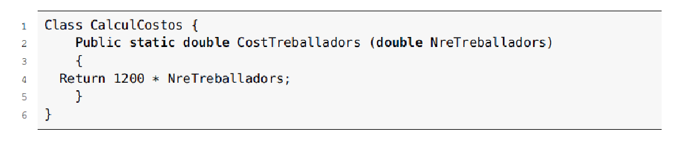

> El término refactorización fue utilizado por primera vez por William F. Opdyke en su tesis doctoral, en 1992, en la Universidad de Illinois.

En el código anterior se muestra un ejemplo de cómo sería la codificación de una clase que tiene como función el cálculo de los costes laborales totales de una empresa. Se puede ver que el coste por trabajador no se encuentra en ninguna variable ni en ninguna constante, sino que el método CostTrabajadores devuelve el valor que ha recibido por parámetro (NreTrabajadores) por un número que considera el salario bruto por trabajador (en este caso supuesto 1200 euros). Probablemente, este importe se utilizará en más clases a lo largo del código de programación desarrollado o, como mínimo, más veces dentro de la misma clase.

¿Cómo quedaría el código una vez aplicada la refactorización? Se puede ver a continuación:

> 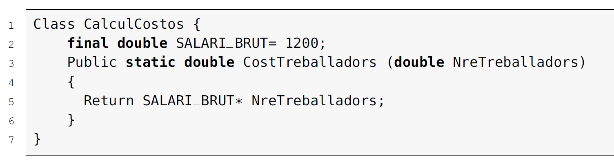
>
> El término refactorización hace referencia a los cambios efectuados en el código de programación desarrollado, sin implicar ningún cambio en los resultados de su ejecución. Es decir, se transforma el código fuente manteniendo intacto su comportamiento, aplicando los cambios sólo en la forma de programar o en la estructura del código fuente, buscando su optimización.

En la figura [2.1](#page48) se puede ver un ejemplo de lo que se quiere expresar. ¿Cuál de las dos casas facilita más la vida de sus inquilinos? Si se tuviera que desarrollar una aplicación informática, ¿a cuál de las dos casas se tendría que parecer más, a la de la izquierda o a la de la derecha?

> **Figura 2.1.** Diseño de una casa

Posiblemente las dos casas cumplen las especificaciones iniciales, edificio en el que se pueda vivir, pero parece que la primera casa será más confortable y óptima.

El término refactorización proviene del término refactorizar (*refactoring*). Este término deviene de su similitud con el concepto de factorización de los números o de los polinomios. Es lo mismo tener 12 que tener 3 x 4, pero, en el segundo caso, el término 12 está dividido en sus factores (aún se podría factorizar más y llegar al 3 x 2 x 2). Otro ejemplo: el polinomio de segundo grado x^2^ - 1 es el mismo que el resultado del producto (*x* + 1)(*x* --- 1), pero en el segundo caso se ha dividido en factores. A la hora de simplificar o de hacer operaciones, será mucho más sencillo el trabajo con el segundo caso (con los términos ya factorizados) que con el primero. Con la factorización aparecen unos términos, unos valores, que inicialmente se encuentran ocultos, aunque forman parte del concepto inicial.

En el caso de la programación sucede una situación muy similar. Si bien el código que se desarrolla no está factorizado, es decir, no se ven a simple vista los factores internos, porque son estructuras que aparentemente se encuentran escondidas, cuando se lleva cabo una refactorización del código fuente sí se pueden ver.

### Ventajas y limitaciones de la refactorización

La utilización de la refactorización puede aportar algunas ventajas a los desarrolladores de software, pero hay que tener en cuenta que tiene limitaciones que hay que conocer antes de tomar la decisión de utilizarla.

> **Ventajas de la refactorización**

Hay muchas ventajas en la utilización de la refactorización, aunque también hay inconvenientes y algunas limitaciones. ¿Por qué los programadores dedican tiempo a la refactorización del código fuente? Una de las respuestas a esta pregunta es el aumento de la **calidad del código fuente**. Un código fuente sobre el que se han utilizado técnicas de refactorización se mantendrá en un estado mejor que un código fuente sobre el que no se hayan aplicado. A medida que un código fuente original se ha ido modificando, ampliando o manteniendo, habrá sufrido modificaciones en la estructura básica sobre la que se diseñó, y es cada vez más difícil efectuar evoluciones y aumenta la probabilidad de generar errores.

Algunas de las ventajas o razones para utilizar la técnica de refactorización del código fuente son:

-   Prevención de la aparición de problemas habituales a partir de los cambios provocados por los mantenimientos de las aplicaciones.

-   Ayuda a aumentar la simplicidad del diseño.

-   Mayor entendimiento de las estructuras de programación.

-   Detección más sencilla de errores.

-   Permite agilizar la programación.

-   Genera satisfacción en los desarrolladores.

A continuación, se desarrollan algunos de estos puntos fuertes de la utilización de la refactorización:

-   **Detección y prevención más sencilla de errores**. La refactorización mejora la robustez del código fuente desarrollado, haciendo que sea más sencillo encontrar errores en el código o encontrar partes del código que sean más propensas a tener o provocar errores en el conjunto del software. A partir de la utilización de casos de prueba adecuados, se podrá mejorar mucho el código fuente.

-   **Prevención de problemas por culpa de los mantenimientos del software**. Con el tiempo, acostumbran a surgir problemas a medida que se va aplicando un mantenimiento evolutivo o un mantenimiento correctivo de las aplicaciones informáticas. Algunos ejemplos de estos problemas pueden ser que el código fuente se vuelva más complejo de entender de lo que sería necesario o que haya duplicidad de código, porque, muchas veces, son personas diferentes las que han desarrollado el código de las que están llevando a cabo el mantenimiento.

-   **Comprensión del código fuente y simplicidad del diseño**. Volviendo a la situación en la que un equipo de programación puede estar compuesto por un número determinado de personas diferentes o que el departamento de mantenimiento de una empresa es diferente al equipo de desarrollo de nuevos proyectos, es muy importante que el código fuente sea muy fácil de entender y que el diseño de la solución haya sido creado con una simplicidad considerable. Es necesario que el diseño se lleve a cabo teniendo en cuenta que se hará una posterior refactorización, es decir, teniendo presentes posibles necesidades futuras de la aplicación que se está creando. Esta tarea no es nada sencilla, pero con un buen y exhaustivo análisis, por medio de muchas conversaciones con los usuarios finales, se podrán llegar a entrever estas necesidades futuras.

-   **Programación más rápida**. Precisamente, si el código se comprende de una forma rápida y sencilla, la evolución de la programación será mucho más rápida y eficaz. El diseño llevado a cabo en la fase anterior también será decisivo en que la programación sea más ágil.

> **Limitaciones de la refactorización**

En cambio, se pueden encontrar varias razones para no considerar adecuada su utilización, ya sea por sus limitaciones o por las posibles problemáticas que pueden surgir:

-   Personal poco preparado para utilizar las técnicas de la refactorización.

-   Exceso de obsesión por conseguir el mejor código fuente.

-   Excesiva dedicación de tiempo a la refactorización, provocando efectos negativos.

-   Repercusiones en el resto del software y del equipo de desarrolladores cuando uno de ellos aplica técnicas de refactorización.

-   Posibles problemas de comunicación provocados por el punto anterior.

-   Limitaciones debidas a las bases de datos, interfaces gráficas\...

Algunos de estos puntos débiles relacionados con la utilización de la refactorización quedan desarrollados a continuación:

-   **Absorción de tiempo**. Una actitud obsesiva con la refactorización podrá llevar a un efecto contrario al que se busca: dedicar mucho más tiempo del que haría falta a la creación de código y aumentar la complejidad del diseño y de la programación innecesariamente.

-   **Afectar o generar problemas en el resto del equipo de programación**. Una refactorización de un programador puede generar problemas a otros componentes del equipo de trabajo, en función de donde se haya llevado a cabo esta refactorización. Si sólo afecta a una clase o a algunos de sus métodos, la refactorización será imperceptible al resto de sus compañeros. Pero cuando afecta a varias clases, podrá alterar otro código fuente que haya sido desarrollado se está desarrollando por parte de otros compañeros. Este problema solo se puede solucionar con una buena comunicación entre los componentes del equipo de trabajo o con una refactorización sincronizada desde los responsables del proyecto, manteniendo informados a los afectados.

-   **Limitaciones debidas a las bases de datos**. La refactorización tiene algunas limitaciones o áreas conflictivas, como las bases de datos o las interfaces gráficas. En el caso de las bases de datos, es un problema el hecho de que los programas que se desarrollan actualmente estén tan ligados a sus estructuras. En el caso de haber modificaciones relacionadas con la refactorización en el diseño de la base de datos vinculada a una aplicación, habría que llevar a cabo muchas acciones que complicarían esta actuación: habrá que ir a la base de datos, efectuar los cambios estructurales adecuados, hacer una migración de los datos hacia el nuevo sistema y adaptar de nuevo todo aquello de la aplicación relacionado con los datos (formularios, informes\...).

-   **Interfaces gráficas**. Una segunda limitación se encuentra con las interfaces gráficas de usuario. Las nuevas técnicas de programación han facilitado la independencia entre los diferentes módulos que componen las aplicaciones. De esta manera, se podrá modificar el contenido del código fuente sin tener que hacer modificaciones en el resto de módulos, como por ejemplo, en las interfaces. El problema con la refactorización vinculado con las interfaces gráficas radica en que, si esta interfaz ha sido publicada en muchos usuarios clientes o si no se tiene acceso al código que la genera, será prácticamente imposible actuar sobre ella.

> La refactorización se considera un aspecto muy importante para el desarrollo de aplicaciones mediante programación extrema.

### Patrones de refactorización más usuales

Los patrones, en un contexto de programación, ofrecen una solución durante el proceso de desarrollo de software a un tipo de problema o de necesidad estándar que puede darse en diferentes contextos. El patrón dará una resolución a este problema, que ya ha sido aceptada como solución buena, y que ya ha sido bautizada con un nombre.

Por otra parte, ya ha quedado definida la refactorización como adaptaciones del código fuente sin que ello provoque cambios en las operaciones del software. Si se unen estos dos conceptos se pueden encontrar algunos patrones existentes.

Como se puede observar en la figura [2.2](#patrones-de-refactorización-más-usuales), todos los patrones se pueden llevar a cabo por medio del asistente de Eclipse.

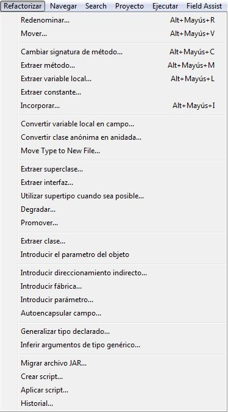**Figura 2.2.** Eclipse: refactorización

Los patrones más habituales son los siguientes:

-   Renombrar

-   Mover

-   Extraer una variable local

-   Extraer una constante

-   Convertir una variable local en un campo

-   Extraer una interfaz

-   Extraer el método

### Renombrar

Este patrón cambia el nombre de variables, clases, métodos, paquetes\... teniendo en cuenta sus referencias.

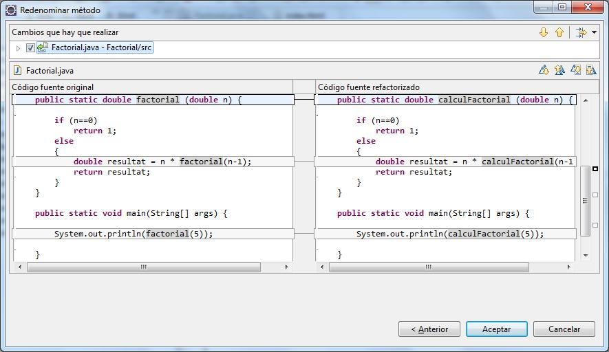En el ejemplo de la figura [2.3](#renombrar), se renombra el método factorial con el nombre calculFactorial.

> **Figura 2.3.** Eclipse refactorización: renombrar

### Mover

Este patrón mueve un método de una clase a otra; mueve una clase de un paquete a otro\... teniendo en cuenta sus referencias.

En el ejemplo de la figura [2.4](#renombrar), mueve la función principal (main), que se encuentra en la clase Factorial, hacia la clase Temp.

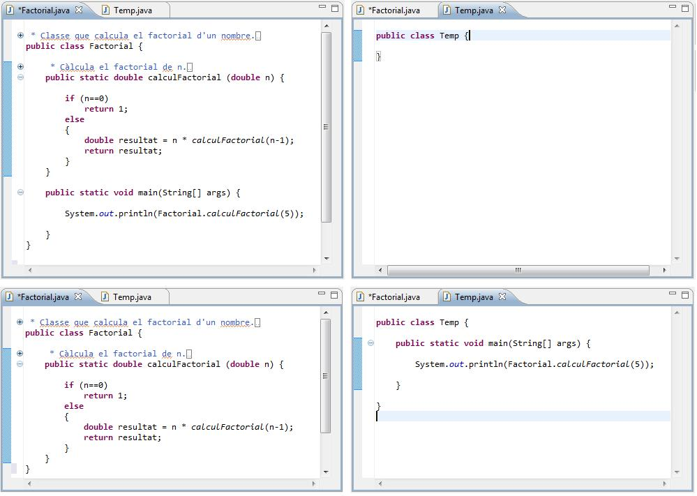

> **Figura 2.4.** Eclipse refactorización: mover

### Extraer una variable local

Dada una expresión, este patrón le asigna una variable local; cualquier referencia a la expresión en el ámbito local será sustituida por la variable.

En el ejemplo, se asigna la expresión \"El factorial de \" como el valor de la variable texto.

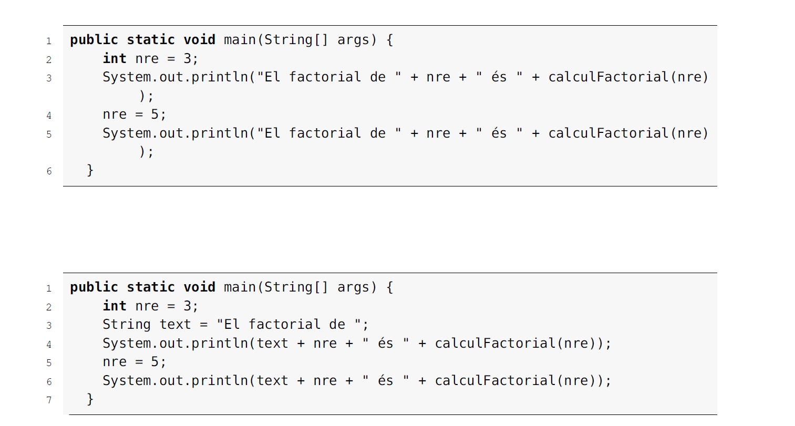

### Extraer una constante

Dada una cadena de caracteres o un valor numérico, este patrón lo convierte en una constante, y cualquier referencia será sustituida por la constante.

En el ejemplo, se asigna la expresión \"El factorial de \" como el valor de la constante TEXT.

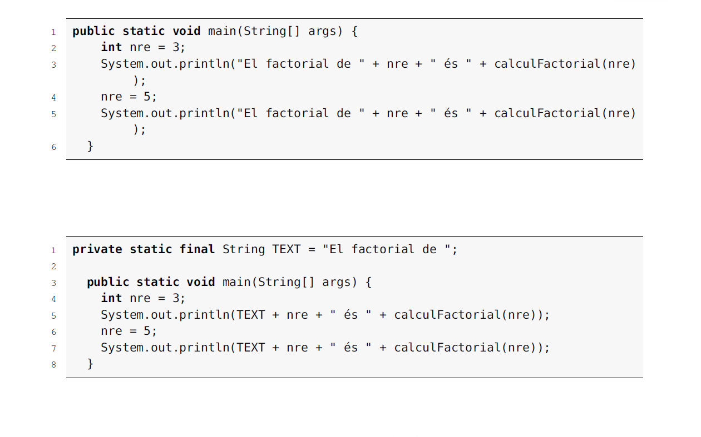

### Convertir una variable local en un campo o atributo

Dada una variable local, este patrón la convierte en atributo de la clase; cualquier referencia será sustituida por el nuevo atributo.

En el siguiente ejemplo se convierte la variable local nre en un atributo de la clase Factorial.

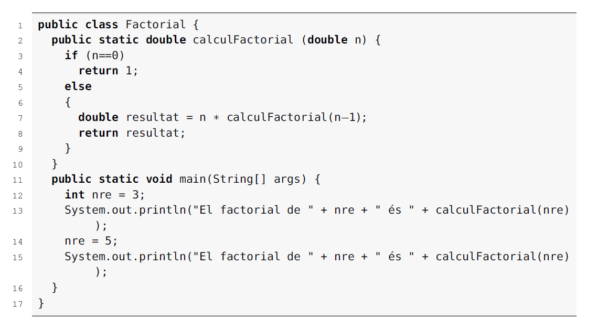

El código refactorizado es el que se muestra a continuación:

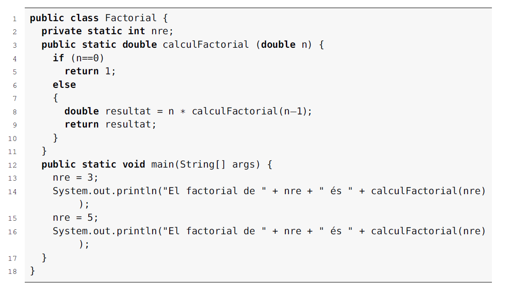

### Extraer una interfaz

Este patrón crea una interfaz con los métodos de una clase.

> **Interfaz**
>
> Una interfaz es un conjunto de métodos abstractos y de propiedades. En las propiedades se especifica qué se debe hacer, pero no su implementación. Serán Las clases que implementan interfaces las que describan la lógica del comportamiento de los métodos.

En el ejemplo se crea la interfaz de la clase Factorial.

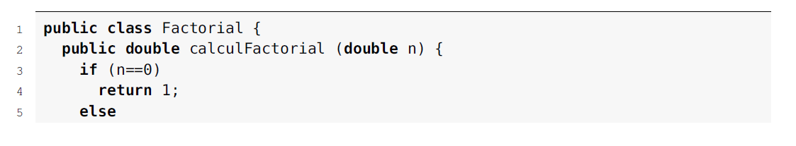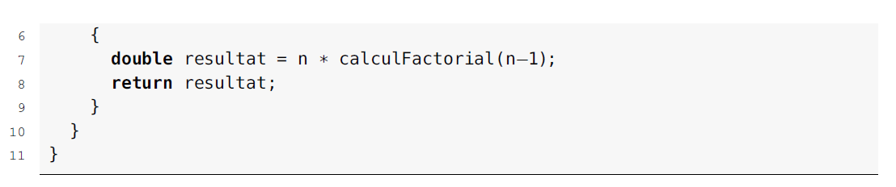

El código refactorizado es el que se muestra a continuación:

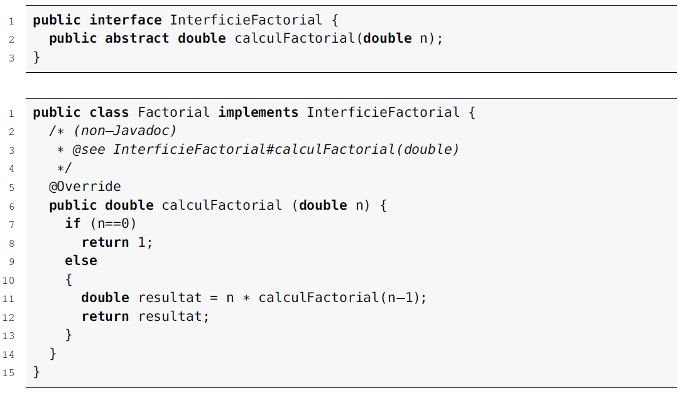

### Extraer el método

Este patrón convierte un trozo de código en un método.

(En el ejemplo, se convierte la variable local nre como un atributo de la clase Factorial)

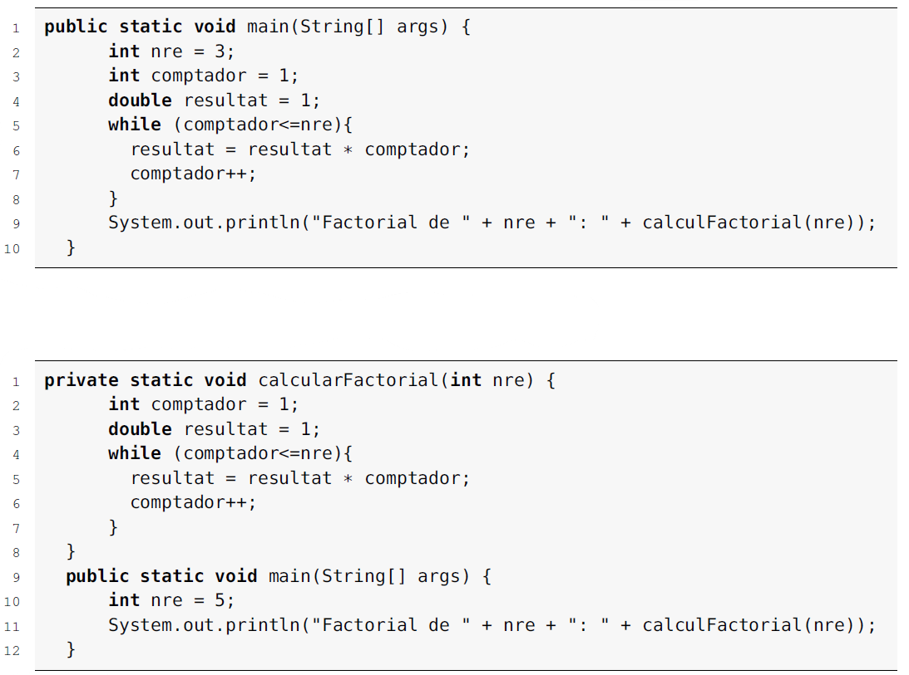

## Pruebas y refactorización. Herramientas de ayuda a la refactorización

Las herramientas de ayuda a la creación de software deben convertirse en aliadas en la tarea de ofrecer soluciones y facilidades para la aplicación de la refactorización sobre el código fuente que se esté desarrollando. Otra ayuda muy importante la ofrecen los casos de prueba. Las pruebas que se habrán efectuado sobre el código fuente son básicas para validar el correcto funcionamiento del sistema y para ayudar a decidir si aplicar o no un patrón de refactorización.

Hay que ir con cuidado con los casos de prueba escogidos. Será necesario que cumplan algunas características que ayudarán a validar la correcta del código fuente:

-   **Casos de pruebas independientes entre módulos, métodos o clases**. Los casos de prueba deben ser independientes para conseguir que los errores en una parte del código fuente no afecten a otras partes del código. De esta manera, se pueden llevar a cabo pruebas incrementales que verifiquen si los cambios que se han producido con los procesos de refactorización han supuesto cambios en el resto del software.

-   **Los casos de pruebas serán automáticos**. Si hay diez casos de pruebas, no será viable que se vayan ejecutando de forma manual uno a uno, sino que es necesario que se puedan ejecutar de forma automática todos para que, posteriormente, se puedan analizar los resultados tanto de forma individual como de forma conjunta.

-   **Casos de pruebas auto verificables**. Una vez que las pruebas se establecen de forma independiente entre los módulos y que se pueden ejecutar de forma automática, solo es necesario que la verificación de estas pruebas sea también automática, es decir, que la propia herramienta verifique si las pruebas han sido satisfactorias o no. La herramienta indicará para qué casos de prueba ha habido problemas y en qué parte del código fuente, a fin de que el programador pueda tomar decisiones.

¿Por qué son tan importantes las pruebas para una buena ejecución de la refactorización? Las pruebas y sus casos de pruebas son básicos para indicar si el código fuente desarrollado funcionará o no funcionará. Pero también ayudarán a saber hasta qué punto se pueden aplicar técnicas de refactorización sobre un código fuente determinado o no.

Se debe ir con cuidado a la hora de utilizar estos casos de pruebas. Si no se aplican de forma adecuada, podrán suponer problema más que una ayuda. Hay que diferenciar mucho el código fuente implementado del caso de prueba y que el vínculo entre ellos sea lo más pequeño posible. Es importante verificar que el código que implementa la prueba tenga una ejecución exitosa, independientemente de cuál haya sido su implementación. Muchas veces, una refactorización en un código fuente obliga a modificar los casos de prueba. Lo que es recomendable es aplicar refactorizaciones poco a poco, de forma más continua, pero que sean pequeños cambios o que los cambios afecten a partes pequeñas de código.

¿Cómo habrá que implementar la refactorización? Una propuesta de metodología es la que se describe a continuación:

-   Desarrollar el código fuente.

-   Analizar el código fuente.

-   Diseñar las pruebas unitarias y funcionales.

-   Implementar las pruebas.

-   Ejecutar las pruebas.

-   ***Analizar cambios a efectuar.***

-   ***Definir una estrategia de aplicación de los cambios.***

-   ***Modificar el código fuente.***

-   Ejecución de las pruebas.

Como se puede observar, esta metodología parece una pequeña gestión de proyectos dentro del propio proyecto de desarrollo de software. Habrá que hacer un buen análisis del código fuente sobre el que se quieren llevar a cabo las pruebas, un diseño de los casos de prueba que se implementan, así como una correcta ejecución y un análisis de los resultados obtenidos.

A continuación, se desarrolla, más detalladamente, esta propuesta de metodología:

-   **Desarrollo del código fuente:** esta parte no se convierte propiamente en parte de la metodología para implementar la refactorización. Antes de llevar a cabo esta técnica, habrá que tener desarrollado el código que se querrá analizar.

-   **Analizar el código fuente:** una vez el software, o una parte de este, ha sido desarrollado, habrá que llevar a cabo un análisis exhaustivo de este código para comprobar si se detectan trozos de código donde se podrá llevar a cabo la refactorización. Para determinarlo, la gran mayoría de veces habrá que diseñar y aplicar casos de prueba.

-   **Diseñar las pruebas unitarias y funcionales:** antes de ejecutarlas, hay que escribir las pruebas. Pero, antes de eso, será necesario haber analizado el código fuente (paso anterior) y diseñado los casos de prueba. *Llevar a cabo la refactorización sin haber ejecutado antes pruebas unitarias y pruebas funcionales puede llegar a resultar muy costoso y puede implicar un riesgo muy importante para el código fuente desarrollado*.

-   **Implementar y ejecutar las pruebas:** una vez diseñados los casos de pruebas, hay que implementarlos y ejecutarlos. La razón de esta ejecución es obtener más información referente a cómo se comportará el software en las diferentes situaciones preparadas. Estas situaciones deben tener en cuenta diversos escenarios, en situaciones extremas y en situaciones normales. El comportamiento actual del sistema, antes de efectuar cualquier cambio, deberá ser el mismo comportamiento que una vez efectuada la refactorización.

-   **Analizar cambios a efectuar:** los casos de prueba han permitido ver cuál es el comportamiento del software desarrollado, pero también ayudan a mostrar los cambios que se podrán efectuar en este software. Los resultados de las pruebas ofrecen información sobre los patrones de refactorización y de diseño que se podrán llevar a cabo. Además de encontrar lugares en el código que ofrecen indicaciones directas de mejora con la refactorización, los casos de prueba también ofrecen informaciones sobre otras refactorizaciones no tan comunes, de las que los programadores no tienen tan clara su necesidad de mejora, pero que harán que el código se vaya deteriorando de forma progresiva en el caso de no actuar a tiempo.

-   **Definir una estrategia de aplicación de los cambios:** esta estrategia de acción deberá aplicarse de forma progresiva. Hay que aplicar primero un conjunto de cambios para confirmar, a continuación, la estabilidad del sistema, es decir, confirmar que los cambios no hayan provocado ningún otro problema o error. A continuación, se llevará a cabo otro conjunto de cambios, y así sucesivamente, hasta finalizarlos todos. Hay actuaciones de refactorización más sencillas de efectuar que otras, y otros cambios que atacan directamente los errores de diseño de la aplicación. Por ejemplo, resolver problemas como el código duplicado o las clases largas, con cambios pequeños y sencillos, permite que se solucionen problemas importantes de diseño; esto significará haber aportado mejoras grandes e importantes al código fuente.

-   **Modificar el código fuente y ejecutar las pruebas:** los cambios que se hayan producido en el código desarrollado muchas veces son muchos, pero pequeños. Si se hacen manualmente, se corre el riesgo de equivocarse. En cambio, utilizando herramientas específicas para aplicar los cambios de refactorización, se pueden efectuar de forma automática sin ningún miedo a equivocarse. Una vez modificado el código, se deberá llevar a cabo la ejecución de las pruebas. Esta vez la ejecución validará que los casos de prueba ejecutados en este momento coincidan con los casos de prueba obtenidos anteriormente. De esta manera, se confirmará que los cambios efectuados no han afectado a los resultados esperados.

### Herramientas para la ayuda a la refactorización

Actualmente, muchas IDE ofrecen herramientas que ayudan a la refactorización del código fuente. Estas herramientas suelen estar integradas o permiten la descarga de módulos externos o conectores. Con estos complementos se pueden llevar a cabo muchos de los patrones de refactorización de forma automática o semiautomática.

La clasificación de estas herramientas se puede hacer a partir de muchos criterios diferentes, como el tipo de herramienta de refactorización (si es privativa o software libre), por las funcionalidades que ofrece (mirar código duplicado, análisis de la calidad del software, propuesta de ubicaciones en el código fuente donde se pueden aplicar acciones de refactorización\...) o a partir de los lenguajes de programación que permiten analizar.

> A continuación, se enumeran algunas de estas herramientas siguiendo la última clasificación:

-   **Java**: RefactorIt, Condenser, JCosmo, Xrefactory, jFactor, **IntelliJ IDEA**.

-   **Visual C++, Visual C#, Visual Basic .NET, ASP.Net, \...** : Visual Studio.

-   **C++**: CppRefactory, Xrefactory.

-   **C#: herramienta de refactorización de C#**, refactorización de C#.

-   **SQL:** SQL Enlight.

-   **Delphi**: Herramienta Modelmaker, Castalia.

-   **Smalltalk**: RefactoringBrowser.

> ERP
>
> Un ERP (Enterprise Resource Planning) es un sistema informático que abarca a toda una empresa, y que se utiliza para gestionar todos sus recursos y compartir la información necesaria entre los diferentes departamentos en una única base de datos.

El IDE Eclipse sirve como ejemplo de herramienta que permite llevar a cabo la refactorización, como se ha mostrado en apartados anteriores. Eclipse ya lleva integradas varias herramientas de refactorización en su instalación estándar. Se pueden encontrar en el Menú principal, como un apartado propio llamado *Refactor*, o bien utilizando el menú contextualizado mientras se trabaja con el editor.

# Referencias

Bibliografía básica

Pressman, R. S. (2002). Ingeniería del software (5a. ed.). Madrid: Mc Graw Hill.

Este libro, considerado la \"Biblia\" de la ingeniería del software, pretende servir a estudiantes y profesionales como una introducción completa a la ingeniería. El formato y el estilo tienen una presentación agradable y cómoda de leer.

Murphy-Hill, E. (2005). Improving Refactoring with Alternate Program Views (PDF).

Artículo referente a la refacción.

Bibliografía complementaria

Reel, J.S. (1999). Critical sucess factors in software projects. IEEE Software (vol. 16, pág. 18-23).

Análisis en profundidad sobre los proyectos de software. Además, da las claves para que un proyecto sea satisfactorio para el cliente, y que además cumpla con las normativas del IEEE.

García Blanco, S.; Morales Ramos, E. (2003). Análisis y diseño de aplicaciones informáticas de gestión. Madrid: Mc Graw Hill.

Myers, G.J. (1983). El arte de probar el software. El Ateneo.

Patton, R. (2005). Software Testing, Second Edition. Sams.

Myers, G.J., Sandler, C., Badgett, T., Thomas, T.M. (2004) The Art of Software Testing (2nd Edition). John Wiley and Sons Inc.

Ammann, P. y Offutt, J. (2008). Introduction to Software Testing Cambridge University Press

Referencias bibliográficas

Boehm, B. (1988, julio). \"A spiral model for software developement and enhancement\". Computer (vol. 31, núm. 7, pág. 33-44).

Piattini, M.G.; Calvo-Manzano, J.A.; Cervera Bravo, J.; Fernández Sanz, L. (2004) Análisis y diseño de aplicaciones informáticas de gestión, una perspectiva de ingeniería del software, pág. 419-469. Alfaomega.

Direcciones de interés

<http://www.eclipse.org/>

Entorno integrado de desarrollo. Código abierto.

<http://martinfowler.com/bliki/EtymologyOfRefactoring.html>

Características de la refactorización.

<http://www.nunit.org/>

NUnit es un framework de pruebas unitarias para todos los lenguajes .Net.

<http://www.jrsoftware.org/isinfo.php>

Inno Setup es un instalador gratuito para programas de Windows.

<http://emea.microsoftstore.com/es/es-ES/Microsoft/Diseno-+-Desarrolladores/Visual-Studio-2010?WT.mc_id=pointitsem_visualstudio_generic_2010&WT.srch=1&cshift_ck=2234617442cs100002723&WT.srch=1>

Entorno integrado de desarrollo de Microsoft.

<http://www.junit.org/>

Web dedicada a los desarrolladores y testeros de software que usan el framework de testeo JUnit.
