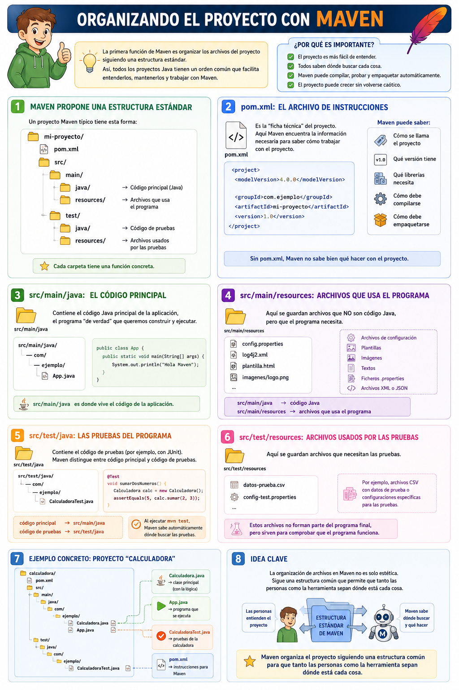

# Organizando el proyecto

- [Organizando el proyecto](#organizando-el-proyecto)
  - [Maven propone una estructura estándar](#maven-propone-una-estructura-estándar)
  - [`pom.xml`: el archivo de instrucciones](#pomxml-el-archivo-de-instrucciones)
  - [`src/main/java`: el código principal](#srcmainjava-el-código-principal)
  - [`src/main/resources`: archivos que usa el programa](#srcmainresources-archivos-que-usa-el-programa)
  - [`src/test/java`: las pruebas del programa](#srctestjava-las-pruebas-del-programa)
  - [`src/test/resources`: archivos usados por las pruebas](#srctestresources-archivos-usados-por-las-pruebas)
  - [Ejemplo concreto](#ejemplo-concreto)
  - [Idea clave](#idea-clave)

La primera función de Maven, **organizar los archivos del proyecto**, consiste en establecer una estructura de carpetas estándar para que todos los proyectos Java tengan una forma parecida.

> Maven no quiere que cada programador coloque los archivos “donde le parezca”, sino que propone un orden común.

Esto es muy importante porque en un proyecto real puede haber muchos tipos de archivos:

* código Java,
* pruebas,
* imágenes,
* configuraciones,
* librerías,
* documentación,
* recursos,
* archivos generados automáticamente.

Si todo estuviera mezclado, el proyecto sería difícil de entender y de mantener.

## Maven propone una estructura estándar

Un proyecto Maven típico tiene esta forma:

```text
mi-proyecto/
│
├── pom.xml
│
└── src/
    ├── main/
    │   ├── java/
    │   └── resources/
    │
    └── test/
        ├── java/
        └── resources/
```

Cada carpeta tiene una función concreta.

## `pom.xml`: el archivo de instrucciones

En la raíz del proyecto suele estar el archivo:

```text
pom.xml
```

Este archivo es como la “ficha técnica” del proyecto.

Ahí Maven encuentra información como:

```xml
<project>
    <modelVersion>4.0.0</modelVersion>

    <groupId>com.ejemplo</groupId>
    <artifactId>mi-proyecto</artifactId>
    <version>1.0</version>
</project>
```

Es decir, Maven puede saber:

* cómo se llama el proyecto,
* qué versión tiene,
* qué librerías necesita,
* cómo debe compilarse,
* cómo debe empaquetarse.

Sin `pom.xml`, Maven no sabe bien qué hacer con el proyecto.

## `src/main/java`: el código principal

La carpeta:

```text
src/main/java
```

contiene el **código Java principal** de la aplicación.

Por ejemplo:

```text
src/main/java/com/ejemplo/App.java
```

Ahí pondríamos clases como:

```java
public class App {
    public static void main(String[] args) {
        System.out.println("Hola Maven");
    }
}
```

Esta parte es el programa “de verdad”, el que queremos construir y ejecutar.

Una forma sencilla de explicarlo a los alumnos sería:

> `src/main/java` es donde vive el código de la aplicación.

## `src/main/resources`: archivos que usa el programa

La carpeta:

```text
src/main/resources
```

se usa para guardar archivos que **no son código Java**, pero que el programa necesita.

Por ejemplo:

```text
src/main/resources/config.properties
src/main/resources/log4j2.xml
src/main/resources/plantilla.html
src/main/resources/imagenes/logo.png
```

Aquí podrían estar:

* archivos de configuración,
* plantillas,
* imágenes,
* textos,
* ficheros `.properties`,
* archivos XML o JSON usados por la aplicación.

La diferencia importante es esta:

```text
src/main/java       → código Java
src/main/resources  → archivos que usa el programa
```

Por ejemplo, si una aplicación necesita leer un archivo de configuración, ese archivo no debería estar mezclado con las clases Java, sino colocado en `resources`.

## `src/test/java`: las pruebas del programa

La carpeta:

```text
src/test/java
```

contiene el código de pruebas.

Por ejemplo:

```text
src/test/java/com/ejemplo/CalculadoraTest.java
```

Ahí podríamos tener pruebas con JUnit:

```java
@Test
void sumarDosNumeros() {
    Calculadora calc = new Calculadora();
    assertEquals(5, calc.sumar(2, 3));
}
```

Esto es muy importante porque Maven distingue entre:

```text
código principal  → src/main/java
código de pruebas → src/test/java
```

Así, cuando ejecutamos:

```bash
mvn test
```

Maven sabe dónde buscar las pruebas automáticamente.

No hay que decirle:

> “Oye Maven, mis pruebas están en esta carpeta rara”.

Porque si usamos la estructura estándar, Maven ya lo sabe.

## `src/test/resources`: archivos usados por las pruebas

La carpeta:

```text
src/test/resources
```

sirve para guardar archivos que necesitan las pruebas.

Por ejemplo:

```text
src/test/resources/datos-prueba.csv
src/test/resources/config-test.properties
```

Imagina que queremos probar un programa que lee datos de un archivo CSV. Podríamos tener un CSV pequeño solo para las pruebas.

Ese archivo no formaría parte necesariamente del programa final, pero sí sirve para comprobar que el programa funciona.


## Ejemplo concreto

Supongamos que tenemos una aplicación sencilla llamada `Calculadora`.

Con Maven podríamos organizarla así:

```text
calculadora/
│
├── pom.xml
│
└── src/
    ├── main/
    │   └── java/
    │       └── com/
    │           └── ejemplo/
    │               ├── Calculadora.java
    │               └── App.java
    │
    └── test/
        └── java/
            └── com/
                └── ejemplo/
                    └── CalculadoraTest.java
```

Aquí se ve claramente:

```text
Calculadora.java      → clase principal
App.java              → programa que se ejecuta
CalculadoraTest.java  → pruebas de la calculadora
pom.xml               → instrucciones para Maven
```

Cada cosa está en su sitio.

## Idea clave

La organización de archivos en Maven no es solo una cuestión estética. Sirve para que:

* el proyecto sea más fácil de entender,
* otros programadores sepan dónde buscar,
* Maven pueda compilar y probar automáticamente,
* las pruebas estén separadas del código principal,
* los recursos estén separados del código Java,
* el proyecto pueda crecer sin volverse caótico.

La frase más importante sería:

> Maven organiza el proyecto siguiendo una estructura común para que tanto las personas como la herramienta sepan dónde está cada cosa.
