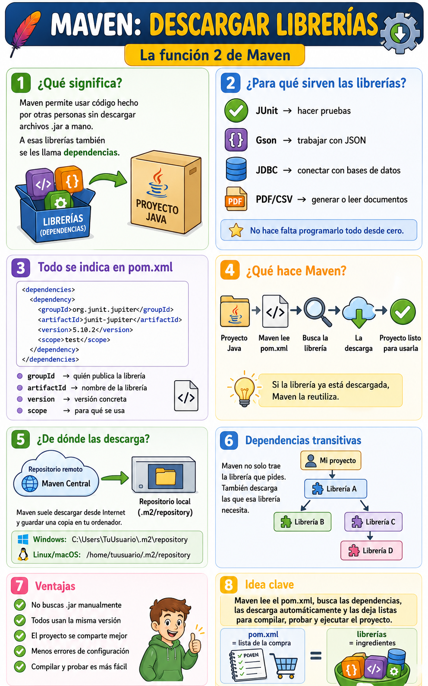

# Gestión de librerías con MAVEN

- [Gestión de librerías con MAVEN](#gestión-de-librerías-con-maven)
- [Descargar librerías](#descargar-librerías)
  - [Ejemplo sencillo](#ejemplo-sencillo)
  - [Las dependencias se declaran en `pom.xml`](#las-dependencias-se-declaran-en-pomxml)
  - [¿Qué significan `groupId`, `artifactId` y `version`?](#qué-significan-groupid-artifactid-y-version)
    - [`groupId`](#groupid)
    - [`artifactId`](#artifactid)
    - [`version`](#version)
  - [¿Dónde busca Maven las librerías?](#dónde-busca-maven-las-librerías)
  - [¿Dónde guarda Maven las librerías descargadas?](#dónde-guarda-maven-las-librerías-descargadas)
  - [Dependencias directas e indirectas](#dependencias-directas-e-indirectas)
  - [Ejemplo con una librería para JSON](#ejemplo-con-una-librería-para-json)
  - [¿Qué pasa cuando ejecutamos Maven?](#qué-pasa-cuando-ejecutamos-maven)
  - [¿Por qué esto es tan útil en clase y en empresas?](#por-qué-esto-es-tan-útil-en-clase-y-en-empresas)
  - [Comparación sencilla](#comparación-sencilla)
  - [Idea clave](#idea-clave)


La segunda gran función de Maven es **descargar librerías automáticamente**.

Dicho de forma sencilla:

> Maven permite que nuestro proyecto use código hecho por otras personas sin tener que descargarlo y colocarlo manualmente.

En Java, esas “piezas de código externas” suelen llamarse **librerías**, **dependencias** o **bibliotecas**.

# Descargar librerías

Cuando programamos una aplicación, muchas veces no queremos hacerlo todo desde cero.

Por ejemplo, imagina que queremos que nuestro programa pueda:

* leer archivos CSV,
* conectarse a una base de datos,
* trabajar con JSON,
* hacer pruebas con JUnit,
* crear documentos PDF,
* usar mapas,
* conectarse a Internet,
* trabajar con fechas de forma avanzada.

Podríamos programar todo eso nosotros mismos, pero sería muy lento y difícil.

Lo normal en programación real es usar librerías ya existentes.

## Ejemplo sencillo

Supongamos que queremos hacer pruebas automáticas en Java con **JUnit**.

JUnit es una librería que nos permite escribir pruebas como esta:

```java
@Test
void sumarDosNumeros() {
    Calculadora calc = new Calculadora();
    assertEquals(5, calc.sumar(2, 3));
}
```

Pero para que Java entienda qué es `@Test` o `assertEquals`, necesitamos tener la librería JUnit en el proyecto.

Sin Maven, tendríamos que:

1. buscar JUnit en Internet,
2. descargar el archivo `.jar`,
3. copiarlo dentro del proyecto,
4. configurar el IDE para que lo use,
5. asegurarnos de que tenemos la versión correcta,
6. repetir el proceso si otro compañero usa el proyecto.

Eso es incómodo y propenso a errores.

Con Maven, en cambio, añadimos JUnit al archivo `pom.xml` y Maven se encarga del resto.

## Las dependencias se declaran en `pom.xml`

El archivo importante vuelve a ser:

```text
pom.xml
```

Dentro de este archivo podemos añadir una sección llamada:

```xml
<dependencies>
    
</dependencies>
```

Ahí escribimos las librerías que necesita nuestro proyecto.

Por ejemplo, para usar JUnit 5 podríamos escribir algo parecido a esto:

```xml
<dependencies>
    <dependency>
        <groupId>org.junit.jupiter</groupId>
        <artifactId>junit-jupiter</artifactId>
        <version>5.10.2</version>
        <scope>test</scope>
    </dependency>
</dependencies>
```

Esto significa:

> “Maven, mi proyecto necesita la librería JUnit Jupiter, versión 5.10.2, para hacer pruebas”.

## ¿Qué significan `groupId`, `artifactId` y `version`?

Cada librería en Maven se identifica normalmente con tres datos principales.

### `groupId`

Indica el grupo, empresa, organización o paquete principal que publica la librería.

Por ejemplo:

```xml
<groupId>org.junit.jupiter</groupId>
```

Sería como decir:

> “Esta librería pertenece al grupo JUnit Jupiter”.

### `artifactId`

Indica el nombre concreto de la librería.

```xml
<artifactId>junit-jupiter</artifactId>
```

Sería como decir:

> “La librería concreta que quiero se llama `junit-jupiter`”.

### `version`

Indica la versión exacta que queremos usar.

```xml
<version>5.10.2</version>
```

Esto es importante porque una librería puede tener muchas versiones.

No es lo mismo usar:

```text
JUnit 4
JUnit 5.8
JUnit 5.10
JUnit 5.11
```

Cada versión puede traer mejoras, cambios o incluso incompatibilidades.

Maven permite que el proyecto diga claramente:

> “Yo funciono con esta versión concreta”.

## ¿Dónde busca Maven las librerías?

Maven descarga las librerías desde repositorios.

Un **repositorio Maven** es como un gran almacén en Internet donde están publicadas muchísimas librerías Java.

El más conocido es **Maven Central**.

Podemos imaginarlo como una enorme tienda de piezas:

```text
Proyecto Java
     │
     │ necesita JUnit
     ▼
Maven lee el pom.xml
     │
     │ busca la dependencia
     ▼
Repositorio Maven Central
     │
     │ descarga la librería
     ▼
Proyecto listo para usarla
```

El programador no tiene que descargar el `.jar` manualmente. Maven lo hace.

## ¿Dónde guarda Maven las librerías descargadas?

Cuando Maven descarga una librería, normalmente la guarda en una carpeta local del ordenador del usuario.

En Windows suele estar en algo parecido a:

```text
C:\Users\TuUsuario\.m2\repository
```

En Linux o macOS suele estar en:

```text
/home/tuusuario/.m2/repository
```

Esa carpeta se llama **repositorio local**.

Esto tiene una ventaja importante: si Maven ya ha descargado una librería una vez, no necesita descargarla de nuevo para cada proyecto.

Por ejemplo:

```text
Proyecto A usa JUnit
Proyecto B usa JUnit
Proyecto C usa JUnit
```

Maven puede reutilizar la librería descargada en `.m2/repository`.

## Dependencias directas e indirectas

Una parte muy interesante de Maven es que no solo descarga la librería que le pedimos directamente.

También puede descargar otras librerías que esa librería necesita para funcionar.

Por ejemplo, imaginemos que nuestro proyecto necesita la librería A:

```text
Mi proyecto necesita A
```

Pero la librería A necesita otras librerías:

```text
A necesita B
A necesita C
C necesita D
```

Maven puede resolver toda esa cadena:

```text
Mi proyecto
 └── Librería A
     ├── Librería B
     └── Librería C
         └── Librería D
```

A esto se le llama **dependencias transitivas**.

Es decir:

> Maven no solo trae la librería que pides, sino también las librerías que esa librería necesita.

Esto evita muchísimo trabajo manual.

## Ejemplo con una librería para JSON

Supongamos que queremos trabajar con JSON usando la librería **Gson**.

Sin Maven, tendríamos que buscar el `.jar` de Gson, descargarlo y añadirlo al proyecto.

Con Maven, añadimos esto al `pom.xml`:

```xml
<dependencies>
    <dependency>
        <groupId>com.google.code.gson</groupId>
        <artifactId>gson</artifactId>
        <version>2.10.1</version>
    </dependency>
</dependencies>
```

Después podríamos usar clases de Gson en nuestro código Java:

```java
import com.google.gson.Gson;

public class App {
    public static void main(String[] args) {
        Gson gson = new Gson();

        Persona persona = new Persona("Ana", 20);
        String json = gson.toJson(persona);

        System.out.println(json);
    }
}
```

Maven se habría encargado de descargar la librería para que el proyecto pueda compilar.

## ¿Qué pasa cuando ejecutamos Maven?

Cuando ejecutamos un comando como:

```bash
mvn compile
```

Maven hace varias cosas:

1. lee el archivo `pom.xml`,
2. mira qué dependencias necesita el proyecto,
3. comprueba si ya están descargadas en el repositorio local,
4. si no están, las descarga desde Internet,
5. las usa para compilar el proyecto.

Lo importante es que el alumno entienda esta idea:

> Maven prepara el entorno del proyecto antes de compilarlo.

No se limita a compilar los `.java`; primero comprueba que tiene todas las piezas necesarias.

## ¿Por qué esto es tan útil en clase y en empresas?

Porque permite compartir proyectos de forma mucho más limpia.

Imagina que un alumno entrega un proyecto Java que usa varias librerías.

Sin Maven, quizá tendría que enviar:

```text
Proyecto/
├── src/
├── lib/
│   ├── junit.jar
│   ├── gson.jar
│   └── otra-libreria.jar
└── instrucciones.txt
```

Y el profesor tendría que comprobar si están bien colocadas, si faltan archivos o si las versiones son correctas.

Con Maven, basta con que el proyecto tenga su `pom.xml`.

Cuando otra persona abre el proyecto y ejecuta Maven, las dependencias se descargan automáticamente.

```text
Proyecto Maven/
├── pom.xml
└── src/
```

El `pom.xml` funciona como una lista de la compra:

> “Estas son las librerías que necesita mi proyecto”.

Y Maven se encarga de traerlas.

## Comparación sencilla

Podemos compararlo con una receta de cocina.

Sin Maven sería como decir:

> “Aquí tienes algunos ingredientes sueltos. Espero que estén todos y sean los correctos”.

Con Maven sería como tener una receta clara:

```text
Necesito:
- harina
- huevos
- azúcar
- chocolate
```

Y además tener un ayudante que va al almacén, busca los ingredientes exactos y los coloca en la cocina.

En programación:

```text
Receta             → pom.xml
Ingredientes       → librerías
Ayudante           → Maven
Almacén            → repositorio Maven
Cocina             → proyecto Java
```

## Idea clave

La función de descargar librerías sirve para que el proyecto pueda usar código externo de forma ordenada, automática y repetible.

La frase más importante sería:

> Maven lee el `pom.xml`, busca las librerías necesarias, las descarga automáticamente y las deja listas para que el proyecto pueda compilar, probarse y ejecutarse.

Esto evita que cada programador tenga que buscar, descargar y configurar manualmente todos los archivos `.jar`.

