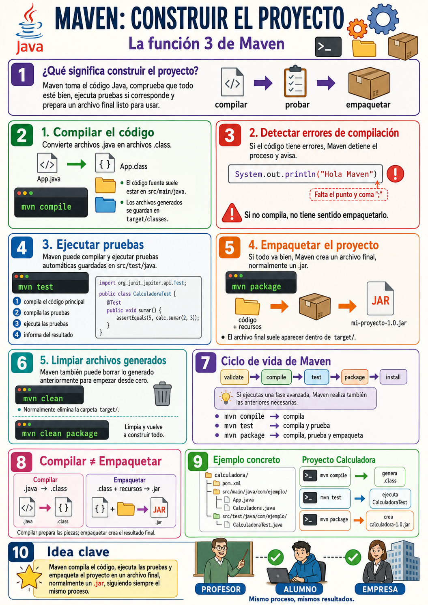

# Construir con MAVEN

- [Construir con MAVEN](#construir-con-maven)
- [Construir el proyecto](#construir-el-proyecto)
  - [1. Compilar el código](#1-compilar-el-código)
  - [2. Comprobar que el proyecto no tiene errores de compilación](#2-comprobar-que-el-proyecto-no-tiene-errores-de-compilación)
  - [3. Ejecutar pruebas](#3-ejecutar-pruebas)
  - [4. Empaquetar el proyecto](#4-empaquetar-el-proyecto)
  - [5. Limpiar archivos generados](#5-limpiar-archivos-generados)
- [El ciclo de vida de Maven](#el-ciclo-de-vida-de-maven)
  - [Diferencia entre compilar y empaquetar](#diferencia-entre-compilar-y-empaquetar)
  - [Ejemplo concreto con Calculadora](#ejemplo-concreto-con-calculadora)
  - [¿Por qué es útil construir con Maven?](#por-qué-es-útil-construir-con-maven)


La tercera gran función de Maven es **construir el proyecto**.

> Maven toma el código Java, comprueba que todo esté bien, ejecuta las pruebas si corresponde y prepara un archivo final que se pueda usar o entregar.

En inglés se suele hablar de **build**. En español podemos traducirlo como **construcción del proyecto**.

# Construir el proyecto

Cuando programamos en Java, normalmente escribimos archivos con extensión `.java`.

Por ejemplo:

```text
src/main/java/com/ejemplo/App.java
src/main/java/com/ejemplo/Calculadora.java
```

Pero esos archivos `.java` no son directamente el producto final. Antes hay que convertirlos en algo que la máquina virtual de Java pueda ejecutar.

Ahí entra Maven.

Maven automatiza tareas como:

```text
compilar → probar → empaquetar
```

Es decir, no se limita a “guardar archivos”. Maven ayuda a preparar el proyecto para que funcione de verdad.

---

## 1. Compilar el código

Compilar significa convertir los archivos `.java` en archivos `.class`.

Los archivos `.java` son código fuente, es decir, el código que escribe el programador:

```java
public class App {
    public static void main(String[] args) {
        System.out.println("Hola Maven");
    }
}
```

Después de compilar, Java genera archivos `.class`, que contienen el código preparado para que lo ejecute la máquina virtual de Java.

Podemos imaginarlo así:

```text
App.java  →  App.class
```

Con Maven podemos compilar usando:

```bash
mvn compile
```

Cuando ejecutamos ese comando, Maven busca el código en:

```text
src/main/java
```

y genera los archivos compilados dentro de una carpeta llamada:

```text
target/
```

Por ejemplo:

```text
mi-proyecto/
│
├── src/
│   └── main/
│       └── java/
│           └── com/
│               └── ejemplo/
│                   └── App.java
│
└── target/
    └── classes/
        └── com/
            └── ejemplo/
                └── App.class
```

La carpeta `target` es importante porque ahí Maven guarda muchos de los archivos que genera automáticamente.

Una forma sencilla de explicarlo sería:

> `src` contiene lo que escribimos nosotros; `target` contiene lo que Maven genera.

---

## 2. Comprobar que el proyecto no tiene errores de compilación

Cuando Maven compila, también detecta errores.

Por ejemplo, si tenemos esto:

```java
public class App {
    public static void main(String[] args) {
        System.out.println("Hola Maven")
    }
}
```

Falta el punto y coma final:

```java
System.out.println("Hola Maven");
```

Si ejecutamos:

```bash
mvn compile
```

Maven fallará y nos avisará de que hay un error.

Esto es útil porque Maven actúa como un control previo:

> “Antes de seguir construyendo el proyecto, vamos a comprobar que el código realmente se puede compilar”.

Si el código no compila, no tiene sentido empaquetarlo.

---

## 3. Ejecutar pruebas

Otra parte importante de construir el proyecto es ejecutar pruebas automáticas.

Si el proyecto tiene pruebas en:

```text
src/test/java
```

Maven puede ejecutarlas con:

```bash
mvn test
```

Por ejemplo, podríamos tener una prueba para una calculadora:

```java
@Test
void sumarDosNumeros() {
    Calculadora calc = new Calculadora();
    assertEquals(5, calc.sumar(2, 3));
}
```

Cuando ejecutamos:

```bash
mvn test
```

Maven hace, de forma simplificada, esto:

```text
1. Compila el código principal.
2. Compila el código de prueba.
3. Ejecuta las pruebas.
4. Informa de si han pasado o han fallado.
```

Esto es especialmente útil en proyectos reales porque nos ayuda a detectar si hemos roto algo.

Por ejemplo, imaginemos que antes `sumar(2, 3)` devolvía `5`, pero después de modificar el código devuelve `6`.

La prueba fallaría y Maven nos avisaría.

La idea para el alumno sería:

> Maven no solo construye el proyecto; también puede comprobar si sigue funcionando correctamente.

---

## 4. Empaquetar el proyecto

Una vez que el código compila y las pruebas pasan, Maven puede preparar el proyecto en un archivo final.

Esto se hace con:

```bash
mvn package
```

En muchos proyectos Java, Maven genera un archivo `.jar`.

Por ejemplo:

```text
target/mi-proyecto-1.0.jar
```

Un archivo `.jar` es como una caja que contiene el programa ya preparado.

Podemos imaginarlo así:

```text
Código Java + recursos + configuración → archivo .jar
```

En un ejemplo sencillo:

```text
calculadora/
│
├── src/
│   └── main/
│       └── java/
│           └── Calculadora.java
│
├── pom.xml
│
└── target/
    └── calculadora-1.0.jar
```

Ese `.jar` es el resultado de la construcción.

Sería como cuando terminamos una maqueta, la metemos en una caja y la dejamos lista para enseñar, entregar o ejecutar.

---

## 5. Limpiar archivos generados

Maven también puede borrar los archivos que ha generado anteriormente.

Para eso se usa:

```bash
mvn clean
```

Este comando elimina normalmente la carpeta:

```text
target/
```

Esto sirve para empezar una construcción desde cero.

Por ejemplo:

```bash
mvn clean package
```

Este comando significa:

```text
1. Borra los archivos generados anteriormente.
2. Compila el proyecto.
3. Ejecuta las pruebas.
4. Empaqueta el resultado final.
```

Es una forma muy habitual de asegurarse de que el proyecto se construye limpiamente.

---

# El ciclo de vida de Maven

Maven organiza la construcción del proyecto mediante fases.

Las fases más importantes para empezar son:

```text
validate  →  compile  →  test  →  package  →  install
```

No hace falta dominar todas al principio, pero conviene entender la idea.

Cuando ejecutamos una fase avanzada, Maven ejecuta también las anteriores necesarias.

Por ejemplo:

```bash
mvn package
```

no solo empaqueta. Antes de empaquetar, Maven también compila y ejecuta las pruebas.

De forma simplificada:

```text
mvn compile
    → compila el código principal

mvn test
    → compila el código principal
    → compila las pruebas
    → ejecuta las pruebas

mvn package
    → compila el código principal
    → compila las pruebas
    → ejecuta las pruebas
    → crea el .jar
```

Esta idea es muy importante:

> En Maven, las fases funcionan como una escalera: si subes a un escalón alto, pasas antes por los escalones anteriores.

---

## Diferencia entre compilar y empaquetar

A los alumnos les suele costar distinguir estas dos ideas.

**Compilar** es convertir el código `.java` en `.class`.

```text
.java → .class
```

**Empaquetar** es meter esos archivos compilados y otros recursos en un archivo final, normalmente `.jar`.

```text
.class + recursos → .jar
```

Es decir:

```text
Compilar: preparar las piezas.
Empaquetar: meter las piezas en la caja final.
```

---

## Ejemplo concreto con Calculadora

Supongamos este proyecto:

```text
calculadora/
│
├── pom.xml
│
└── src/
    ├── main/
    │   └── java/
    │       └── com/
    │           └── ejemplo/
    │               ├── App.java
    │               └── Calculadora.java
    │
    └── test/
        └── java/
            └── com/
                └── ejemplo/
                    └── CalculadoraTest.java
```

Si ejecutamos:

```bash
mvn compile
```

Maven compila:

```text
App.java
Calculadora.java
```

y genera archivos `.class` en `target/classes`.

Si ejecutamos:

```bash
mvn test
```

Maven compila el código principal, compila `CalculadoraTest.java` y ejecuta las pruebas.

Si ejecutamos:

```bash
mvn package
```

Maven hace lo anterior y además crea algo como:

```text
target/calculadora-1.0.jar
```

Ese archivo `.jar` es el paquete final del proyecto.

---

## ¿Por qué es útil construir con Maven?

Porque evita que cada programador tenga que recordar manualmente todos los pasos.

Sin Maven, podríamos tener que hacer algo como:

```text
1. Buscar librerías.
2. Compilar varias clases.
3. Compilar las pruebas.
4. Ejecutar las pruebas.
5. Crear el .jar.
6. Comprobar que todo está en su sitio.
```

Con Maven, podemos pedirlo con un comando:

```bash
mvn package
```

Y Maven sigue el proceso definido.

Esto permite que el proyecto sea más fácil de construir en distintos ordenadores: el del alumno, el del profesor, el de un compañero o el de una empresa.

---


> Idea clave

La función de construir el proyecto sirve para convertir el código fuente en un resultado final utilizable.

La frase más importante sería:

> Maven compila el código, ejecuta las pruebas y empaqueta el proyecto en un archivo final, normalmente un `.jar`, siguiendo siempre el mismo proceso.

Así conseguimos proyectos más ordenados, repetibles y fáciles de entregar o ejecutar.

