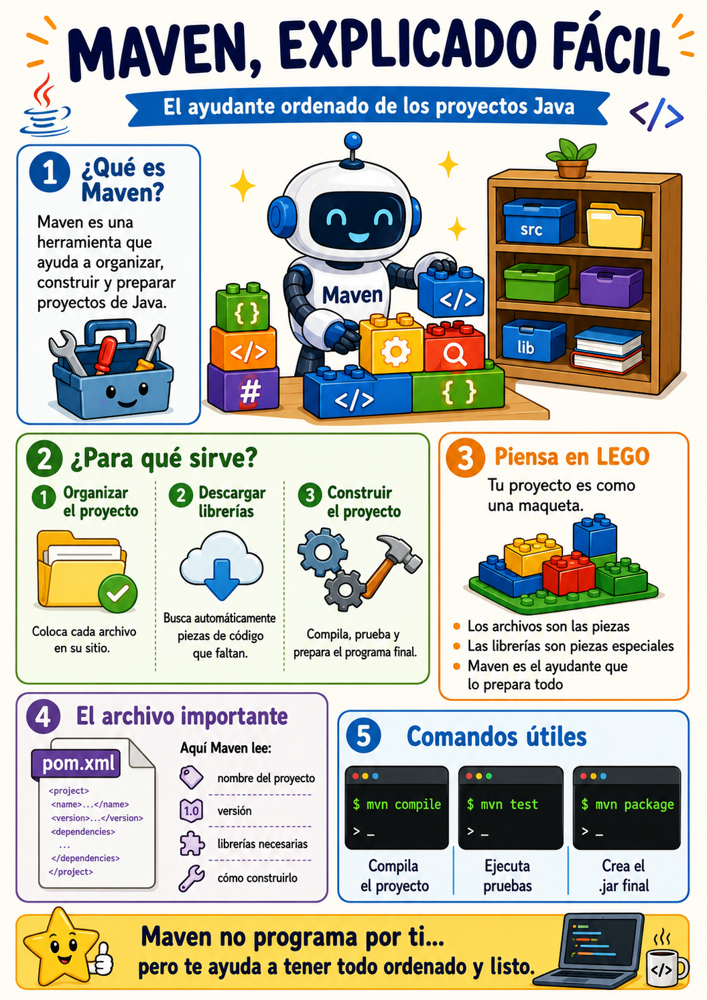

# Introducción a Maven

- [Introducción a Maven](#introducción-a-maven)
  - [1. Organizar el proyecto Ampliación](#1-organizar-el-proyecto-ampliación)
  - [2. Descargar librerías automáticamente Ampliación](#2-descargar-librerías-automáticamente-ampliación)
  - [3. Construir el proyecto Ampliación](#3-construir-el-proyecto-ampliación)
  - [El archivo más importante: `pom.xml`](#el-archivo-más-importante-pomxml)
  - [Una comparación sencilla : Resumen muy simple](#una-comparación-sencilla--resumen-muy-simple)

**MAVEN** Es una herramienta que ayuda a los programadores de Java a **organizar, construir y preparar sus proyectos** sin tener que hacerlo todo a mano.

Imagina que vas a hacer una maqueta enorme de LEGO.

Tú tienes:

* piezas normales,
* piezas especiales,
* instrucciones,
* una caja donde guardarlo todo,
* y al final quieres que la maqueta quede terminada.

Pues Maven sería como un **ayudante muy ordenado** que te dice:

> “Pon las piezas aquí, las instrucciones aquí, y yo me encargo de buscar las piezas especiales que falten y montar el proyecto cuando me lo pidas”.



> ¿Para qué sirve Maven?


## 1. Organizar el proyecto [Ampliación](./1_maven_carpetas.md)

En Java, un proyecto puede tener muchos archivos:

```text
src/
 └── main/
     └── java/
         └── MiPrograma.java
```

Maven propone una estructura ordenada para que todos los proyectos se parezcan un poco.

Es como decir:

> “Los cuadernos van en la mochila, los lápices en el estuche y los libros en la carpeta”.

Así cualquier programador que vea el proyecto sabe dónde buscar.

## 2. Descargar librerías automáticamente [Ampliación](./2_maven_librerías.md)

Una **librería** es código hecho por otras personas que tú puedes usar.

Por ejemplo, imagina que quieres hacer un programa que trabaje con mapas, fechas, bases de datos o archivos especiales. En lugar de programarlo todo desde cero, puedes usar una librería.

Sin Maven, tendrías que buscarla en Internet, descargarla, copiarla en tu proyecto y configurarla.

Con Maven, solo escribes algo en un archivo llamado `pom.xml`, y Maven la descarga por ti.

Sería como decirle:

> “Maven, necesito esta pieza especial de LEGO”.

Y Maven responde:

> “Vale, la busco y la pongo en tu proyecto”.

## 3. Construir el proyecto [Ampliación](./3_maven_build.md)

Cuando programas en Java, escribes archivos `.java`, pero para ejecutar el programa hay que compilarlos.

Maven puede hacer tareas como:

```bash
mvn compile
```

Eso significa:

> “Maven, compila mi proyecto”.

También puede ejecutar pruebas:

```bash
mvn test
```

Y puede empaquetar el proyecto:

```bash
mvn package
```

Eso crea normalmente un archivo `.jar`, que sería como la “caja final” con tu programa preparado.

## El archivo más importante: `pom.xml`

El corazón de Maven es un archivo llamado:

```text
pom.xml
```

Ese archivo le dice a Maven cosas como:

* cómo se llama el proyecto,
* qué versión tiene,
* qué librerías necesita,
* cómo debe construirse.

Por ejemplo:

```xml
<dependencies>
    <dependency>
        <groupId>org.example</groupId>
        <artifactId>una-libreria</artifactId>
        <version>1.0</version>
    </dependency>
</dependencies>
```

Eso sería como una lista de la compra:

> “Necesito esta librería, de este grupo, con esta versión”.

## Una comparación sencilla : Resumen muy simple

Sin Maven:

> “Tengo que buscar las librerías, descargarlas, colocarlas, compilar el proyecto, hacer pruebas y preparar el archivo final yo solo”.

Con Maven:

> “Le digo a Maven qué necesita mi proyecto y él hace gran parte del trabajo repetitivo”.

>Resumen muy simple

Maven es como un **mayordomo para proyectos Java**:

* ordena el proyecto,
* descarga las librerías que hacen falta,
* compila el código,
* ejecuta pruebas,
* prepara el programa final.

La idea más importante es esta:

> Maven no programa por ti, pero te ayuda a que el proyecto esté ordenado y sea más fácil de construir.
