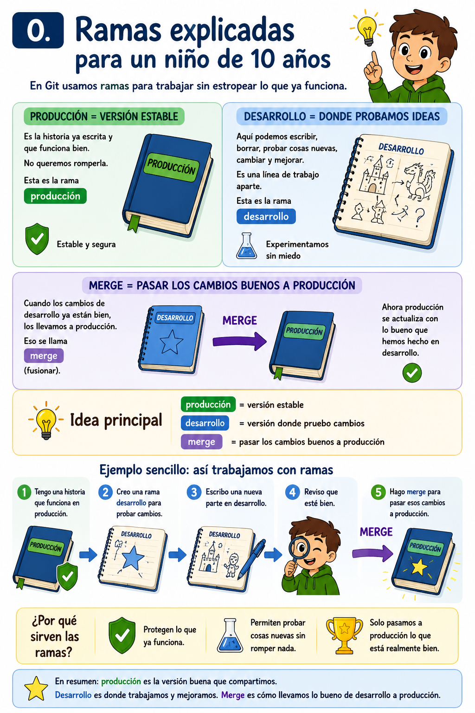

# 0. Ramas


Imagina que estás escribiendo una historia en un cuaderno.

Tienes una versión que ya está bien escrita. Esa versión es la que enseñas a los demás. No quieres estropearla mientras pruebas ideas nuevas.

Esa versión estable sería la rama:

```text
producción
```

Ahora imagina que se te ocurre añadir un nuevo capítulo, cambiar algunos personajes o probar un final distinto. En vez de escribir directamente encima de la historia buena, haces una línea de trabajo aparte.

Esa línea de trabajo sería la rama:

```text
desarrollo
```

En `desarrollo` puedes probar cambios tranquilamente. Puedes escribir, borrar, corregir y mejorar. Mientras tanto, `producción` sigue igual, sin romperse.

Cuando los cambios de `desarrollo` ya están bien, los llevas a `producción`.

Eso se llama:

```text
merge
```

Es decir, **fusionar** una rama con otra.

La idea principal es esta:

```text
producción = versión estable
desarrollo = versión donde pruebo cambios
merge = pasar los cambios buenos a producción
```

Un ejemplo sencillo:

```text
1. Tengo una historia que funciona en producción.
2. Creo una rama desarrollo para probar cambios.
3. Escribo una nueva parte en desarrollo.
4. Reviso que esté bien.
5. Hago merge para pasar esos cambios a producción.
```

Así, si algo sale mal mientras estás probando, no estropeas la versión buena del proyecto.

