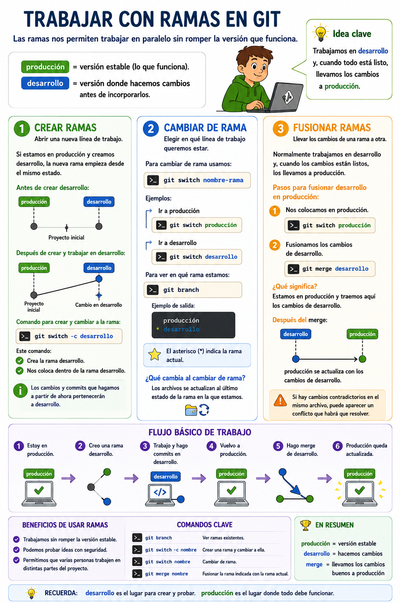

- [1. Trabajar con ramas](#1-trabajar-con-ramas)
  - [Crear ramas](#crear-ramas)
  - [Cambiar de rama](#cambiar-de-rama)
  - [Fusionar ramas](#fusionar-ramas)
  - [Flujo básico de trabajo](#flujo-básico-de-trabajo)

# 1. Trabajar con ramas

Cuando trabajamos con Git, no siempre queremos modificar directamente la versión principal de un proyecto. A veces necesitamos probar cambios, añadir una parte nueva o corregir algo sin poner en peligro lo que ya funciona.

Para eso usamos **ramas**.

Una rama es una línea de trabajo dentro del repositorio. Podemos tener una rama llamada `producción`, que representa la versión estable del proyecto, y otra rama llamada `desarrollo`, donde hacemos cambios antes de incorporarlos a la versión estable.

La idea sería esta:

```text
producción = versión estable
desarrollo = versión donde hacemos cambios
```

Al crear una rama nueva, Git no hace una copia completa del proyecto como si duplicara una carpeta. Lo que hace es crear una nueva línea de trabajo que empieza desde el mismo punto. A partir de ese momento, cada rama puede avanzar de forma independiente.

Por ejemplo, si estamos en `producción` y creamos la rama `desarrollo`, al principio las dos ramas tienen el mismo contenido:

```text
producción
desarrollo
    │
    ● Proyecto inicial
```

Pero si nos cambiamos a `desarrollo`, modificamos un archivo y hacemos un commit, entonces `desarrollo` avanza y `producción` se queda igual:

```text
producción
    │
    ● Proyecto inicial
     \
      ● Cambio realizado en desarrollo
      │
desarrollo
```

Esto es útil porque podemos trabajar sin miedo a estropear la versión estable.

---

## Crear ramas

Crear una rama significa abrir una nueva línea de trabajo dentro del repositorio.

Si estamos en `producción` y creamos `desarrollo`, la nueva rama empieza desde el mismo estado en el que está `producción` en ese momento.

Para crear una rama y cambiarnos directamente a ella usamos:

```bash
git switch -c desarrollo
```

Este comando hace dos cosas:

```text
1. Crea la rama desarrollo.
2. Nos coloca dentro de la rama desarrollo.
```

Después de ejecutarlo, cualquier cambio y cualquier commit que hagamos pertenecerá a `desarrollo`, no a `producción`.

---

## Cambiar de rama

Cambiar de rama significa elegir en qué línea de trabajo queremos estar.

Para cambiar de una rama a otra usamos:

```bash
git switch nombre-rama
```

Por ejemplo, para ir a `producción`:

```bash
git switch producción
```

Para volver a `desarrollo`:

```bash
git switch desarrollo
```

Para ver en qué rama estamos, usamos:

```bash
git branch
```

Git mostrará las ramas existentes y marcará con un asterisco `*` la rama actual.

Ejemplo:

```text
  producción
* desarrollo
```

Esto significa que ahora mismo estamos trabajando en `desarrollo`.

---

## Fusionar ramas

Fusionar ramas significa llevar los cambios de una rama a otra.

En nuestro ejemplo, normalmente trabajaremos en `desarrollo` y, cuando los cambios estén preparados, los llevaremos a `producción`.

A eso se le llama hacer un **merge**.

El merge se hace desde la rama que va a recibir los cambios.

Es decir, si queremos llevar los cambios de `desarrollo` a `producción`, primero nos colocamos en `producción`:

```bash
git switch producción
```

Después fusionamos los cambios de `desarrollo`:

```bash
git merge desarrollo
```

La idea es:

```text
Estoy en producción y traigo aquí los cambios de desarrollo.
```

Después del merge, `producción` ya tendrá los cambios que se habían preparado en `desarrollo`.

---

## Flujo básico de trabajo

```text
1. Estoy en producción.
2. Creo una rama desarrollo.
3. Trabajo y hago commits en desarrollo.
4. Vuelvo a producción.
5. Hago merge de desarrollo.
6. Producción queda actualizada.
```

En resumen, las ramas nos permiten trabajar de forma más segura y ordenada. `producción` mantiene la versión que funciona, `desarrollo` permite preparar cambios, y `merge` sirve para incorporar esos cambios cuando ya están listos.

Este tipo de práctica encaja con el criterio de evaluación relacionado con el uso del **control de versiones integrado en el entorno de desarrollo**. 

